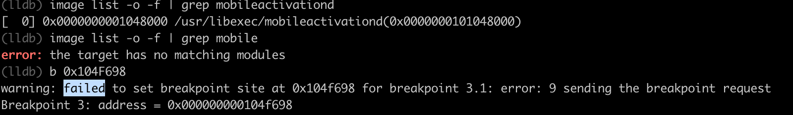

# 心得

## warning failed to set breakpoint site at for breakpoint error 9 sending the breakpoint request

* 现象

```bash
(lldb) b 0x104F698
warning: failed to set breakpoint site at 0x104f698 for breakpoint 3.1: error: 9 sending the breakpoint request
```



* 原因
  * 表面原因：地址写错了
  * 底层原因：`image list`中输出的库的ALSR基地址，搞错了

* 具体解释

