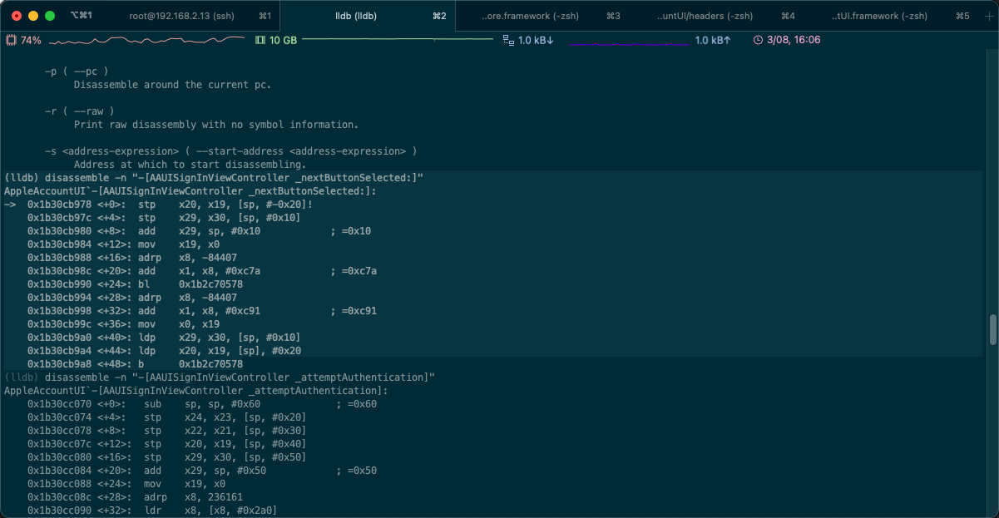
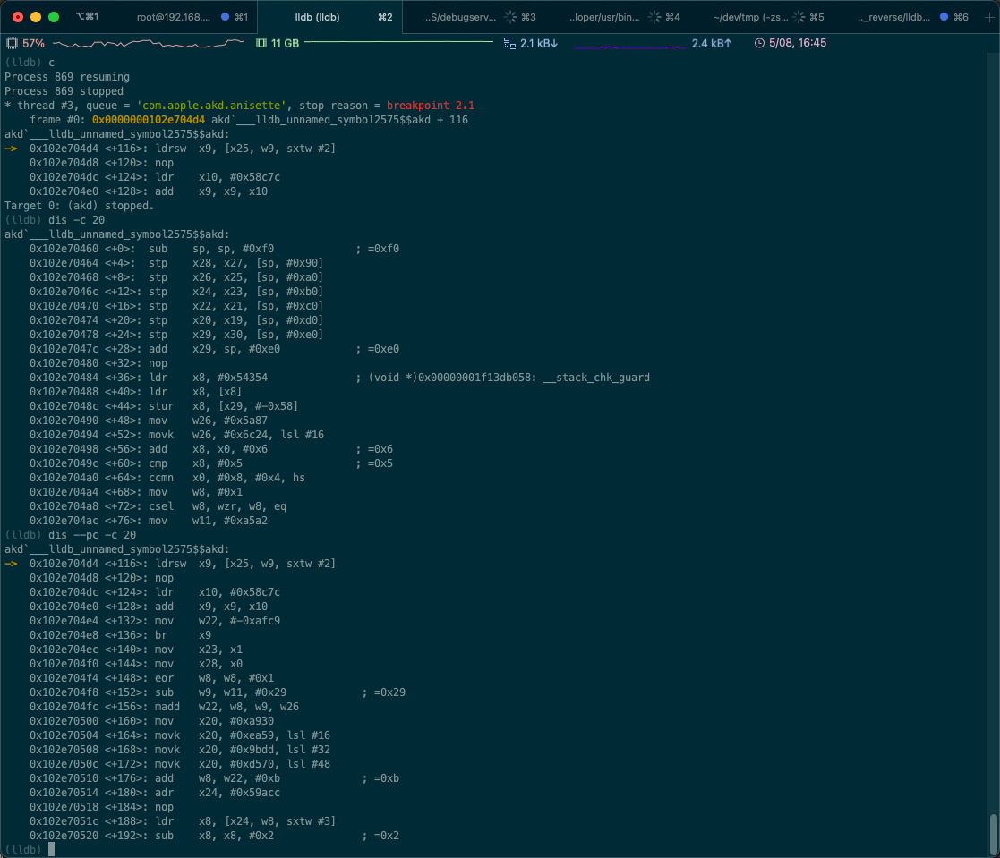

# disassemble

TODO：

【记录】lldb命令使用心得：disassemble

---

* `disassemble` == `dis` == `di`
  ```bash
    di        -- Disassemble specified instructions in the current target. 
                Defaults to the current function for the current thread and
                stack frame.
    dis       -- Disassemble specified instructions in the current target. 
                Defaults to the current function for the current thread and
                stack frame.
  ```

## disassemble举例

### 官网的例子

[GDB to LLDB command map — The LLDB Debugger (llvm.org)](https://lldb.llvm.org/use/map.html)

官网有相关例子：

* Disassemble the current function for the current frame
  ```bash
  (lldb) disassemble --frame
  (lldb) di -f
  ```
* Disassemble any functions named main
  ```bash
  (lldb) disassemble --name main
  (lldb) di -n main
  ```
* Disassemble an address range
  ```bash
  (lldb) disassemble --start-address 0x1eb8 --end-address 0x1ec3
  (lldb) di -s 0x1eb8 -e 0x1ec3
  ```
* Disassemble 20 instructions from a given address
  ```bash
  (lldb) disassemble --start-address 0x1eb8 --count 20
  (lldb) di -s 0x1eb8 -c 20
  ```
* Show mixed source and disassembly for the current function for the current frame
  ```bash
  (lldb) disassemble --frame --mixed
  (lldb) di -f -m
  ```
* Disassemble the current function for the current frame and show the opcode bytes
  ```bash
  (lldb) disassemble --frame --bytes
  (lldb) di -f -b
  ```
* Disassemble the current source line for the current frame
  ```bash
  (lldb) disassemble --line
  (lldb) di -l
  ```

### 某次测试的一些命令

* 某次测试的一些命令
  * 如果当前已处于某个函数，则：
    ```bash
    dis -f == dis = dis -n FunctionName
    ```
  * 其他常见用法：
    ```bash
    disassemble == dis = di
    dis -n "-[AAUISignInViewController _nextButtonSelected:]"
    dis -f
    dis --start-address 0x1b30cb978 --end-address 0x1b30cb990
    dis --start-address 0x1b30cb978 --count 10
    dis --frame --mixed
    dis --frame --bytes
    dis --line
    ```

#### 当前frame = 当前函数的 全部汇编代码

```bash
dis -f
```
* 效果
  ```bash
  (lldb) dis -f
  AppleAccountUI`-[AAUISignInViewController _nextButtonSelected:]:
  ->  0x1b30cb978 <+0>:  stp    x20, x19, [sp, #-0x20]!
      0x1b30cb97c <+4>:  stp    x29, x30, [sp, #0x10]
      0x1b30cb980 <+8>:  add    x29, sp, #0x10            ; =0x10
      0x1b30cb984 <+12>: mov    x19, x0
      0x1b30cb988 <+16>: adrp   x8, -84407
      0x1b30cb98c <+20>: add    x1, x8, #0xc7a            ; =0xc7a
      0x1b30cb990 <+24>: bl     0x1b2c70578
      0x1b30cb994 <+28>: adrp   x8, -84407
      0x1b30cb998 <+32>: add    x1, x8, #0xc91            ; =0xc91
      0x1b30cb99c <+36>: mov    x0, x19
      0x1b30cb9a0 <+40>: ldp    x29, x30, [sp, #0x10]
      0x1b30cb9a4 <+44>: ldp    x20, x19, [sp], #0x20
      0x1b30cb9a8 <+48>: b      0x1b2c70578
  ```

#### 指定函数

```bash
disassemble -n "-[AAUISignInViewController _nextButtonSelected:]"
```
* 效果
  ```bash
  (lldb) disassemble -n "-[AAUISignInViewController _nextButtonSelected:]"
  AppleAccountUI`-[AAUISignInViewController _nextButtonSelected:]:
  ->  0x1b30cb978 <+0>:  stp    x20, x19, [sp, #-0x20]!
      0x1b30cb97c <+4>:  stp    x29, x30, [sp, #0x10]
      0x1b30cb980 <+8>:  add    x29, sp, #0x10            ; =0x10
      0x1b30cb984 <+12>: mov    x19, x0
      0x1b30cb988 <+16>: adrp   x8, -84407
      0x1b30cb98c <+20>: add    x1, x8, #0xc7a            ; =0xc7a
      0x1b30cb990 <+24>: bl     0x1b2c70578
      0x1b30cb994 <+28>: adrp   x8, -84407
      0x1b30cb998 <+32>: add    x1, x8, #0xc91            ; =0xc91
      0x1b30cb99c <+36>: mov    x0, x19
      0x1b30cb9a0 <+40>: ldp    x29, x30, [sp, #0x10]
      0x1b30cb9a4 <+44>: ldp    x20, x19, [sp], #0x20
      0x1b30cb9a8 <+48>: b      0x1b2c70578
  ```
  * 

#### 指定地址范围

```bash
disassemble --start-address 0x1b30cb978 --end-address 0x1b30cb990
```
* 参数说明
  * 包括：`start address`=0x1b30cb978
  * 不包括：`end address`=0x1b30cb990 
* 输出效果
  ```bash
  (lldb) disassemble --start-address 0x1b30cb978 --end-address 0x1b30cb990
  AppleAccountUI`-[AAUISignInViewController _nextButtonSelected:]:
  ->  0x1b30cb978 <+0>:  stp    x20, x19, [sp, #-0x20]!
      0x1b30cb97c <+4>:  stp    x29, x30, [sp, #0x10]
      0x1b30cb980 <+8>:  add    x29, sp, #0x10            ; =0x10
      0x1b30cb984 <+12>: mov    x19, x0
      0x1b30cb988 <+16>: adrp   x8, -84407
      0x1b30cb98c <+20>: add    x1, x8, #0xc7a            ; =0xc7a
  ```

额外加上行数：

```bash
disassemble --start-address 0x1b30cb978 --count 10
```
* 输出效果
  ```bash
  (lldb) disassemble --start-address 0x1b30cb978 --count 10
  AppleAccountUI`-[AAUISignInViewController _nextButtonSelected:]:
  ->  0x1b30cb978 <+0>:  stp    x20, x19, [sp, #-0x20]!
      0x1b30cb97c <+4>:  stp    x29, x30, [sp, #0x10]
      0x1b30cb980 <+8>:  add    x29, sp, #0x10            ; =0x10
      0x1b30cb984 <+12>: mov    x19, x0
      0x1b30cb988 <+16>: adrp   x8, -84407
      0x1b30cb98c <+20>: add    x1, x8, #0xc7a            ; =0xc7a
      0x1b30cb990 <+24>: bl     0x1b2c70578
      0x1b30cb994 <+28>: adrp   x8, -84407
      0x1b30cb998 <+32>: add    x1, x8, #0xc91            ; =0xc91
      0x1b30cb99c <+36>: mov    x0, x19
  ```

#### 显示opcode

```bash
disassemble --frame --bytes
```
* 说明
  * 和IDA中设置显示opcode的效果类似：解析后的arm指令前面，显示出对应的二进制数据opcode
* 输出效果
  ```bash
  (lldb) disassemble --frame --bytes
  AppleAccountUI`-[AAUISignInViewController _nextButtonSelected:]:
  ->  0x1b30cb978 <+0>:  0xa9be4ff4   stp    x20, x19, [sp, #-0x20]!
      0x1b30cb97c <+4>:  0xa9017bfd   stp    x29, x30, [sp, #0x10]
      0x1b30cb980 <+8>:  0x910043fd   add    x29, sp, #0x10            ; =0x10
      0x1b30cb984 <+12>: 0xaa0003f3   mov    x19, x0
      0x1b30cb988 <+16>: 0xb0f5b248   adrp   x8, -84407
      0x1b30cb98c <+20>: 0x9131e901   add    x1, x8, #0xc7a            ; =0xc7a
      0x1b30cb990 <+24>: 0x97ee92fa   bl     0x1b2c70578
      0x1b30cb994 <+28>: 0xb0f5b248   adrp   x8, -84407
      0x1b30cb998 <+32>: 0x91324501   add    x1, x8, #0xc91            ; =0xc91
      0x1b30cb99c <+36>: 0xaa1303e0   mov    x0, x19
      0x1b30cb9a0 <+40>: 0xa9417bfd   ldp    x29, x30, [sp, #0x10]
      0x1b30cb9a4 <+44>: 0xa8c24ff4   ldp    x20, x19, [sp], #0x20
      0x1b30cb9a8 <+48>: 0x17ee92f4   b      0x1b2c70578
  ```


### 其他例子

#### 显示某个地址的反汇编

```bash
disassemble -s 0x00000001091694a4
```
* 输出效果
  ```bash
  (lldb) disassemble -s 0x00000001091694a4
  Module_Framework`___lldb_unnamed_symbol171165$$Module_Framework:
      0x1091694a4 <+0>: ret    

  Module_Framework`___lldb_unnamed_symbol171166$$Module_Framework:
      0x1091694a8 <+0>: b      0x1091a45ac               ; ___lldb_unnamed_symbol174729$$Module_Framework

  Module_Framework`___lldb_unnamed_symbol171167$$Module_Framework:
      0x1091694ac <+0>: ldr    x2, [x0, #0x10]
      0x1091694b0 <+4>: br     x2

  Module_Framework`___lldb_unnamed_symbol171168$$Module_Framework:
      0x1091694b4 <+0>: ret    

  Module_Framework`___lldb_unnamed_symbol171169$$Module_Framework:
      0x1091694b8 <+0>: b      0x1091a45ac               ; ___lldb_unnamed_symbol174729$$Module_Framework

  Module_Framework`___lldb_unnamed_symbol171170$$Module_Framework:
      0x1091694bc <+0>: ldr    x2, [x0, #0x10]
      0x1091694c0 <+4>: br     x2
  ```

#### 指定显示的行数

* 显示从 函数最开始 算起的 20行代码
  ```bash
  dis -c 20
  ```
* 显示从 当前PC位置 算起的 20行代码
  ```bash
  dis --pc -c 20
  ```

输出效果：

```bash
(lldb) c
Process 869 resuming
Process 869 stopped
* thread #3, queue = 'com.apple.akd.anisette', stop reason = breakpoint 2.1
    frame #0: 0x0000000102e704d4 akd`___lldb_unnamed_symbol2575$$akd + 116
akd`___lldb_unnamed_symbol2575$$akd:
->  0x102e704d4 <+116>: ldrsw  x9, [x25, w9, sxtw #2]
    0x102e704d8 <+120>: nop
    0x102e704dc <+124>: ldr    x10, #0x58c7c
    0x102e704e0 <+128>: add    x9, x9, x10
Target 0: (akd) stopped.
(lldb) dis -c 20
akd`___lldb_unnamed_symbol2575$$akd:
    0x102e70460 <+0>:  sub    sp, sp, #0xf0             ; =0xf0
    0x102e70464 <+4>:  stp    x28, x27, [sp, #0x90]
    0x102e70468 <+8>:  stp    x26, x25, [sp, #0xa0]
    0x102e7046c <+12>: stp    x24, x23, [sp, #0xb0]
    0x102e70470 <+16>: stp    x22, x21, [sp, #0xc0]
    0x102e70474 <+20>: stp    x20, x19, [sp, #0xd0]
    0x102e70478 <+24>: stp    x29, x30, [sp, #0xe0]
    0x102e7047c <+28>: add    x29, sp, #0xe0            ; =0xe0
    0x102e70480 <+32>: nop
    0x102e70484 <+36>: ldr    x8, #0x54354              ; (void *)0x00000001f13db058: __stack_chk_guard
    0x102e70488 <+40>: ldr    x8, [x8]
    0x102e7048c <+44>: stur   x8, [x29, #-0x58]
    0x102e70490 <+48>: mov    w26, #0x5a87
    0x102e70494 <+52>: movk   w26, #0x6c24, lsl #16
    0x102e70498 <+56>: add    x8, x0, #0x6              ; =0x6
    0x102e7049c <+60>: cmp    x8, #0x5                  ; =0x5
    0x102e704a0 <+64>: ccmn   x0, #0x8, #0x4, hs
    0x102e704a4 <+68>: mov    w8, #0x1
    0x102e704a8 <+72>: csel   w8, wzr, w8, eq
    0x102e704ac <+76>: mov    w11, #0xa5a2
(lldb) dis --pc -c 20
akd`___lldb_unnamed_symbol2575$$akd:
->  0x102e704d4 <+116>: ldrsw  x9, [x25, w9, sxtw #2]
    0x102e704d8 <+120>: nop
    0x102e704dc <+124>: ldr    x10, #0x58c7c
    0x102e704e0 <+128>: add    x9, x9, x10
    0x102e704e4 <+132>: mov    w22, #-0xafc9
    0x102e704e8 <+136>: br     x9
    0x102e704ec <+140>: mov    x23, x1
    0x102e704f0 <+144>: mov    x28, x0
    0x102e704f4 <+148>: eor    w8, w8, #0x1
    0x102e704f8 <+152>: sub    w9, w11, #0x29            ; =0x29
    0x102e704fc <+156>: madd   w22, w8, w9, w26
    0x102e70500 <+160>: mov    x20, #0xa930
    0x102e70504 <+164>: movk   x20, #0xea59, lsl #16
    0x102e70508 <+168>: movk   x20, #0x9bdd, lsl #32
    0x102e7050c <+172>: movk   x20, #0xd570, lsl #48
    0x102e70510 <+176>: add    w8, w22, #0xb             ; =0xb
    0x102e70514 <+180>: adr    x24, #0x59acc
    0x102e70518 <+184>: nop
    0x102e7051c <+188>: ldr    x8, [x24, w8, sxtw #3]
    0x102e70520 <+192>: sub    x8, x8, #0x2              ; =0x2
(lldb)
```



## disassemble语法

```bash
(lldb) help disassemble
Disassemble specified instructions in the current target.  Defaults to the
current function for the current thread and stack frame.

Syntax: disassemble [<cmd-options>]

Command Options Usage:
  disassemble [-bmr] -s <address-expression> [-A <arch>] [-C <num-lines>] [-e <address-expression>] [-F <disassembly-flavor>] [-P <plugin>]
  disassemble [-bmr] -s <address-expression> [-A <arch>] [-C <num-lines>] [-c <num-lines>] [-F <disassembly-flavor>] [-P <plugin>]
  disassemble [-bmr] [-A <arch>] [-C <num-lines>] [-c <num-lines>] [-F <disassembly-flavor>] [-n <function-name>] [-P <plugin>]
  disassemble [-bfmr] [-A <arch>] [-C <num-lines>] [-c <num-lines>] [-F <disassembly-flavor>] [-P <plugin>]
  disassemble [-bmpr] [-A <arch>] [-C <num-lines>] [-c <num-lines>] [-F <disassembly-flavor>] [-P <plugin>]
  disassemble [-blmr] [-A <arch>] [-C <num-lines>] [-F <disassembly-flavor>] [-P <plugin>]
  disassemble [-bmr] [-a <address-expression>] [-A <arch>] [-C <num-lines>] [-c <num-lines>] [-F <disassembly-flavor>] [-P <plugin>]

       --force
            Force dissasembly of large functions.

       -A <arch> ( --arch <arch> )
            Specify the architecture to use from cross disassembly.

       -C <num-lines> ( --context <num-lines> )
            Number of context lines of source to show.

       -F <disassembly-flavor> ( --flavor <disassembly-flavor> )
            Name of the disassembly flavor you want to use. Currently the only
            valid options are default, and for Intel architectures, att and
            intel.

       -P <plugin> ( --plugin <plugin> )
            Name of the disassembler plugin you want to use.

       -a <address-expression> ( --address <address-expression> )
            Disassemble function containing this address.

       -b ( --bytes )
            Show opcode bytes when disassembling.

       -c <num-lines> ( --count <num-lines> )
            Number of instructions to display.

       -e <address-expression> ( --end-address <address-expression> )
            Address at which to end disassembling.

       -f ( --frame )
            Disassemble from the start of the current frame's function.

       -l ( --line )
            Disassemble the current frame's current source line instructions if
            there is debug line table information, else disassemble around the
            pc.

       -m ( --mixed )
            Enable mixed source and assembly display.

       -n <function-name> ( --name <function-name> )
            Disassemble entire contents of the given function name.

       -p ( --pc )
            Disassemble around the current pc.

       -r ( --raw )
            Print raw disassembly with no symbol information.

       -s <address-expression> ( --start-address <address-expression> )
            Address at which to start disassembling.
```
