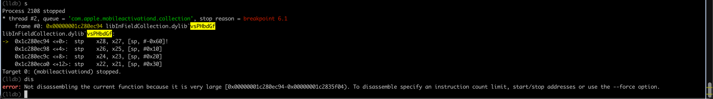

# 心得

## error Not disassembling the current function because it is very large

### 现象

```bash
(lldb) dis
error: Not disassembling the current function because it is very large [0x00000001c280ec94-0x00000001c2835f04). To disassemble specify an instruction count limit, start/stop addresses or use the --force option.
```




### 原因

此处（Mach-O中，ObjC的汇编）代码做了混淆，使得该函数最后一行代码是BR的间接跳转，从而使得（包括IDA中的，和此处lldb中的）反编译器无法正确识别函数结束位置。
而误判了一个，起始和结束地址是：

* 0x00000001c280ec94-0x00000001c2835f04
  * 总大小是：0x00000001c2835f04 - 0x00000001c280ec94
    * = 0x27270
    * = 160368
    * = 156KB
      * 不正常的，非常大的，函数代码量了

### 解决办法

* 根据提示，去指定代码起始和结束位置
* 然后用
  ```bash
  dis -s startAddress -e endAddress
  ```

### 具体步骤

此处起始地址：已经知道

从lldb上面的调试中：

```bash
(lldb) c
Process 2375 resuming
Process 2375 stopped
* thread #3, queue = 'com.apple.mobileactivationd.collection', stop reason = breakpoint 4.1 5.1
    frame #0: 0x00000001c280ec94 libInFieldCollection.dylib`vsPHbdGf
libInFieldCollection.dylib`vsPHbdGf:
->  0x1c280ec94 <+0>:  stp    x28, x27, [sp, #-0x60]!
    0x1c280ec98 <+4>:  stp    x26, x25, [sp, #0x10]
    0x1c280ec9c <+8>:  stp    x24, x23, [sp, #0x20]
    0x1c280eca0 <+12>: stp    x22, x21, [sp, #0x30]
Target 0: (mobileactivationd) stopped.
```

就能看出是：

* 起始地址：`0x1c280ec94`

而结束位置，此处需要借助于IDA中：

```asm
__text:00000001A8A26C94 _vsPHbdGf
__text:00000001A8A26C94                 STP             X28, X27, [SP,#-0x10+var_50]!
__text:00000001A8A26C98                 STP             X26, X25, [SP,#0x50+var_40]
...
__text:00000001A8A26DF8                 BR              X10
__text:00000001A8A26DF8 ; End of function _vsPHbdGf
__text:00000001A8A26DF8
__text:00000001A8A26DFC
```

-》（加了基地址后的）二进制内偏移量地址是：00000001A8A26DFC

-》巧了，从最后3位的地址，就完全对得上

-》算出此处的结束地址是：

* 0x1c280edfc

然后去：

```bash
dis -s 0x1c280ec94 -e 0x1c280edfc
```

即可顺利打印反汇编代码。
