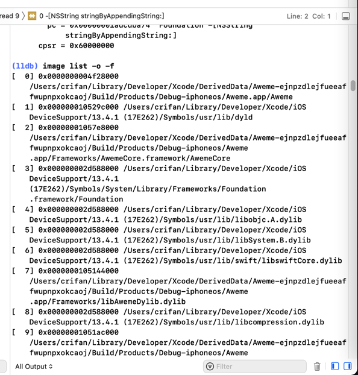
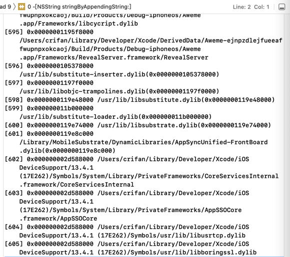
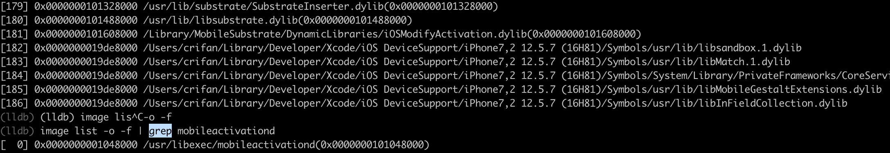
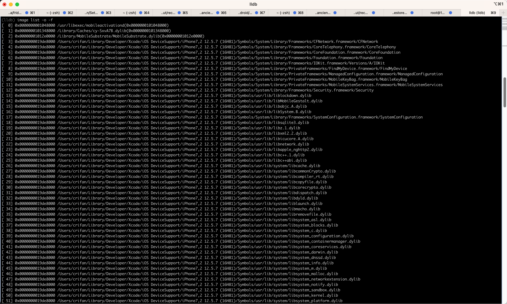

# image list举例

## Aweme

```bash
(lldb) image list -o -f
[  0] 0x0000000004874000 /private/var/containers/Bundle/Application/9AB25481-0AD3-435C-A02E-68F9623535BB/Aweme.app/Aweme(0x0000000104874000)
[  1] 0x0000000104b78000 /Users/crifan/Library/Developer/Xcode/iOS DeviceSupport/13.4.1 (17E262)/Symbols/usr/lib/dyld
...
```
* 另外某次的类似例子的截图
  * 
  * 
* 说明
  * 第一个是app本身的二进制
    * `/private/var/containers/Bundle/Application/9AB25481-0AD3-435C-A02E-68F9623535BB/Aweme.app/Aweme`
      * 此处`ALSR`的基地址是：`0x0000000004874000`
* 第二个是`dyld`
    * `/Users/crifan/Library/Developer/Xcode/iOS DeviceSupport/13.4.1 (17E262)/Symbols/usr/lib/dyld`

## AwemeCore

```bash
(lldb) image list -o -f | grep AwemeCore
[  0] 0x0000000100adc000 /Users/crifan/Library/Developer/Xcode/DerivedData/Aweme-fswcidjoxbkibsdwekuzlsfcdqls/Build/Products/Debug-iphoneos/Aweme.app/Frameworks/AwemeCore.framework/AwemeCore
```

## Module_Framework

* 带`grep`的

```bash
(lldb) image list -o -f | grep Module_Framework
[  0] 0x0000000104238000 /Users/crifan/Library/Developer/Xcode/DerivedData/youtube-dvlfmmtvybrcdraorwznbwwepoae/Build/Products/Debug-iphoneos/youtube.app/Frameworks/Module_Framework.framework/Module_Framework
```

* 带`grep`输出后，继续计算函数地址和查找相关函数

```bash
(lldb) image list -o -f | grep Module_Framework
[  0] 0x0000000102b50000 /Users/crifan/Library/Developer/Xcode/DerivedData/youtube-dvlfmmtvybrcdraorwznbwwepoae/Build/Products/Debug-iphoneos/youtube.app/Frameworks/Module_Framework.framework/Module_Framework
(lldb) p/x 0x0000000102b50000 + 0x10470B8
(long) $0 = 0x0000000103b970b8
(lldb) im loo -a 0x0000000103b970b8
      Address: Module_Framework[0x00000000010470b8] (Module_Framework.__TEXT.__text + 17051832)
      Summary: Module_Framework`___lldb_unnamed_symbol12565$$Module_Framework
```

## mobileactivationd

### 带grep的过滤结果

```bash
(lldb) image list -o -f | grep mobileactivationd
[  0] 0x0000000001048000 /usr/libexec/mobileactivationd(0x0000000101048000)
```



### 完整列表

```bash
(lldb) image list -o -f
[  0] 0x0000000001048000 /usr/libexec/mobileactivationd(0x0000000101048000)
[  1] 0x0000000101348000 /Library/Caches/cy-SxvA7B.dylib(0x0000000101348000)
[  2] 0x00000001012e0000 /Library/MobileSubstrate/MobileSubstrate.dylib(0x00000001012e0000)
[  3] 0x0000000019de8000 /Users/crifan/Library/Developer/Xcode/iOS DeviceSupport/iPhone7,2 12.5.7 (16H81)/Symbols/System/Library/Frameworks/CFNetwork.framework/CFNetwork
[  4] 0x0000000019de8000 /Users/crifan/Library/Developer/Xcode/iOS DeviceSupport/iPhone7,2 12.5.7 (16H81)/Symbols/System/Library/Frameworks/CoreTelephony.framework/CoreTelephony
[  5] 0x0000000019de8000 /Users/crifan/Library/Developer/Xcode/iOS DeviceSupport/iPhone7,2 12.5.7 (16H81)/Symbols/System/Library/Frameworks/CoreFoundation.framework/CoreFoundation
[  6] 0x0000000019de8000 /Users/crifan/Library/Developer/Xcode/iOS DeviceSupport/iPhone7,2 12.5.7 (16H81)/Symbols/System/Library/Frameworks/Foundation.framework/Foundation
[  7] 0x0000000019de8000 /Users/crifan/Library/Developer/Xcode/iOS DeviceSupport/iPhone7,2 12.5.7 (16H81)/Symbols/System/Library/Frameworks/IOKit.framework/Versions/A/IOKit
[  8] 0x0000000019de8000 /Users/crifan/Library/Developer/Xcode/iOS DeviceSupport/iPhone7,2 12.5.7 (16H81)/Symbols/System/Library/PrivateFrameworks/FindMyDevice.framework/FindMyDevice
[  9] 0x0000000019de8000 /Users/crifan/Library/Developer/Xcode/iOS DeviceSupport/iPhone7,2 12.5.7 (16H81)/Symbols/System/Library/PrivateFrameworks/ManagedConfiguration.framework/ManagedConfiguration
[ 10] 0x0000000019de8000 /Users/crifan/Library/Developer/Xcode/iOS DeviceSupport/iPhone7,2 12.5.7 (16H81)/Symbols/System/Library/PrivateFrameworks/MobileKeyBag.framework/MobileKeyBag
[ 11] 0x0000000019de8000 /Users/crifan/Library/Developer/Xcode/iOS DeviceSupport/iPhone7,2 12.5.7 (16H81)/Symbols/System/Library/PrivateFrameworks/MobileSystemServices.framework/MobileSystemServices
[ 12] 0x0000000019de8000 /Users/crifan/Library/Developer/Xcode/iOS DeviceSupport/iPhone7,2 12.5.7 (16H81)/Symbols/System/Library/Frameworks/Security.framework/Security
[ 13] 0x0000000019de8000 /Users/crifan/Library/Developer/Xcode/iOS DeviceSupport/iPhone7,2 12.5.7 (16H81)/Symbols/usr/lib/liblockdown.dylib
[ 14] 0x0000000019de8000 /Users/crifan/Library/Developer/Xcode/iOS DeviceSupport/iPhone7,2 12.5.7 (16H81)/Symbols/usr/lib/libMobileGestalt.dylib
[ 15] 0x0000000019de8000 /Users/crifan/Library/Developer/Xcode/iOS DeviceSupport/iPhone7,2 12.5.7 (16H81)/Symbols/usr/lib/libobjc.A.dylib
[ 16] 0x0000000019de8000 /Users/crifan/Library/Developer/Xcode/iOS DeviceSupport/iPhone7,2 12.5.7 (16H81)/Symbols/usr/lib/libSystem.B.dylib
[ 17] 0x0000000019de8000 /Users/crifan/Library/Developer/Xcode/iOS DeviceSupport/iPhone7,2 12.5.7 (16H81)/Symbols/System/Library/Frameworks/SystemConfiguration.framework/SystemConfiguration
[ 18] 0x0000000019de8000 /Users/crifan/Library/Developer/Xcode/iOS DeviceSupport/iPhone7,2 12.5.7 (16H81)/Symbols/usr/lib/libsqlite3.dylib
[ 19] 0x0000000019de8000 /Users/crifan/Library/Developer/Xcode/iOS DeviceSupport/iPhone7,2 12.5.7 (16H81)/Symbols/usr/lib/libz.1.dylib
[ 20] 0x0000000019de8000 /Users/crifan/Library/Developer/Xcode/iOS DeviceSupport/iPhone7,2 12.5.7 (16H81)/Symbols/usr/lib/libxml2.2.dylib
[ 21] 0x0000000019de8000 /Users/crifan/Library/Developer/Xcode/iOS DeviceSupport/iPhone7,2 12.5.7 (16H81)/Symbols/usr/lib/libicucore.A.dylib
[ 22] 0x0000000019de8000 /Users/crifan/Library/Developer/Xcode/iOS DeviceSupport/iPhone7,2 12.5.7 (16H81)/Symbols/usr/lib/libnetwork.dylib
[ 23] 0x0000000019de8000 /Users/crifan/Library/Developer/Xcode/iOS DeviceSupport/iPhone7,2 12.5.7 (16H81)/Symbols/usr/lib/libapple_nghttp2.dylib
[ 24] 0x0000000019de8000 /Users/crifan/Library/Developer/Xcode/iOS DeviceSupport/iPhone7,2 12.5.7 (16H81)/Symbols/usr/lib/libc++.1.dylib
[ 25] 0x0000000019de8000 /Users/crifan/Library/Developer/Xcode/iOS DeviceSupport/iPhone7,2 12.5.7 (16H81)/Symbols/usr/lib/libc++abi.dylib
[ 26] 0x0000000019de8000 /Users/crifan/Library/Developer/Xcode/iOS DeviceSupport/iPhone7,2 12.5.7 (16H81)/Symbols/usr/lib/system/libcache.dylib
[ 27] 0x0000000019de8000 /Users/crifan/Library/Developer/Xcode/iOS DeviceSupport/iPhone7,2 12.5.7 (16H81)/Symbols/usr/lib/system/libcommonCrypto.dylib
[ 28] 0x0000000019de8000 /Users/crifan/Library/Developer/Xcode/iOS DeviceSupport/iPhone7,2 12.5.7 (16H81)/Symbols/usr/lib/system/libcompiler_rt.dylib
[ 29] 0x0000000019de8000 /Users/crifan/Library/Developer/Xcode/iOS DeviceSupport/iPhone7,2 12.5.7 (16H81)/Symbols/usr/lib/system/libcopyfile.dylib
[ 30] 0x0000000019de8000 /Users/crifan/Library/Developer/Xcode/iOS DeviceSupport/iPhone7,2 12.5.7 (16H81)/Symbols/usr/lib/system/libcorecrypto.dylib
[ 31] 0x0000000019de8000 /Users/crifan/Library/Developer/Xcode/iOS DeviceSupport/iPhone7,2 12.5.7 (16H81)/Symbols/usr/lib/system/libdispatch.dylib
[ 32] 0x0000000019de8000 /Users/crifan/Library/Developer/Xcode/iOS DeviceSupport/iPhone7,2 12.5.7 (16H81)/Symbols/usr/lib/system/libdyld.dylib
[ 33] 0x0000000019de8000 /Users/crifan/Library/Developer/Xcode/iOS DeviceSupport/iPhone7,2 12.5.7 (16H81)/Symbols/usr/lib/system/liblaunch.dylib
[ 34] 0x0000000019de8000 /Users/crifan/Library/Developer/Xcode/iOS DeviceSupport/iPhone7,2 12.5.7 (16H81)/Symbols/usr/lib/system/libmacho.dylib
[ 35] 0x0000000019de8000 /Users/crifan/Library/Developer/Xcode/iOS DeviceSupport/iPhone7,2 12.5.7 (16H81)/Symbols/usr/lib/system/libremovefile.dylib
[ 36] 0x0000000019de8000 /Users/crifan/Library/Developer/Xcode/iOS DeviceSupport/iPhone7,2 12.5.7 (16H81)/Symbols/usr/lib/system/libsystem_asl.dylib
[ 37] 0x0000000019de8000 /Users/crifan/Library/Developer/Xcode/iOS DeviceSupport/iPhone7,2 12.5.7 (16H81)/Symbols/usr/lib/system/libsystem_blocks.dylib
[ 38] 0x0000000019de8000 /Users/crifan/Library/Developer/Xcode/iOS DeviceSupport/iPhone7,2 12.5.7 (16H81)/Symbols/usr/lib/system/libsystem_c.dylib
[ 39] 0x0000000019de8000 /Users/crifan/Library/Developer/Xcode/iOS DeviceSupport/iPhone7,2 12.5.7 (16H81)/Symbols/usr/lib/system/libsystem_configuration.dylib
[ 40] 0x0000000019de8000 /Users/crifan/Library/Developer/Xcode/iOS DeviceSupport/iPhone7,2 12.5.7 (16H81)/Symbols/usr/lib/system/libsystem_containermanager.dylib
[ 41] 0x0000000019de8000 /Users/crifan/Library/Developer/Xcode/iOS DeviceSupport/iPhone7,2 12.5.7 (16H81)/Symbols/usr/lib/system/libsystem_coreservices.dylib
[ 42] 0x0000000019de8000 /Users/crifan/Library/Developer/Xcode/iOS DeviceSupport/iPhone7,2 12.5.7 (16H81)/Symbols/usr/lib/system/libsystem_darwin.dylib
[ 43] 0x0000000019de8000 /Users/crifan/Library/Developer/Xcode/iOS DeviceSupport/iPhone7,2 12.5.7 (16H81)/Symbols/usr/lib/system/libsystem_dnssd.dylib
[ 44] 0x0000000019de8000 /Users/crifan/Library/Developer/Xcode/iOS DeviceSupport/iPhone7,2 12.5.7 (16H81)/Symbols/usr/lib/system/libsystem_info.dylib
[ 45] 0x0000000019de8000 /Users/crifan/Library/Developer/Xcode/iOS DeviceSupport/iPhone7,2 12.5.7 (16H81)/Symbols/usr/lib/system/libsystem_m.dylib
[ 46] 0x0000000019de8000 /Users/crifan/Library/Developer/Xcode/iOS DeviceSupport/iPhone7,2 12.5.7 (16H81)/Symbols/usr/lib/system/libsystem_malloc.dylib
[ 47] 0x0000000019de8000 /Users/crifan/Library/Developer/Xcode/iOS DeviceSupport/iPhone7,2 12.5.7 (16H81)/Symbols/usr/lib/system/libsystem_networkextension.dylib
[ 48] 0x0000000019de8000 /Users/crifan/Library/Developer/Xcode/iOS DeviceSupport/iPhone7,2 12.5.7 (16H81)/Symbols/usr/lib/system/libsystem_notify.dylib
[ 49] 0x0000000019de8000 /Users/crifan/Library/Developer/Xcode/iOS DeviceSupport/iPhone7,2 12.5.7 (16H81)/Symbols/usr/lib/system/libsystem_sandbox.dylib
[ 50] 0x0000000019de8000 /Users/crifan/Library/Developer/Xcode/iOS DeviceSupport/iPhone7,2 12.5.7 (16H81)/Symbols/usr/lib/system/libsystem_kernel.dylib
[ 51] 0x0000000019de8000 /Users/crifan/Library/Developer/Xcode/iOS DeviceSupport/iPhone7,2 12.5.7 (16H81)/Symbols/usr/lib/system/libsystem_platform.dylib
[ 52] 0x0000000019de8000 /Users/crifan/Library/Developer/Xcode/iOS DeviceSupport/iPhone7,2 12.5.7 (16H81)/Symbols/usr/lib/system/libsystem_pthread.dylib
[ 53] 0x0000000019de8000 /Users/crifan/Library/Developer/Xcode/iOS DeviceSupport/iPhone7,2 12.5.7 (16H81)/Symbols/usr/lib/system/libsystem_symptoms.dylib
[ 54] 0x0000000019de8000 /Users/crifan/Library/Developer/Xcode/iOS DeviceSupport/iPhone7,2 12.5.7 (16H81)/Symbols/usr/lib/system/libsystem_trace.dylib
[ 55] 0x0000000019de8000 /Users/crifan/Library/Developer/Xcode/iOS DeviceSupport/iPhone7,2 12.5.7 (16H81)/Symbols/usr/lib/system/libunwind.dylib
[ 56] 0x0000000019de8000 /Users/crifan/Library/Developer/Xcode/iOS DeviceSupport/iPhone7,2 12.5.7 (16H81)/Symbols/usr/lib/system/libxpc.dylib
[ 57] 0x0000000019de8000 /Users/crifan/Library/Developer/Xcode/iOS DeviceSupport/iPhone7,2 12.5.7 (16H81)/Symbols/usr/lib/libenergytrace.dylib
[ 58] 0x0000000019de8000 /Users/crifan/Library/Developer/Xcode/iOS DeviceSupport/iPhone7,2 12.5.7 (16H81)/Symbols/usr/lib/libbsm.0.dylib
[ 59] 0x0000000019de8000 /Users/crifan/Library/Developer/Xcode/iOS DeviceSupport/iPhone7,2 12.5.7 (16H81)/Symbols/usr/lib/libpcap.A.dylib
[ 60] 0x0000000019de8000 /Users/crifan/Library/Developer/Xcode/iOS DeviceSupport/iPhone7,2 12.5.7 (16H81)/Symbols/usr/lib/libcoretls.dylib
[ 61] 0x0000000019de8000 /Users/crifan/Library/Developer/Xcode/iOS DeviceSupport/iPhone7,2 12.5.7 (16H81)/Symbols/usr/lib/libcoretls_cfhelpers.dylib
[ 62] 0x0000000019de8000 /Users/crifan/Library/Developer/Xcode/iOS DeviceSupport/iPhone7,2 12.5.7 (16H81)/Symbols/usr/lib/libarchive.2.dylib
[ 63] 0x0000000019de8000 /Users/crifan/Library/Developer/Xcode/iOS DeviceSupport/iPhone7,2 12.5.7 (16H81)/Symbols/usr/lib/libCRFSuite.dylib
[ 64] 0x0000000019de8000 /Users/crifan/Library/Developer/Xcode/iOS DeviceSupport/iPhone7,2 12.5.7 (16H81)/Symbols/usr/lib/liblangid.dylib
[ 65] 0x0000000019de8000 /Users/crifan/Library/Developer/Xcode/iOS DeviceSupport/iPhone7,2 12.5.7 (16H81)/Symbols/usr/lib/libbz2.1.0.dylib
[ 66] 0x0000000019de8000 /Users/crifan/Library/Developer/Xcode/iOS DeviceSupport/iPhone7,2 12.5.7 (16H81)/Symbols/usr/lib/liblzma.5.dylib
[ 67] 0x0000000019de8000 /Users/crifan/Library/Developer/Xcode/iOS DeviceSupport/iPhone7,2 12.5.7 (16H81)/Symbols/usr/lib/libcupolicy.dylib
[ 68] 0x0000000019de8000 /Users/crifan/Library/Developer/Xcode/iOS DeviceSupport/iPhone7,2 12.5.7 (16H81)/Symbols/usr/lib/libTelephonyUtilDynamic.dylib
[ 69] 0x0000000019de8000 /Users/crifan/Library/Developer/Xcode/iOS DeviceSupport/iPhone7,2 12.5.7 (16H81)/Symbols/System/Library/PrivateFrameworks/CommonUtilities.framework/CommonUtilities
[ 70] 0x0000000019de8000 /Users/crifan/Library/Developer/Xcode/iOS DeviceSupport/iPhone7,2 12.5.7 (16H81)/Symbols/System/Library/Frameworks/MobileCoreServices.framework/MobileCoreServices
[ 71] 0x0000000019de8000 /Users/crifan/Library/Developer/Xcode/iOS DeviceSupport/iPhone7,2 12.5.7 (16H81)/Symbols/System/Library/Frameworks/CoreServices.framework/CoreServices
[ 72] 0x0000000019de8000 /Users/crifan/Library/Developer/Xcode/iOS DeviceSupport/iPhone7,2 12.5.7 (16H81)/Symbols/System/Library/PrivateFrameworks/MobileInstallation.framework/MobileInstallation
[ 73] 0x0000000019de8000 /Users/crifan/Library/Developer/Xcode/iOS DeviceSupport/iPhone7,2 12.5.7 (16H81)/Symbols/System/Library/PrivateFrameworks/MobileWiFi.framework/MobileWiFi
[ 74] 0x0000000019de8000 /Users/crifan/Library/Developer/Xcode/iOS DeviceSupport/iPhone7,2 12.5.7 (16H81)/Symbols/System/Library/PrivateFrameworks/Bom.framework/Bom
[ 75] 0x0000000019de8000 /Users/crifan/Library/Developer/Xcode/iOS DeviceSupport/iPhone7,2 12.5.7 (16H81)/Symbols/System/Library/PrivateFrameworks/CaptiveNetwork.framework/CaptiveNetwork
[ 76] 0x0000000019de8000 /Users/crifan/Library/Developer/Xcode/iOS DeviceSupport/iPhone7,2 12.5.7 (16H81)/Symbols/System/Library/PrivateFrameworks/EAP8021X.framework/EAP8021X
[ 77] 0x0000000019de8000 /Users/crifan/Library/Developer/Xcode/iOS DeviceSupport/iPhone7,2 12.5.7 (16H81)/Symbols/System/Library/PrivateFrameworks/FMCoreLite.framework/FMCoreLite
[ 78] 0x0000000019de8000 /Users/crifan/Library/Developer/Xcode/iOS DeviceSupport/iPhone7,2 12.5.7 (16H81)/Symbols/usr/lib/libmis.dylib
[ 79] 0x0000000019de8000 /Users/crifan/Library/Developer/Xcode/iOS DeviceSupport/iPhone7,2 12.5.7 (16H81)/Symbols/System/Library/PrivateFrameworks/Netrb.framework/Netrb
[ 80] 0x0000000019de8000 /Users/crifan/Library/Developer/Xcode/iOS DeviceSupport/iPhone7,2 12.5.7 (16H81)/Symbols/System/Library/PrivateFrameworks/GraphicsServices.framework/GraphicsServices
[ 81] 0x0000000019de8000 /Users/crifan/Library/Developer/Xcode/iOS DeviceSupport/iPhone7,2 12.5.7 (16H81)/Symbols/System/Library/PrivateFrameworks/DataMigration.framework/DataMigration
[ 82] 0x0000000019de8000 /Users/crifan/Library/Developer/Xcode/iOS DeviceSupport/iPhone7,2 12.5.7 (16H81)/Symbols/System/Library/PrivateFrameworks/AppSupport.framework/AppSupport
[ 83] 0x0000000019de8000 /Users/crifan/Library/Developer/Xcode/iOS DeviceSupport/iPhone7,2 12.5.7 (16H81)/Symbols/System/Library/Frameworks/Accounts.framework/Accounts
[ 84] 0x0000000019de8000 /Users/crifan/Library/Developer/Xcode/iOS DeviceSupport/iPhone7,2 12.5.7 (16H81)/Symbols/System/Library/PrivateFrameworks/PersistentConnection.framework/PersistentConnection
[ 85] 0x0000000019de8000 /Users/crifan/Library/Developer/Xcode/iOS DeviceSupport/iPhone7,2 12.5.7 (16H81)/Symbols/System/Library/Frameworks/CoreText.framework/CoreText
[ 86] 0x0000000019de8000 /Users/crifan/Library/Developer/Xcode/iOS DeviceSupport/iPhone7,2 12.5.7 (16H81)/Symbols/System/Library/PrivateFrameworks/FontServices.framework/libGSFontCache.dylib
[ 87] 0x0000000019de8000 /Users/crifan/Library/Developer/Xcode/iOS DeviceSupport/iPhone7,2 12.5.7 (16H81)/Symbols/System/Library/Frameworks/CoreGraphics.framework/CoreGraphics
[ 88] 0x0000000019de8000 /Users/crifan/Library/Developer/Xcode/iOS DeviceSupport/iPhone7,2 12.5.7 (16H81)/Symbols/System/Library/PrivateFrameworks/UIFoundation.framework/UIFoundation
[ 89] 0x0000000019de8000 /Users/crifan/Library/Developer/Xcode/iOS DeviceSupport/iPhone7,2 12.5.7 (16H81)/Symbols/usr/lib/libAccessibility.dylib
[ 90] 0x0000000019de8000 /Users/crifan/Library/Developer/Xcode/iOS DeviceSupport/iPhone7,2 12.5.7 (16H81)/Symbols/System/Library/PrivateFrameworks/OTSVG.framework/OTSVG
[ 91] 0x0000000019de8000 /Users/crifan/Library/Developer/Xcode/iOS DeviceSupport/iPhone7,2 12.5.7 (16H81)/Symbols/usr/lib/libcompression.dylib
[ 92] 0x0000000019de8000 /Users/crifan/Library/Developer/Xcode/iOS DeviceSupport/iPhone7,2 12.5.7 (16H81)/Symbols/System/Library/Frameworks/Accelerate.framework/Accelerate
[ 93] 0x0000000019de8000 /Users/crifan/Library/Developer/Xcode/iOS DeviceSupport/iPhone7,2 12.5.7 (16H81)/Symbols/System/Library/PrivateFrameworks/FontServices.framework/FontServices
[ 94] 0x0000000019de8000 /Users/crifan/Library/Developer/Xcode/iOS DeviceSupport/iPhone7,2 12.5.7 (16H81)/Symbols/System/Library/Frameworks/ImageIO.framework/ImageIO
[ 95] 0x0000000019de8000 /Users/crifan/Library/Developer/Xcode/iOS DeviceSupport/iPhone7,2 12.5.7 (16H81)/Symbols/System/Library/PrivateFrameworks/FontServices.framework/libFontParser.dylib
[ 96] 0x0000000019de8000 /Users/crifan/Library/Developer/Xcode/iOS DeviceSupport/iPhone7,2 12.5.7 (16H81)/Symbols/System/Library/PrivateFrameworks/CoreUI.framework/CoreUI
[ 97] 0x0000000019de8000 /Users/crifan/Library/Developer/Xcode/iOS DeviceSupport/iPhone7,2 12.5.7 (16H81)/Symbols/System/Library/Frameworks/QuartzCore.framework/QuartzCore
[ 98] 0x0000000019de8000 /Users/crifan/Library/Developer/Xcode/iOS DeviceSupport/iPhone7,2 12.5.7 (16H81)/Symbols/System/Library/Frameworks/IOSurface.framework/IOSurface
[ 99] 0x0000000019de8000 /Users/crifan/Library/Developer/Xcode/iOS DeviceSupport/iPhone7,2 12.5.7 (16H81)/Symbols/System/Library/PrivateFrameworks/TextureIO.framework/TextureIO
[100] 0x0000000019de8000 /Users/crifan/Library/Developer/Xcode/iOS DeviceSupport/iPhone7,2 12.5.7 (16H81)/Symbols/System/Library/Frameworks/Metal.framework/Metal
[101] 0x0000000019de8000 /Users/crifan/Library/Developer/Xcode/iOS DeviceSupport/iPhone7,2 12.5.7 (16H81)/Symbols/usr/lib/libate.dylib
[102] 0x0000000019de8000 /Users/crifan/Library/Developer/Xcode/iOS DeviceSupport/iPhone7,2 12.5.7 (16H81)/Symbols/System/Library/Frameworks/CoreImage.framework/CoreImage
[103] 0x0000000019de8000 /Users/crifan/Library/Developer/Xcode/iOS DeviceSupport/iPhone7,2 12.5.7 (16H81)/Symbols/System/Library/Frameworks/Accelerate.framework/Frameworks/vImage.framework/vImage
[104] 0x0000000019de8000 /Users/crifan/Library/Developer/Xcode/iOS DeviceSupport/iPhone7,2 12.5.7 (16H81)/Symbols/System/Library/Frameworks/Accelerate.framework/Frameworks/vecLib.framework/vecLib
[105] 0x0000000019de8000 /Users/crifan/Library/Developer/Xcode/iOS DeviceSupport/iPhone7,2 12.5.7 (16H81)/Symbols/System/Library/Frameworks/Accelerate.framework/Frameworks/vecLib.framework/libvMisc.dylib
[106] 0x0000000019de8000 /Users/crifan/Library/Developer/Xcode/iOS DeviceSupport/iPhone7,2 12.5.7 (16H81)/Symbols/System/Library/Frameworks/Accelerate.framework/Frameworks/vecLib.framework/libvDSP.dylib
[107] 0x0000000019de8000 /Users/crifan/Library/Developer/Xcode/iOS DeviceSupport/iPhone7,2 12.5.7 (16H81)/Symbols/System/Library/Frameworks/Accelerate.framework/Frameworks/vecLib.framework/libBLAS.dylib
[108] 0x0000000019de8000 /Users/crifan/Library/Developer/Xcode/iOS DeviceSupport/iPhone7,2 12.5.7 (16H81)/Symbols/System/Library/Frameworks/Accelerate.framework/Frameworks/vecLib.framework/libLAPACK.dylib
[109] 0x0000000019de8000 /Users/crifan/Library/Developer/Xcode/iOS DeviceSupport/iPhone7,2 12.5.7 (16H81)/Symbols/System/Library/Frameworks/Accelerate.framework/Frameworks/vecLib.framework/libLinearAlgebra.dylib
[110] 0x0000000019de8000 /Users/crifan/Library/Developer/Xcode/iOS DeviceSupport/iPhone7,2 12.5.7 (16H81)/Symbols/System/Library/Frameworks/Accelerate.framework/Frameworks/vecLib.framework/libSparseBLAS.dylib
[111] 0x0000000019de8000 /Users/crifan/Library/Developer/Xcode/iOS DeviceSupport/iPhone7,2 12.5.7 (16H81)/Symbols/System/Library/Frameworks/Accelerate.framework/Frameworks/vecLib.framework/libQuadrature.dylib
[112] 0x0000000019de8000 /Users/crifan/Library/Developer/Xcode/iOS DeviceSupport/iPhone7,2 12.5.7 (16H81)/Symbols/System/Library/Frameworks/Accelerate.framework/Frameworks/vecLib.framework/libBNNS.dylib
[113] 0x0000000019de8000 /Users/crifan/Library/Developer/Xcode/iOS DeviceSupport/iPhone7,2 12.5.7 (16H81)/Symbols/System/Library/Frameworks/Accelerate.framework/Frameworks/vecLib.framework/libSparse.dylib
[114] 0x0000000019de8000 /Users/crifan/Library/Developer/Xcode/iOS DeviceSupport/iPhone7,2 12.5.7 (16H81)/Symbols/System/Library/PrivateFrameworks/IOSurfaceAccelerator.framework/IOSurfaceAccelerator
[115] 0x0000000019de8000 /Users/crifan/Library/Developer/Xcode/iOS DeviceSupport/iPhone7,2 12.5.7 (16H81)/Symbols/System/Library/PrivateFrameworks/AppleJPEG.framework/AppleJPEG
[116] 0x0000000019de8000 /Users/crifan/Library/Developer/Xcode/iOS DeviceSupport/iPhone7,2 12.5.7 (16H81)/Symbols/System/Library/Frameworks/OpenGLES.framework/libCoreFSCache.dylib
[117] 0x0000000019de8000 /Users/crifan/Library/Developer/Xcode/iOS DeviceSupport/iPhone7,2 12.5.7 (16H81)/Symbols/System/Library/PrivateFrameworks/IOAccelerator.framework/IOAccelerator
[118] 0x0000000019de8000 /Users/crifan/Library/Developer/Xcode/iOS DeviceSupport/iPhone7,2 12.5.7 (16H81)/Symbols/System/Library/PrivateFrameworks/ASEProcessing.framework/ASEProcessing
[119] 0x0000000019de8000 /Users/crifan/Library/Developer/Xcode/iOS DeviceSupport/iPhone7,2 12.5.7 (16H81)/Symbols/System/Library/PrivateFrameworks/libEDR.framework/libEDR
[120] 0x0000000019de8000 /Users/crifan/Library/Developer/Xcode/iOS DeviceSupport/iPhone7,2 12.5.7 (16H81)/Symbols/System/Library/PrivateFrameworks/CrashReporterSupport.framework/CrashReporterSupport
[121] 0x0000000019de8000 /Users/crifan/Library/Developer/Xcode/iOS DeviceSupport/iPhone7,2 12.5.7 (16H81)/Symbols/System/Library/PrivateFrameworks/HangTracer.framework/HangTracer
[122] 0x0000000019de8000 /Users/crifan/Library/Developer/Xcode/iOS DeviceSupport/iPhone7,2 12.5.7 (16H81)/Symbols/System/Library/PrivateFrameworks/AggregateDictionary.framework/AggregateDictionary
[123] 0x0000000019de8000 /Users/crifan/Library/Developer/Xcode/iOS DeviceSupport/iPhone7,2 12.5.7 (16H81)/Symbols/System/Library/Frameworks/CoreVideo.framework/CoreVideo
[124] 0x0000000019de8000 /Users/crifan/Library/Developer/Xcode/iOS DeviceSupport/iPhone7,2 12.5.7 (16H81)/Symbols/System/Library/PrivateFrameworks/IOMobileFramebuffer.framework/IOMobileFramebuffer
[125] 0x0000000019de8000 /Users/crifan/Library/Developer/Xcode/iOS DeviceSupport/iPhone7,2 12.5.7 (16H81)/Symbols/System/Library/Frameworks/OpenGLES.framework/OpenGLES
[126] 0x0000000019de8000 /Users/crifan/Library/Developer/Xcode/iOS DeviceSupport/iPhone7,2 12.5.7 (16H81)/Symbols/System/Library/PrivateFrameworks/PowerLog.framework/PowerLog
[127] 0x0000000019de8000 /Users/crifan/Library/Developer/Xcode/iOS DeviceSupport/iPhone7,2 12.5.7 (16H81)/Symbols/System/Library/PrivateFrameworks/CoreBrightness.framework/CoreBrightness
[128] 0x0000000019de8000 /Users/crifan/Library/Developer/Xcode/iOS DeviceSupport/iPhone7,2 12.5.7 (16H81)/Symbols/System/Library/PrivateFrameworks/SpringBoardServices.framework/SpringBoardServices
[129] 0x0000000019de8000 /Users/crifan/Library/Developer/Xcode/iOS DeviceSupport/iPhone7,2 12.5.7 (16H81)/Symbols/System/Library/PrivateFrameworks/FrontBoardServices.framework/FrontBoardServices
[130] 0x0000000019de8000 /Users/crifan/Library/Developer/Xcode/iOS DeviceSupport/iPhone7,2 12.5.7 (16H81)/Symbols/System/Library/PrivateFrameworks/BaseBoard.framework/BaseBoard
[131] 0x0000000019de8000 /Users/crifan/Library/Developer/Xcode/iOS DeviceSupport/iPhone7,2 12.5.7 (16H81)/Symbols/System/Library/PrivateFrameworks/BackBoardServices.framework/BackBoardServices
[132] 0x0000000019de8000 /Users/crifan/Library/Developer/Xcode/iOS DeviceSupport/iPhone7,2 12.5.7 (16H81)/Symbols/System/Library/PrivateFrameworks/AssertionServices.framework/AssertionServices
[133] 0x0000000019de8000 /Users/crifan/Library/Developer/Xcode/iOS DeviceSupport/iPhone7,2 12.5.7 (16H81)/Symbols/usr/lib/libauthinstall.dylib
[134] 0x0000000019de8000 /Users/crifan/Library/Developer/Xcode/iOS DeviceSupport/iPhone7,2 12.5.7 (16H81)/Symbols/usr/lib/libamsupport.dylib
[135] 0x0000000019de8000 /Users/crifan/Library/Developer/Xcode/iOS DeviceSupport/iPhone7,2 12.5.7 (16H81)/Symbols/usr/lib/updaters/libSERestoreInfo.dylib
[136] 0x0000000019de8000 /Users/crifan/Library/Developer/Xcode/iOS DeviceSupport/iPhone7,2 12.5.7 (16H81)/Symbols/System/Library/PrivateFrameworks/DeviceIdentity.framework/DeviceIdentity
[137] 0x0000000019de8000 /Users/crifan/Library/Developer/Xcode/iOS DeviceSupport/iPhone7,2 12.5.7 (16H81)/Symbols/System/Library/PrivateFrameworks/DiskImages.framework/DiskImages
[138] 0x0000000019de8000 /Users/crifan/Library/Developer/Xcode/iOS DeviceSupport/iPhone7,2 12.5.7 (16H81)/Symbols/usr/lib/libReverseProxyDevice.dylib
[139] 0x0000000019de8000 /Users/crifan/Library/Developer/Xcode/iOS DeviceSupport/iPhone7,2 12.5.7 (16H81)/Symbols/System/Library/PrivateFrameworks/MediaKit.framework/MediaKit
[140] 0x0000000019de8000 /Users/crifan/Library/Developer/Xcode/iOS DeviceSupport/iPhone7,2 12.5.7 (16H81)/Symbols/System/Library/PrivateFrameworks/APFS.framework/APFS
[141] 0x0000000019de8000 /Users/crifan/Library/Developer/Xcode/iOS DeviceSupport/iPhone7,2 12.5.7 (16H81)/Symbols/usr/lib/libutil.dylib
[142] 0x0000000019de8000 /Users/crifan/Library/Developer/Xcode/iOS DeviceSupport/iPhone7,2 12.5.7 (16H81)/Symbols/System/Library/PrivateFrameworks/AXCoreUtilities.framework/AXCoreUtilities
[143] 0x0000000019de8000 /Users/crifan/Library/Developer/Xcode/iOS DeviceSupport/iPhone7,2 12.5.7 (16H81)/Symbols/System/Library/Frameworks/MediaAccessibility.framework/MediaAccessibility
[144] 0x0000000019de8000 /Users/crifan/Library/Developer/Xcode/iOS DeviceSupport/iPhone7,2 12.5.7 (16H81)/Symbols/System/Library/PrivateFrameworks/ColorSync.framework/ColorSync
[145] 0x0000000019de8000 /Users/crifan/Library/Developer/Xcode/iOS DeviceSupport/iPhone7,2 12.5.7 (16H81)/Symbols/System/Library/Frameworks/OpenGLES.framework/libGFXShared.dylib
[146] 0x0000000019de8000 /Users/crifan/Library/Developer/Xcode/iOS DeviceSupport/iPhone7,2 12.5.7 (16H81)/Symbols/System/Library/Frameworks/OpenGLES.framework/libGLImage.dylib
[147] 0x0000000019de8000 /Users/crifan/Library/Developer/Xcode/iOS DeviceSupport/iPhone7,2 12.5.7 (16H81)/Symbols/System/Library/Frameworks/OpenGLES.framework/libCVMSPluginSupport.dylib
[148] 0x0000000019de8000 /Users/crifan/Library/Developer/Xcode/iOS DeviceSupport/iPhone7,2 12.5.7 (16H81)/Symbols/System/Library/Frameworks/OpenGLES.framework/libCoreVMClient.dylib
[149] 0x0000000019de8000 /Users/crifan/Library/Developer/Xcode/iOS DeviceSupport/iPhone7,2 12.5.7 (16H81)/Symbols/usr/lib/libFosl_dynamic.dylib
[150] 0x0000000019de8000 /Users/crifan/Library/Developer/Xcode/iOS DeviceSupport/iPhone7,2 12.5.7 (16H81)/Symbols/System/Library/Frameworks/CoreMedia.framework/CoreMedia
[151] 0x0000000019de8000 /Users/crifan/Library/Developer/Xcode/iOS DeviceSupport/iPhone7,2 12.5.7 (16H81)/Symbols/System/Library/Frameworks/VideoToolbox.framework/VideoToolbox
[152] 0x0000000019de8000 /Users/crifan/Library/Developer/Xcode/iOS DeviceSupport/iPhone7,2 12.5.7 (16H81)/Symbols/System/Library/PrivateFrameworks/GraphVisualizer.framework/GraphVisualizer
[153] 0x0000000019de8000 /Users/crifan/Library/Developer/Xcode/iOS DeviceSupport/iPhone7,2 12.5.7 (16H81)/Symbols/System/Library/Frameworks/MetalPerformanceShaders.framework/MetalPerformanceShaders
[154] 0x0000000019de8000 /Users/crifan/Library/Developer/Xcode/iOS DeviceSupport/iPhone7,2 12.5.7 (16H81)/Symbols/System/Library/PrivateFrameworks/FaceCore.framework/FaceCore
[155] 0x0000000019de8000 /Users/crifan/Library/Developer/Xcode/iOS DeviceSupport/iPhone7,2 12.5.7 (16H81)/Symbols/System/Library/PrivateFrameworks/UserFS.framework/UserFS
[156] 0x0000000019de8000 /Users/crifan/Library/Developer/Xcode/iOS DeviceSupport/iPhone7,2 12.5.7 (16H81)/Symbols/System/Library/Frameworks/CoreAudio.framework/CoreAudio
[157] 0x0000000019de8000 /Users/crifan/Library/Developer/Xcode/iOS DeviceSupport/iPhone7,2 12.5.7 (16H81)/Symbols/usr/lib/libCTGreenTeaLogger.dylib
[158] 0x0000000019de8000 /Users/crifan/Library/Developer/Xcode/iOS DeviceSupport/iPhone7,2 12.5.7 (16H81)/Symbols/System/Library/PrivateFrameworks/AppleSauce.framework/AppleSauce
[159] 0x0000000019de8000 /Users/crifan/Library/Developer/Xcode/iOS DeviceSupport/iPhone7,2 12.5.7 (16H81)/Symbols/usr/lib/libtailspin.dylib
[160] 0x0000000019de8000 /Users/crifan/Library/Developer/Xcode/iOS DeviceSupport/iPhone7,2 12.5.7 (16H81)/Symbols/System/Library/PrivateFrameworks/SignpostCollection.framework/SignpostCollection
[161] 0x0000000019de8000 /Users/crifan/Library/Developer/Xcode/iOS DeviceSupport/iPhone7,2 12.5.7 (16H81)/Symbols/System/Library/PrivateFrameworks/ktrace.framework/ktrace
[162] 0x0000000019de8000 /Users/crifan/Library/Developer/Xcode/iOS DeviceSupport/iPhone7,2 12.5.7 (16H81)/Symbols/System/Library/PrivateFrameworks/SampleAnalysis.framework/SampleAnalysis
[163] 0x0000000019de8000 /Users/crifan/Library/Developer/Xcode/iOS DeviceSupport/iPhone7,2 12.5.7 (16H81)/Symbols/System/Library/PrivateFrameworks/kperfdata.framework/kperfdata
[164] 0x0000000019de8000 /Users/crifan/Library/Developer/Xcode/iOS DeviceSupport/iPhone7,2 12.5.7 (16H81)/Symbols/System/Library/PrivateFrameworks/CoreSymbolication.framework/CoreSymbolication
[165] 0x0000000019de8000 /Users/crifan/Library/Developer/Xcode/iOS DeviceSupport/iPhone7,2 12.5.7 (16H81)/Symbols/usr/lib/libdscsym.dylib
[166] 0x0000000019de8000 /Users/crifan/Library/Developer/Xcode/iOS DeviceSupport/iPhone7,2 12.5.7 (16H81)/Symbols/System/Library/PrivateFrameworks/SignpostSupport.framework/SignpostSupport
[167] 0x0000000019de8000 /Users/crifan/Library/Developer/Xcode/iOS DeviceSupport/iPhone7,2 12.5.7 (16H81)/Symbols/System/Library/PrivateFrameworks/LoggingSupport.framework/LoggingSupport
[168] 0x0000000019de8000 /Users/crifan/Library/Developer/Xcode/iOS DeviceSupport/iPhone7,2 12.5.7 (16H81)/Symbols/System/Library/PrivateFrameworks/kperf.framework/kperf
[169] 0x0000000019de8000 /Users/crifan/Library/Developer/Xcode/iOS DeviceSupport/iPhone7,2 12.5.7 (16H81)/Symbols/System/Library/PrivateFrameworks/CorePhoneNumbers.framework/CorePhoneNumbers
[170] 0x0000000019de8000 /Users/crifan/Library/Developer/Xcode/iOS DeviceSupport/iPhone7,2 12.5.7 (16H81)/Symbols/System/Library/Frameworks/MetalPerformanceShaders.framework/Frameworks/MPSCore.framework/MPSCore
[171] 0x0000000019de8000 /Users/crifan/Library/Developer/Xcode/iOS DeviceSupport/iPhone7,2 12.5.7 (16H81)/Symbols/System/Library/Frameworks/MetalPerformanceShaders.framework/Frameworks/MPSImage.framework/MPSImage
[172] 0x0000000019de8000 /Users/crifan/Library/Developer/Xcode/iOS DeviceSupport/iPhone7,2 12.5.7 (16H81)/Symbols/System/Library/Frameworks/MetalPerformanceShaders.framework/Frameworks/MPSNeuralNetwork.framework/MPSNeuralNetwork
[173] 0x0000000019de8000 /Users/crifan/Library/Developer/Xcode/iOS DeviceSupport/iPhone7,2 12.5.7 (16H81)/Symbols/System/Library/Frameworks/MetalPerformanceShaders.framework/Frameworks/MPSMatrix.framework/MPSMatrix
[174] 0x0000000019de8000 /Users/crifan/Library/Developer/Xcode/iOS DeviceSupport/iPhone7,2 12.5.7 (16H81)/Symbols/System/Library/Frameworks/MetalPerformanceShaders.framework/Frameworks/MPSRayIntersector.framework/MPSRayIntersector
[175] 0x0000000019de8000 /Users/crifan/Library/Developer/Xcode/iOS DeviceSupport/iPhone7,2 12.5.7 (16H81)/Symbols/System/Library/PrivateFrameworks/ConstantClasses.framework/ConstantClasses
[176] 0x0000000019de8000 /Users/crifan/Library/Developer/Xcode/iOS DeviceSupport/iPhone7,2 12.5.7 (16H81)/Symbols/System/Library/Frameworks/CoreData.framework/CoreData
[177] 0x0000000019de8000 /Users/crifan/Library/Developer/Xcode/iOS DeviceSupport/iPhone7,2 12.5.7 (16H81)/Symbols/System/Library/PrivateFrameworks/ProtocolBuffer.framework/ProtocolBuffer
[178] 0x0000000101408000 /usr/lib/substrate/SubstrateLoader.dylib(0x0000000101408000)
[179] 0x0000000101328000 /usr/lib/substrate/SubstrateInserter.dylib(0x0000000101328000)
[180] 0x0000000101488000 /usr/lib/libsubstrate.dylib(0x0000000101488000)
[181] 0x0000000101608000 /Library/MobileSubstrate/DynamicLibraries/iOSModifyActivation.dylib(0x0000000101608000)
[182] 0x0000000019de8000 /Users/crifan/Library/Developer/Xcode/iOS DeviceSupport/iPhone7,2 12.5.7 (16H81)/Symbols/usr/lib/libsandbox.1.dylib
[183] 0x0000000019de8000 /Users/crifan/Library/Developer/Xcode/iOS DeviceSupport/iPhone7,2 12.5.7 (16H81)/Symbols/usr/lib/libMatch.1.dylib
[184] 0x0000000019de8000 /Users/crifan/Library/Developer/Xcode/iOS DeviceSupport/iPhone7,2 12.5.7 (16H81)/Symbols/System/Library/PrivateFrameworks/CoreServicesInternal.framework/CoreServicesInternal
[185] 0x0000000019de8000 /Users/crifan/Library/Developer/Xcode/iOS DeviceSupport/iPhone7,2 12.5.7 (16H81)/Symbols/usr/lib/libMobileGestaltExtensions.dylib
[186] 0x0000000019de8000 /Users/crifan/Library/Developer/Xcode/iOS DeviceSupport/iPhone7,2 12.5.7 (16H81)/Symbols/usr/lib/libInFieldCollection.dylib
(lldb)
```


