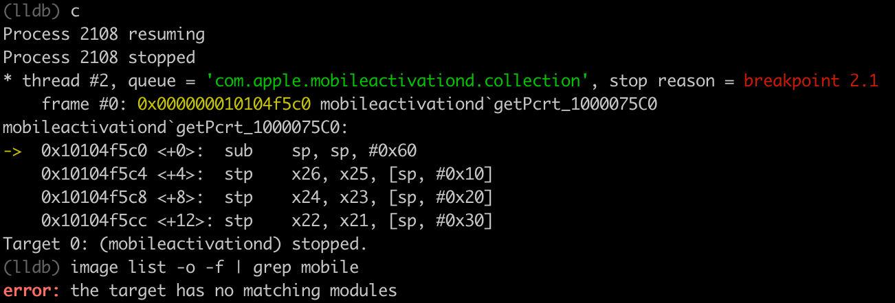

# image list心得

## 希望把Xcode中lldb中image list输出结果导出到文件

最终方案：lldb中运行script触发python交互环境，用python代码，把命令结果保存到文件中

具体步骤：

具体命令：

```py
(lldb) script
Python Interactive Interpreter. To exit, type 'quit()', 'exit()'.
>>> result = lldb.SBCommandReturnObject()
>>> lldb.debugger.GetCommandInterpreter().HandleCommand("image list -o -f", result)
2
>>> fd = open("/Users/crifan/Downloads/image_list_of_20220115_0959.txt", "w")
>>> fd.write(result.GetOutput())
100566
>>> fd.close()
>>> quit
(lldb)
```


输出文件内容：


## error the target has no matching modules

* 现象

此处，对于要去查看：`/usr/libexec/mobileactivationd`的`ALSR`基地址，报错：

```bash
(lldb) image list -o -f | grep mobile
error: the target has no matching modules
```



* 原因
  * lldb中的image list等命令，对于普通Linux中的额外命令的支持，很有限：
    * 只支持：后续grep 二进制库的全名
      * 举例
        * `image list -o -f | grep mobileactivationd`
    * 不支持：后续grep 二进制库的部分名称
      * 举例
        * `mobileactivationd`的部分name是`mobile`
          * `image list -o -f | grep mobile`

* 解决办法：改名二进制文件=库的全名

```bash
(lldb) image list -o -f | grep mobileactivationd
[  0] 0x0000000001048000 /usr/libexec/mobileactivationd(0x0000000101048000)
```
