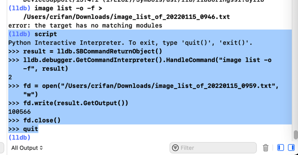
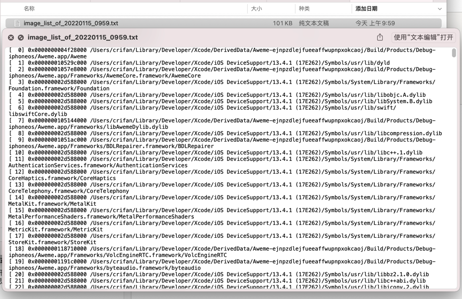

# image list心得

## 希望把Xcode中lldb中image list输出结果导出到文件

最终方案：lldb中运行script触发python交互环境，用python代码，把命令结果保存到文件中

具体步骤：

具体命令：

```py
(lldb) script
Python Interactive Interpreter. To exit, type 'quit()', 'exit()'.
>>> result = lldb.SBCommandReturnObject()
>>> lldb.debugger.GetCommandInterpreter().HandleCommand("image list -o -f", result)
2
>>> fd = open("/Users/crifan/Downloads/image_list_of_20220115_0959.txt", "w")
>>> fd.write(result.GetOutput())
100566
>>> fd.close()
>>> quit
(lldb)
```



输出文件内容：


