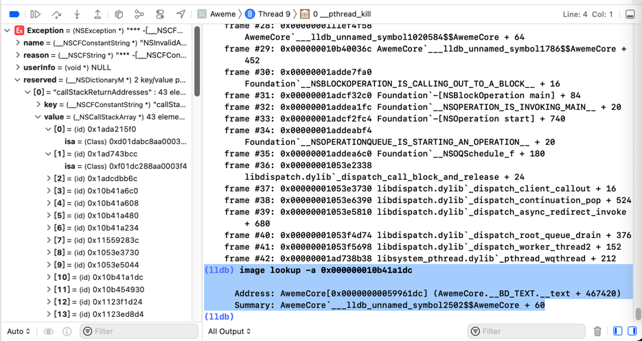
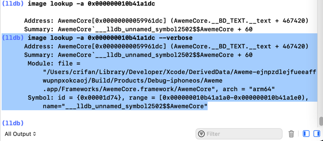

# image lookup的多命令对比举例

## `image lookup -a` vs `image lookup -v -a`==`image lookup -va`

### AwemeCore 0x000000010b41a1dc

* 
  ```bash
  (lldb) image lookup -a 0x000000010b41a1dc
        Address: AwemeCore[0x00000000059961dc] (AwemeCore.__BD_TEXT.__text + 467420)
        Summary: AwemeCore`___lldb_unnamed_symbol2502$$AwemeCore + 60
  ```

加上verbose，可以输出更加详细的信息：

* 
  ```bash
  (lldb) image lookup -a 0x000000010b41a1dc --verbose
        Address: AwemeCore[0x00000000059961dc] (AwemeCore.__BD_TEXT.__text + 467420)
        Summary: AwemeCore`___lldb_unnamed_symbol2502$$AwemeCore + 60
        Module: file = "/Users/crifan/Library/Developer/Xcode/DerivedData/Aweme-ejnpzdlejfueeaffwupnpxokcaoj/Build/Products/Debug-iphoneos/Aweme.app/Frameworks/AwemeCore.framework/AwemeCore", arch = "arm64"
        Symbol: id = {0x00001d74}, range = [0x000000010b41a1a0-0x000000010b41a1e0), name="___lldb_unnamed_symbol2502$$AwemeCore"
  ```

### AwemeCore 0x10f04f810

```bash
(lldb) image lookup -a 0x10f04f810
      Address: AwemeCore[0x000000000c587810] (AwemeCore.__BD_TEXT.__text + 113653776)
      Summary: AwemeCore`___lldb_unnamed_symbol1023498$$AwemeCore + 32

(lldb) image lookup -v -a 0x10f04f810
      Address: AwemeCore[0x000000000c587810] (AwemeCore.__BD_TEXT.__text + 113653776)
      Summary: AwemeCore`___lldb_unnamed_symbol1023498$$AwemeCore + 32
       Module: file = "/Users/crifan/Library/Developer/Xcode/DerivedData/Aweme-fswcidjoxbkibsdwekuzlsfcdqls/Build/Products/Debug-iphoneos/Aweme.app/Frameworks/AwemeCore.framework/AwemeCore", arch = "arm64"
       Symbol: id = {0x0014c028}, range = [0x000000010f04f7f0-0x000000010f04f844), name="___lldb_unnamed_symbol1023498$$AwemeCore"
```

### Module_Framework 0x0000000107dd18c4

```bash
(lldb) image lookup -a 0x0000000107dd18c4
      Address: Module_Framework[0x000000000198d8c4] (Module_Framework.__TEXT.__text + 26777796)
      Summary: Module_Framework`-[HAMPlayerInternal setStatus:]_block + 72

(lldb) image lookup -v -a 0x0000000107dd18c4
      Address: Module_Framework[0x000000000198d8c4] (Module_Framework.__TEXT.__text + 26777796)
      Summary: Module_Framework`-[HAMPlayerInternal setStatus:]_block + 72
       Module: file = "/Users/crifan/Library/Developer/Xcode/DerivedData/youtube-haehnttylwejqpfqywoxzkyxdyfa/Build/Products/Debug-iphoneos/youtube.app/Frameworks/Module_Framework.framework/Module_Framework", arch = "arm64"
       Symbol: id = {0x0003eee7}, range = [0x0000000107dd187c-0x0000000107dd1904), name="-[HAMPlayerInternal setStatus:]_block"
```

### akd 0x104B0C460

```bash
(lldb) image lookup -a 0x104B0C460
      Address: akd[0x00000001000a0460] (akd.__TEXT.__text + 639120)
      Summary: akd`___lldb_unnamed_symbol2575$$akd
(lldb) image lookup -va 0x104B0C460
      Address: akd[0x00000001000a0460] (akd.__TEXT.__text + 639120)
      Summary: akd`___lldb_unnamed_symbol2575$$akd
       Module: file = "/System/Library/PrivateFrameworks/AuthKit.framework/akd", arch = "arm64"
       Symbol: id = {0x00000c53}, range = [0x0000000104b0c460-0x0000000104b0e928), name="___lldb_unnamed_symbol2575$$akd"
```

### AppleStoreCore 0x000000010373d398

```bash
(lldb) image lookup -a 0x000000010373d398
      Address: AppleStoreCore[0x00000000000a9398] (AppleStoreCore.__TEXT.__text + 673828)
      Summary: AppleStoreCore`___lldb_unnamed_symbol3027$$AppleStoreCore + 872

(lldb) image lookup -va 0x000000010373d398
      Address: AppleStoreCore[0x00000000000a9398] (AppleStoreCore.__TEXT.__text + 673828)
      Summary: AppleStoreCore`___lldb_unnamed_symbol3027$$AppleStoreCore + 872
       Module: file = "/Users/crifan/Library/Developer/Xcode/DerivedData/Jolly-fbcdzphrbokcgxhejxlslydrdyaa/Build/Products/Debug-iphoneos/Jolly.app/Frameworks/AppleStoreCore.framework/AppleStoreCore", arch = "arm64"
       Symbol: id = {0x000040fa}, range = [0x000000010373d030-0x000000010373d640), name="___lldb_unnamed_symbol3027$$AppleStoreCore"
```

## `image lookup -vs` vs `image lookup -vn`

### Security SSLHandshake

```bash
(lldb) image lookup -vs SSLHandshake
1 symbols match 'SSLHandshake' in /Users/crifan/Library/Developer/Xcode/iOS DeviceSupport/15.1 (19B74) arm64e/Symbols/System/Library/Frameworks/Security.framework/Security:
        Address: Security[0x00000001891501c0] (Security.__TEXT.__text + 67704)
        Summary: Security`SSLHandshake
         Module: file = "/Users/crifan/Library/Developer/Xcode/iOS DeviceSupport/15.1 (19B74) arm64e/Symbols/System/Library/Frameworks/Security.framework/Security", arch = "arm64e"
         Symbol: id = {0x00001da4}, range = [0x000000018acc01c0-0x000000018acc0320), name="SSLHandshake"

(lldb) image lookup -vn SSLHandshake
1 match found in /Users/crifan/Library/Developer/Xcode/iOS DeviceSupport/15.1 (19B74) arm64e/Symbols/System/Library/Frameworks/Security.framework/Security:
        Address: Security[0x00000001891501c0] (Security.__TEXT.__text + 67704)
        Summary: Security`SSLHandshake
         Module: file = "/Users/crifan/Library/Developer/Xcode/iOS DeviceSupport/15.1 (19B74) arm64e/Symbols/System/Library/Frameworks/Security.framework/Security", arch = "arm64e"
         Symbol: id = {0x00001da4}, range = [0x000000018acc01c0-0x000000018acc0320), name="SSLHandshake"
```

### Security SecTrustEvaluateFastAsync

```bash
(lldb) image lookup -vs SecTrustEvaluateFastAsync
1 symbols match 'SecTrustEvaluateFastAsync' in /Users/crifan/Library/Developer/Xcode/iOS DeviceSupport/15.1 (19B74) arm64e/Symbols/System/Library/Frameworks/Security.framework/Security:
        Address: Security[0x0000000189226304] (Security.__TEXT.__text + 944572)
        Summary: Security`SecTrustEvaluateFastAsync
         Module: file = "/Users/crifan/Library/Developer/Xcode/iOS DeviceSupport/15.1 (19B74) arm64e/Symbols/System/Library/Frameworks/Security.framework/Security", arch = "arm64e"
         Symbol: id = {0x000020a1}, range = [0x000000018b40a304-0x000000018b40a3b0), name="SecTrustEvaluateFastAsync"

(lldb) image lookup -vn SecTrustEvaluateFastAsync
1 match found in /Users/crifan/Library/Developer/Xcode/iOS DeviceSupport/15.1 (19B74) arm64e/Symbols/System/Library/Frameworks/Security.framework/Security:
        Address: Security[0x0000000189226304] (Security.__TEXT.__text + 944572)
        Summary: Security`SecTrustEvaluateFastAsync
         Module: file = "/Users/crifan/Library/Developer/Xcode/iOS DeviceSupport/15.1 (19B74) arm64e/Symbols/System/Library/Frameworks/Security.framework/Security", arch = "arm64e"
         Symbol: id = {0x000020a1}, range = [0x000000018b40a304-0x000000018b40a3b0), name="SecTrustEvaluateFastAsync"
```

### initialize

* 用`symbol`找：只找到1个

```bash
(lldb) image lookup -vs initialize
1 symbols match 'initialize' in /Users/crifan/Library/Developer/Xcode/iOS DeviceSupport/15.1 (19B74) arm64e/Symbols/System/Library/Frameworks/WatchConnectivity.framework/WatchConnectivity:
        Address: WatchConnectivity[0x00000001bf42bdb8] (WatchConnectivity.__TEXT.__text + 123420)
        Summary: WatchConnectivity`initialize
         Module: file = "/Users/crifan/Library/Developer/Xcode/iOS DeviceSupport/15.1 (19B74) arm64e/Symbols/System/Library/Frameworks/WatchConnectivity.framework/WatchConnectivity", arch = "arm64e"
         Symbol: id = {0x0000021c}, range = [0x00000001c0507db8-0x00000001c0507e9c), name="initialize"
```

* 用`n`=`name`找：找到非常多

此处只列出部分内容：

```bash
(lldb) image lookup -vn initialize
1 match found in /Users/crifan/Library/Developer/Xcode/iOS DeviceSupport/15.1 (19B74) arm64e/Symbols/usr/lib/dyld:
        Address: dyld[0x000000000000afd0] (dyld.__TEXT.__text + 40912)
        Summary: dyld`dyld4::RuntimeState::initialize()
         Module: file = "/Users/crifan/Library/Developer/Xcode/iOS DeviceSupport/15.1 (19B74) arm64e/Symbols/usr/lib/dyld", arch = "arm64e"
         Symbol: id = {0x000000c7}, range = [0x00000001032b6fd0-0x00000001032b70bc), name="dyld4::RuntimeState::initialize()", mangled="_ZN5dyld412RuntimeState10initializeEv"

2 matches found in /Users/crifan/Library/Developer/Xcode/iOS DeviceSupport/15.1 (19B74) arm64e/Symbols/System/Library/Frameworks/AVKit.framework/AVKit:
        Address: AVKit[0x000000019a386f48] (AVKit.__TEXT.__text + 330556)
        Summary: AVKit`+[AVChapter initialize]
         Module: file = "/Users/crifan/Library/Developer/Xcode/iOS DeviceSupport/15.1 (19B74) arm64e/Symbols/System/Library/Frameworks/AVKit.framework/AVKit", arch = "arm64e"
         Symbol: id = {0x0000063c}, range = [0x000000019b462f48-0x000000019b462fb8), name="+[AVChapter initialize]"
        Address: AVKit[0x000000019a41a474] (AVKit.__TEXT.__text + 933992)
        Summary: AVKit`+[AVPlayerController initialize]
         Module: file = "/Users/crifan/Library/Developer/Xcode/iOS DeviceSupport/15.1 (19B74) arm64e/Symbols/System/Library/Frameworks/AVKit.framework/AVKit", arch = "arm64e"
         Symbol: id = {0x00001316}, range = [0x000000019b4f6474-0x000000019b4f6500), name="+[AVPlayerController initialize]"
...
1 match found in /Users/crifan/Library/Developer/Xcode/DerivedData/Jolly-fbcdzphrbokcgxhejxlslydrdyaa/Build/Products/Debug-iphoneos/Jolly.app/Frameworks/RevealServer.framework/RevealServer:
        Address: RevealServer[0x000000000004a9dc] (RevealServer.__TEXT.__text + 277116)
        Summary: RevealServer`+[IBAHTTPConnection initialize]
         Module: file = "/Users/crifan/Library/Developer/Xcode/DerivedData/Jolly-fbcdzphrbokcgxhejxlslydrdyaa/Build/Products/Debug-iphoneos/Jolly.app/Frameworks/RevealServer.framework/RevealServer", arch = "arm64e"
         Symbol: id = {0x00001189}, range = [0x00000001048b69dc-0x00000001048b6a30), name="+[IBAHTTPConnection initialize]"
...
```

## `image lookup -s` vs `image lookup -n` vs `image lookup -r -s`

### statfs

```bash
(lldb) image lookup -s statfs
1 symbols match 'statfs' in /Users/crifan/Library/Developer/Xcode/iOS DeviceSupport/13.3.1 (17D50)/Symbols/usr/lib/dyld:
        Address: dyld[0x000000000004c324] (dyld.__TEXT.__text + 308004)
        Summary: dyld`statfs64
1 symbols match 'statfs' in /Users/crifan/Library/Developer/Xcode/DerivedData/Aweme-fswcidjoxbkibsdwekuzlsfcdqls/Build/Products/Debug-iphoneos/Aweme.app/Frameworks/AwemeCore.framework/AwemeCore:


1 symbols match 'statfs' in /Users/crifan/Library/Developer/Xcode/iOS DeviceSupport/13.3.1 (17D50)/Symbols/usr/lib/system/libsystem_kernel.dylib:
        Address: libsystem_kernel.dylib[0x000000018028c8c4] (libsystem_kernel.dylib.__TEXT.__text + 160068)
        Summary: libsystem_kernel.dylib`statfs


(lldb) image lookup -n statfs
1 match found in /Users/crifan/Library/Developer/Xcode/iOS DeviceSupport/13.3.1 (17D50)/Symbols/usr/lib/dyld:
        Address: dyld[0x000000000004c324] (dyld.__TEXT.__text + 308004)
        Summary: dyld`statfs64
1 match found in /Users/crifan/Library/Developer/Xcode/iOS DeviceSupport/13.3.1 (17D50)/Symbols/usr/lib/system/libsystem_kernel.dylib:
        Address: libsystem_kernel.dylib[0x000000018028c8c4] (libsystem_kernel.dylib.__TEXT.__text + 160068)
        Summary: libsystem_kernel.dylib`statfs


(lldb) image lookup -r -s statfs
4 symbols match the regular expression 'statfs' in /Users/crifan/Library/Developer/Xcode/iOS DeviceSupport/13.3.1 (17D50)/Symbols/usr/lib/dyld:
        Address: dyld[0x000000000004c0a4] (dyld.__TEXT.__text + 307364)
        Summary: dyld`fstatfs64        Address: dyld[0x000000000004c0a4] (dyld.__TEXT.__text + 307364)
        Summary: dyld`fstatfs64        Address: dyld[0x000000000004c324] (dyld.__TEXT.__text + 308004)
        Summary: dyld`statfs64        Address: dyld[0x000000000004c324] (dyld.__TEXT.__text + 308004)
        Summary: dyld`statfs64
2 symbols match the regular expression 'statfs' in /Users/crifan/Library/Developer/Xcode/DerivedData/Aweme-fswcidjoxbkibsdwekuzlsfcdqls/Build/Products/Debug-iphoneos/Aweme.app/Frameworks/AwemeCore.framework/AwemeCore:
...
2 symbols match the regular expression 'statfs' in /Users/crifan/Library/Developer/Xcode/iOS DeviceSupport/13.3.1 (17D50)/Symbols/System/Library/Frameworks/Foundation.framework/Foundation:
        Address: Foundation[0x00000001809a3160] (Foundation.__TEXT.__stubs + 10188)
        Summary: Foundation`symbol stub for: fstatfs        Address: Foundation[0x00000001809a3f34] (Foundation.__TEXT.__stubs + 13728)
        Summary: Foundation`symbol stub for: statfs
2 symbols match the regular expression 'statfs' in /Users/crifan/Library/Developer/Xcode/DerivedData/Aweme-fswcidjoxbkibsdwekuzlsfcdqls/Build/Products/Debug-iphoneos/Aweme.app/Frameworks/libAwemeDylib.dylib:
        Address: libAwemeDylib.dylib[0x000000000003896c] (libAwemeDylib.dylib.__TEXT.__stubs + 1104)
        Summary: libAwemeDylib.dylib`symbol stub for: fstatfs        Address: libAwemeDylib.dylib[0x0000000000038ca8] (libAwemeDylib.dylib.__TEXT.__stubs + 1932)
        Summary: libAwemeDylib.dylib`symbol stub for: statfs
2 symbols match the regular expression 'statfs' in /Users/crifan/Library/Developer/Xcode/iOS DeviceSupport/13.3.1 (17D50)/Symbols/usr/lib/libsqlite3.dylib:
        Address: libsqlite3.dylib[0x0000000182217478] (libsqlite3.dylib.__TEXT.__stubs + 744)
        Summary: libsqlite3.dylib`symbol stub for: fstatfs        Address: libsqlite3.dylib[0x0000000182217730] (libsqlite3.dylib.__TEXT.__stubs + 1440)
        Summary: libsqlite3.dylib`symbol stub for: statfs
1 symbols match the regular expression 'statfs' in /Users/crifan/Library/Developer/Xcode/iOS DeviceSupport/13.3.1 (17D50)/Symbols/System/Library/Frameworks/IOKit.framework/Versions/A/IOKit:
        Address: IOKit[0x0000000181458f9c] (IOKit.__TEXT.__stubs + 5088)
        Summary: IOKit`symbol stub for: statfs
1 symbols match the regular expression 'statfs' in /Users/crifan/Library/Developer/Xcode/iOS DeviceSupport/13.3.1 (17D50)/Symbols/System/Library/Frameworks/ImageIO.framework/ImageIO:
        Address: ImageIO[0x0000000180e541ac] (ImageIO.__TEXT.__stubs + 8340)
        Summary: ImageIO`symbol stub for: statfs
1 symbols match the regular expression 'statfs' in /Users/crifan/Library/Developer/Xcode/iOS DeviceSupport/13.3.1 (17D50)/Symbols/System/Library/Frameworks/SystemConfiguration.framework/SystemConfiguration:
        Address: SystemConfiguration[0x000000018073646c] (SystemConfiguration.__TEXT.__stubs + 3000)
        Summary: SystemConfiguration`symbol stub for: fstatfs
1 symbols match the regular expression 'statfs' in /Users/crifan/Library/Developer/Xcode/iOS DeviceSupport/13.3.1 (17D50)/Symbols/usr/lib/system/libcopyfile.dylib:
        Address: libcopyfile.dylib[0x00000001a05aa260] (libcopyfile.dylib.__TEXT.__stubs + 624)
        Summary: libcopyfile.dylib`symbol stub for: fstatfs
1 symbols match the regular expression 'statfs' in /Users/crifan/Library/Developer/Xcode/iOS DeviceSupport/13.3.1 (17D50)/Symbols/usr/lib/system/libremovefile.dylib:
        Address: libremovefile.dylib[0x00000001b5fc0b74] (libremovefile.dylib.__TEXT.__stubs + 144)
        Summary: libremovefile.dylib`symbol stub for: fstatfs
3 symbols match the regular expression 'statfs' in /Users/crifan/Library/Developer/Xcode/iOS DeviceSupport/13.3.1 (17D50)/Symbols/usr/lib/system/libsystem_c.dylib:
        Address: libsystem_c.dylib[0x00000001800883a4] (libsystem_c.dylib.__TEXT.__text + 4268)
        Summary: libsystem_c.dylib`cvt_statfs_to_statvfs        Address: libsystem_c.dylib[0x00000001800fa510] (libsystem_c.dylib.__TEXT.__stubs + 1272)
        Summary: libsystem_c.dylib`symbol stub for: fstatfs        Address: libsystem_c.dylib[0x00000001800fab10] (libsystem_c.dylib.__TEXT.__stubs + 2808)
        Summary: libsystem_c.dylib`symbol stub for: statfs
1 symbols match the regular expression 'statfs' in /Users/crifan/Library/Developer/Xcode/iOS DeviceSupport/13.3.1 (17D50)/Symbols/usr/lib/system/libsystem_info.dylib:
        Address: libsystem_info.dylib[0x00000001803634ac] (libsystem_info.dylib.__TEXT.__stubs + 1836)
        Summary: libsystem_info.dylib`symbol stub for: statfs
4 symbols match the regular expression 'statfs' in /Users/crifan/Library/Developer/Xcode/iOS DeviceSupport/13.3.1 (17D50)/Symbols/usr/lib/system/libsystem_kernel.dylib:
        Address: libsystem_kernel.dylib[0x000000018028b3fc] (libsystem_kernel.dylib.__TEXT.__text + 154748)
        Summary: libsystem_kernel.dylib`fstatfs        Address: libsystem_kernel.dylib[0x000000018028b3fc] (libsystem_kernel.dylib.__TEXT.__text + 154748)
        Summary: libsystem_kernel.dylib`fstatfs        Address: libsystem_kernel.dylib[0x000000018028c8c4] (libsystem_kernel.dylib.__TEXT.__text + 160068)
        Summary: libsystem_kernel.dylib`statfs        Address: libsystem_kernel.dylib[0x000000018028c8c4] (libsystem_kernel.dylib.__TEXT.__text + 160068)
        Summary: libsystem_kernel.dylib`statfs
1 symbols match the regular expression 'statfs' in /Users/crifan/Library/Developer/Xcode/iOS DeviceSupport/13.3.1 (17D50)/Symbols/usr/lib/libarchive.2.dylib:
        Address: libarchive.2.dylib[0x00000001a027e28c] (libarchive.2.dylib.__TEXT.__stubs + 1212)
        Summary: libarchive.2.dylib`symbol stub for: fstatfs
1 symbols match the regular expression 'statfs' in /Users/crifan/Library/Developer/Xcode/iOS DeviceSupport/13.3.1 (17D50)/Symbols/usr/lib/libMobileGestalt.dylib:
        Address: libMobileGestalt.dylib[0x000000018149fd18] (libMobileGestalt.dylib.__TEXT.__stubs + 2280)
        Summary: libMobileGestalt.dylib`symbol stub for: statfs
...
1 symbols match the regular expression 'statfs' in /Users/crifan/Library/Developer/Xcode/iOS DeviceSupport/13.3.1 (17D50)/Symbols/System/Library/PrivateFrameworks/MobileKeyBag.framework/MobileKeyBag:
        Address: MobileKeyBag[0x00000001822554d4] (MobileKeyBag.__TEXT.__stubs + 2460)
        Summary: MobileKeyBag`symbol stub for: statfs
1 symbols match the regular expression 'statfs' in /Users/crifan/Library/Developer/Xcode/iOS DeviceSupport/13.3.1 (17D50)/Symbols/System/Library/PrivateFrameworks/APFS.framework/APFS:
        Address: APFS[0x00000001aa73f114] (APFS.__TEXT.__stubs + 948)
        Summary: APFS`symbol stub for: fstatfs
1 symbols match the regular expression 'statfs' in /Users/crifan/Library/Developer/Xcode/iOS DeviceSupport/13.3.1 (17D50)/Symbols/System/Library/PrivateFrameworks/ktrace.framework/ktrace:
        Address: ktrace[0x00000001b3d0555c] (ktrace.__TEXT.__stubs + 3552)
        Summary: ktrace`symbol stub for: statfs
...
2 symbols match the regular expression 'statfs' in /Users/crifan/Library/Developer/Xcode/iOS DeviceSupport/13.3.1 (17D50)/Symbols/System/Library/PrivateFrameworks/CoreServicesInternal.framework/CoreServicesInternal:
        Address: CoreServicesInternal[0x000000018178fd50] (CoreServicesInternal.__TEXT.__text + 116648)
        Summary: CoreServicesInternal`GetStatfsByFSID(fsid, statfs*, int)        Address: CoreServicesInternal[0x0000000181798ca8] (CoreServicesInternal.__TEXT.__stubs + 3264)
        Summary: CoreServicesInternal`symbol stub for: statfs
```
