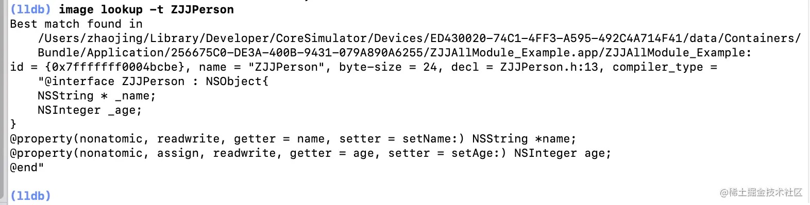

# image lookup的单命令举例

## `image lookup -a`

### lldb官网示例

```bash
(lldb) image lookup --address 0x100000aa3
      Address: a.out[0x0000000100000aa3] (a.out.__TEXT.__text + 131)
      Summary: a.out`main + 67 at main.c:13

(lldb) image lookup -a 0x1000
      Address: a.out[0x0000000000001000] (a.out.__PAGEZERO + 4096)

      Address: libsystem_c.dylib[0x0000000000001000] (libsystem_c.dylib.__TEXT.__text + 928)
      Summary: libsystem_c.dylib`mcount + 9

      Address: libsystem_dnssd.dylib[0x0000000000001000] (libsystem_dnssd.dylib.__TEXT.__text + 456)
      Summary: libsystem_dnssd.dylib`ConvertHeaderBytes + 38

      Address: libsystem_kernel.dylib[0x0000000000001000] (libsystem_kernel.dylib.__TEXT.__text + 1116)
      Summary: libsystem_kernel.dylib`clock_get_time + 102

(lldb) image lookup -a 0x1000 a.out
      Address: a.out[0x0000000000001000] (a.out.__PAGEZERO + 4096)

(lldb) image lookup --address 0x100123aa3
      Address: a.out[0x0000000100000aa3] (a.out.__TEXT.__text + 131)
      Summary: a.out`main + 67 at main.c:13
```

### AwemeCore相关

```bash
(lldb) image lookup -a 0x114fb69c4
      Address: AwemeCore[0x000000001009a9c4] (AwemeCore.__BD_TEXT.__text + 175598020)
      Summary: AwemeCore`___lldb_unnamed_symbol1674948$$AwemeCore
(lldb) image lookup -a 0x10aed1514
      Address: AwemeCore[0x0000000005fb5514] (AwemeCore.__BD_TEXT.__text + 6886676)
      Summary: AwemeCore`___lldb_unnamed_symbol49294$$AwemeCore
(lldb) image lookup -a 0x10ad33da0
      Address: AwemeCore[0x0000000005e17da0] (AwemeCore.__BD_TEXT.__text + 5193120)
      Summary: AwemeCore`___lldb_unnamed_symbol36558$$AwemeCore

(lldb) image lookup -a 0x10a7125c4
      Address: AwemeCore[0x0000000005a3a5c4] (AwemeCore.__BD_TEXT.__text + 1140164)
      Summary: AwemeCore`___lldb_unnamed_symbol6381$$AwemeCore

(lldb) image lookup -a 0x11427c178
      Address: AwemeCore[0x000000000fa14178] (AwemeCore.__BD_TEXT.__text + 168755576)
      Summary: AwemeCore`___lldb_unnamed_symbol1588524$$AwemeCore

(lldb) image lookup -a 0x1128fc41c
      Address: AwemeCore[0x000000000fa1441c] (AwemeCore.__BD_TEXT.__text + 168756252)
      Summary: AwemeCore`___lldb_unnamed_symbol1588526$$AwemeCore
```

### Apple Store相关

#### AppleAccountUI

```bash
(lldb) image lookup -a 0x1af6922fc
      Address: AppleAccountUI[0x00000001ae0222fc] (AppleAccountUI.__TEXT.__text + 475404)
      Summary: AppleAccountUI`-[AAUISignInViewController _attemptAuthenticationWithContext:].cold.1
```

#### StoreKitUI

```bash
(lldb) image lookup -a 0x00000001b0b30578
      Address: StoreKitUI[0x00000001ae9f0578] (StoreKitUI.__TEXT.__objc_methlist + 2432)
      Summary: StoreKitUI`_OBJC_$_CLASS_METHODS_SKUIImageCollectionViewCell + 16
```

### YouTube相关

#### YouTube

```bash
(lldb) image lookup -a 0x0000000105163494
      Address: YouTube[0x00000001003db494] (YouTube.__TEXT.__text + 4013856)
      Summary: YouTube`___lldb_unnamed_symbol22084$$YouTube + 164
```

#### Module_Framework

```bash
(lldb) image lookup -a 0x00000001063d9850
      Address: Module_Framework[0x000000000194d850] (Module_Framework.__TEXT.__text + 26515536)
      Summary: Module_Framework`___lldb_unnamed_symbol15681$$Module_Framework + 376
(lldb) image lookup -a 0x00000001063d8d34
      Address: Module_Framework[0x000000000194cd34] (Module_Framework.__TEXT.__text + 26512692)
      Summary: Module_Framework`___lldb_unnamed_symbol15676$$Module_Framework + 80
(lldb) image lookup -a 0x000000010888211c
      Address: Module_Framework[0x0000000003df611c] (Module_Framework.__TEXT.__text + 64954652)
      Summary: Module_Framework`___lldb_unnamed_symbol170908$$Module_Framework + 52
(lldb) image lookup -a 0x0000000108884064
      Address: Module_Framework[0x0000000003df8064] (Module_Framework.__TEXT.__text + 64962660)
      Summary: Module_Framework`___lldb_unnamed_symbol171000$$Module_Framework + 28
(lldb) image lookup -a 0x0000000108388e4c
      Address: Module_Framework[0x00000000038fce4c] (Module_Framework.__TEXT.__text + 59739724)
      Summary: Module_Framework`___lldb_unnamed_symbol110205$$Module_Framework + 40
(lldb) image lookup -a 0x00000001063d999c
      Address: Module_Framework[0x000000000194d99c] (Module_Framework.__TEXT.__text + 26515868)
      Summary: Module_Framework`-[HAMCronetDataLoadTask startWithDelegate:delegateQueue:]_block_block + 36

(lldb) image lookup -a 0x1062d4298
      Address: Module_Framework[0x0000000003e84298] (Module_Framework.__TEXT.__stubs + 29856)
      Summary: Module_Framework`symbol stub for: objc_msgSend

(lldb) image lookup -a 0x103a97ed4
      Address: Module_Framework[0x0000000000f8fed4] (Module_Framework.__TEXT.__text + 16301780)
      Summary: Module_Framework`-[MLHAMQueuePlayerSegmentList updatePeriodCurrentTimeForSegment:]_block

(lldb) image lookup -a 0x108806a08
      Address: Module_Framework[0x000000000198aa08] (Module_Framework.__TEXT.__text + 26765832)
      Summary: Module_Framework`-[HAMPlayerInternal pause]

(lldb) im loo -a 0x00000001091694a4
      Address: Module_Framework[0x0000000003df94a4] (Module_Framework.__TEXT.__text + 64967844)
      Summary: Module_Framework`___lldb_unnamed_symbol171165$$Module_Framework
```

### `-a`找不到的例子

另外，通过`-a`也有找不到的

比如：

进入：跳板汇编代码后

```asm
->  0x112925950: adrp   x16, -70002
    0x112925954: ldr    x16, [x16, #0xb30]
    0x112925958: br     x16
    0x11292595c: adrp   x16, -70002
    0x112925960: ldr    x16, [x16, #0xb38]
    0x112925964: br     x16
    0x112925968: adrp   x16, -70002
    0x11292596c: ldr    x16, [x16, #0xb40]
```

去查找：`0x112925950`

```bash
(lldb) image lookup -a 0x112925950
      Address: AwemeCore[0x000000001147d950] (AwemeCore.__BD_TEXT.__stubs + 28440)
      Summary:
```

就是：找不到的。

其他找不到的例子：

```bash
(lldb) image lookup -a 0x114af2380
      Address: AwemeCore[0x000000001147a380] (AwemeCore.__BD_TEXT.__stubs + 14664)
      Summary:
```

### `-a`找出是`data`的例子

```bash
(lldb) image lookup -a 0x00000001f2468c6a
      Address: AppleAccountUI[0x00000001f0328c6a] (AppleAccountUI.__DATA_DIRTY.__objc_data + 242)
      Summary: (void *)0x73e800000001f246
```

### 先`_shortMethodDescription`再用`-a`查找函数地址，可以找到Class函数

对于`_shortMethodDescription`查看到的函数地址：

```bash
  + (id) awe_userRecommendImageNamed:(id)arg1; (0x114d06fcc)
  + (id) awe_userRecommendImageNamed:(id)arg1 compatibleWithTraitCollection:(id)arg2; (0x114d06fdc)
```

用`-a`去查找对应地址，可以找到，对应的`Class`级别的函数：

```bash
(lldb) image lookup -a 0x114d06fcc
      Address: AwemeCore[0x000000000fffefcc] (AwemeCore.__BD_TEXT.__text + 174960588)
      Summary: AwemeCore`+[UIImage(AWEUserRecommend) awe_userRecommendImageNamed:]
(lldb) image lookup -a 0x114d06fdc
      Address: AwemeCore[0x000000000fffefdc] (AwemeCore.__BD_TEXT.__text + 174960604)
      Summary: AwemeCore`+[UIImage(AWEUserRecommend) awe_userRecommendImageNamed:compatibleWithTraitCollection:]
```

### 其他

```bash
(lldb) image lookup -a 0x1021a4ab0
      Address: libsubstrate.dylib[0x0000000000014ab0] (libsubstrate.dylib.__TEXT.__stubs + 516)
      Summary: libsubstrate.dylib`symbol stub for: _dyld_get_all_image_infos

(lldb) image lookup -a 0x0000000105c636fc
      Address: substitute-inserter.dylib[0x00000000000076fc] (substitute-inserter.dylib.__TEXT.__text + 11384)
      Summary: substitute-inserter.dylib`___lldb_unnamed_symbol6$$substitute-inserter.dylib + 3536
```

## `image lookup -n` == `image lookup -name`

### getInt

```bash
(lldb) image lookup -name getInt
1 match found in /Users/liu_david/Library/Developer/Xcode/DerivedData/TestWeak-egnzdbndwsiikvcheqmcxvkqnwbw/Build/Products/Debug/TestWeak:
        Address: TestWeak[0x0000000100001a70] (TestWeak.__TEXT.__text + 48)
        Summary: TestWeak`-[Person getInt] at main.m:29
1 match found in /usr/lib/libicucore.A.dylib:
        Address: libicucore.A.dylib[0x000000000003b046] (libicucore.A.dylib.__TEXT.__text + 239078)
        Summary: libicucore.A.dylib`icu::ResourceBundle::getInt(UErrorCode&) const
1 match found in /System/Library/Frameworks/Security.framework/Versions/A/Security:
        Address: Security[0x000000000012260e] (Security.__TEXT.__text + 1184206)
        Summary: Security`Security::Context::getInt(unsigned int, int) const
1 match found in /System/Library/Frameworks/SceneKit.framework/Versions/A/SceneKit:
        Address: SceneKit[0x000000000024f396] (SceneKit.__TEXT.__text + 2414070)
        Summary: SceneKit`getInt(std::__1::basic_string<char, std::__1::char_traits<char>, std::__1::allocator<char> > const&, std::__1::basic_string<char, std::__1::char_traits<char>, std::__1::allocator<char> >&, int&, bool, bool)
1 match found in /usr/lib/libTelephonyUtilDynamic.dylib:
        Address: libTelephonyUtilDynamic.dylib[0x0000000000012e10] (libTelephonyUtilDynamic.dylib.__TEXT.__text + 69904)
        Summary: libTelephonyUtilDynamic.dylib`ctu::cf::map_adapter::getInt(__CFString const*, int) const
1 match found in /System/Library/PrivateFrameworks/CorePrediction.framework/Versions/A/CorePrediction:
        Address: CorePrediction[0x00000000000475c4] (CorePrediction.__TEXT.__text + 286980)
        Summary: CorePrediction`-[CPMLEvalutionResult getInt]
```

### transformOtherModelToSuit:

```bash
(lldb) image lookup -n transformOtherModelToSuit:
1 match found in /Users/crifan/Library/Developer/Xcode/DerivedData/DiDi-cwpbvvyvqmeijmcjnneothzuthsy/Build/Products/Debug-iphonesimulator/DiDi.app/DiDi:
        Address: DiDi[0x0000000100293d60] (DiDi.__TEXT.__text + 2693664)
        Summary: DiDi`+[FW_BetFunction transformOtherModelToSuit:] at FW_BetFunction.m:107
```

### ___lldb_unnamed_symbol2575$$akd

```bash
(lldb) image lookup -n ___lldb_unnamed_symbol2575$$akd
1 match found in /System/Library/PrivateFrameworks/AuthKit.framework/akd:
        Address: akd[0x00000001000a0460] (akd.__TEXT.__text + 639120)
        Summary: akd`___lldb_unnamed_symbol2575$$akd
```

### "+[UMUserManager sharedManager]"

```bash
(lldb) image lookup -n "+[UMUserManager sharedManager]"
1 match found in /Users/crifan/Library/Developer/Xcode/iOS DeviceSupport/15.1 (19B74) arm64e/Symbols/System/Library/PrivateFrameworks/UserManagement.framework/UserManagement:
        Address: UserManagement[0x000000019ffdb3e4] (UserManagement.__TEXT.__text + 1896)
        Summary: UserManagement`+[UMUserManager sharedManager]
```

## `image lookup -r -n` == `image lookup -rn` == `im loo -rn`

### objc_msgSend

```bash
(lldb) image lookup -r -n objc_msgSend
7 matches found in /Users/crifan/Library/Developer/Xcode/iOS DeviceSupport/13.7 (17H35)/Symbols/usr/lib/libobjc.A.dylib:
        Address: libobjc.A.dylib[0x00000001801b7e60] (libobjc.A.dylib.__TEXT.__text + 2816)
        Summary: libobjc.A.dylib`_objc_msgSend_uncached        Address: libobjc.A.dylib[0x00000001801b7b20] (libobjc.A.dylib.__TEXT.__text + 1984)
        Summary: libobjc.A.dylib`objc_msgSend        Address: libobjc.A.dylib[0x00000001801b7ce0] (libobjc.A.dylib.__TEXT.__text + 2432)
        Summary: libobjc.A.dylib`objc_msgSendSuper        Address: libobjc.A.dylib[0x00000001801b7d60] (libobjc.A.dylib.__TEXT.__text + 2560)
        Summary: libobjc.A.dylib`objc_msgSendSuper2        Address: libobjc.A.dylib[0x00000001801b8080] (libobjc.A.dylib.__TEXT.__text + 3360)
        Summary: libobjc.A.dylib`objc_msgSendSuper2_debug        Address: libobjc.A.dylib[0x00000001801b8060] (libobjc.A.dylib.__TEXT.__text + 3328)
        Summary: libobjc.A.dylib`objc_msgSend_debug        Address: libobjc.A.dylib[0x00000001801b8040] (libobjc.A.dylib.__TEXT.__text + 3296)
        Summary: libobjc.A.dylib`objc_msgSend_noarg
2 matches found in /Users/crifan/Library/Developer/Xcode/DerivedData/Aweme-fswcidjoxbkibsdwekuzlsfcdqls/Build/Products/Debug-iphoneos/Aweme.app/Frameworks/libcycript.dylib:
        Address: libcycript.dylib[0x0000000000069cb8] (libcycript.dylib.__TEXT.__text + 416952)
        Summary: libcycript.dylib`$objc_msgSend(OpaqueJSContext const*, OpaqueJSValue*, OpaqueJSValue*, unsigned long, OpaqueJSValue const* const*, OpaqueJSValue const**)        Address: libcycript.dylib[0x000000000006d318] (libcycript.dylib.__TEXT.__text + 430872)
        Summary: libcycript.dylib`$objc_msgSend(OpaqueJSContext const*, OpaqueJSValue*, OpaqueJSValue*, unsigned long, OpaqueJSValue const* const*)
```

### accountsWithAccountType

```bash
(lldb) image lookup -r -n accountsWithAccountType
44 matches found in /Users/crifan/Library/Developer/Xcode/iOS DeviceSupport/15.1 (19B74) arm64e/Symbols/System/Library/Frameworks/Accounts.framework/Accounts:
        Address: Accounts[0x0000000181af486c] (Accounts.__TEXT.__text + 26736)
        Summary: Accounts`-[ACAccountStore accountsWithAccountTypeIdentifiers:preloadedProperties:error:]        Address: Accounts[0x0000000181af5fbc] (Accounts.__TEXT.__text + 32704)
        Summary: Accounts`__79-[ACAccountStore accountsWithAccountTypeIdentifiers:preloadedProperties:error:]_block_invoke        Address: Accounts[0x0000000181af6e08] (Accounts.__TEXT.__text + 36364)
        Summary: Accounts`__79-[ACAccountStore accountsWithAccountTypeIdentifiers:preloadedProperties:error:]_block_invoke_2        Address: Accounts[0x0000000181af9328] (Accounts.__TEXT.__text + 45868)
        Summary: Accounts`__56-[ACAccountStore accountsWithAccountType:options:error:]_block_invoke_2        Address: Accounts[0x0000000181afb2cc] (Accounts.__TEXT.__text + 53968)
        Summary: Accounts`-[ACAccountStore accountsWithAccountType:]        Address: Accounts[0x0000000181afb944] (Accounts.__TEXT.__text + 55
...
```

找到了太多的结果。

### "accountsWithAccountType:"

所以故意用`"accountsWithAccountType:"`缩小范围：

```bash
(lldb) image lookup -r -n "accountsWithAccountType:"
27 matches found in /Users/crifan/Library/Developer/Xcode/iOS DeviceSupport/15.1 (19B74) arm64e/Symbols/System/Library/Frameworks/Accounts.framework/Accounts:
        Address: Accounts[0x0000000181af9328] (Accounts.__TEXT.__text + 45868)
        Summary: Accounts`__56-[ACAccountStore accountsWithAccountType:options:error:]_block_invoke_2        Address: Accounts[0x0000000181afb2cc] (Accounts.__TEXT.__text + 53968)
        Summary: Accounts`-[ACAccountStore accountsWithAccountType:]        Address: Accounts[0x0000000181afc3bc] (Accounts.__TEXT.__text + 58304)
        Summary: Accounts`-[ACAccountStore accountsWithAccountType:options:completion:]        Address: Accounts[0x0000000181afcb30] (Accounts.__TEXT.__text + 60212)
        Summary: Accounts`__42-[ACAccountStore accountsWithAccountType:]_block_invoke        Address: Accounts[0x0000000181afcbb0] (Accounts.__TEXT.__text + 60340)
        Summary: Accounts`-[ACAccountStore accountsWithAccountType:options:error:]        Address: Accounts[0x0000000181afd1bc] (Accounts.__TEXT.__text + 61888)
        Summary: Accounts`__56-[ACAccountStore accountsWithAccountType:options:error:]_block_invoke        Address: Accounts[0x0000000181afd474] (Accounts.__TEXT.__text + 62584)
        Summary: Accounts`__61-[ACAccountStore accountsWithAccountType:options:completion:]_block_invoke_2        Address: Accounts[0x0000000181b001ac] (Accounts.__TEXT.__text + 74160)
        Summary: Accounts`__61-[ACAccountStore accountsWithAccountType:options:completion:]_block_invoke        Address: Accounts[0x0000000181b00a28] (Accounts.__TEXT.__text + 76332)
        Summary: Accounts`__42-[ACAccountStore accountsWithAccountType:]_block_invoke_2        Address: Accounts[0x0000000181b064f0] (Accounts.__TEXT.__text + 99572)
        Summary: Accounts`__42-[ACAccountStore accountsWithAccountType:]_block_invoke.170        Address: Accounts[0x0000000181b0653c] (Accounts.__TEXT.__text + 99648)
        Summary: Accounts`__56-[ACAccountStore accountsWithAccountType:options:error:]_block_invoke.179        Address: Accounts[0x0000000181b06598] (Accounts.__TEXT.__text + 99740)
        Summary: Accounts`-[ACAccountStore accountsWithAccountType:completion:]        Address: Accounts[0x0000000181b068bc] (Accounts.__TEXT.__text + 100544)
        Summary: Accounts`__53-[ACAccountStore accountsWithAccountType:completion:]_block_invoke        Address: Accounts[0x0000000181b069b8] (Accounts.__TEXT.__text + 100796)
        Summary: Accounts`__53-[ACAccountStore accountsWithAccountType:completion:]_block_invoke_2        Address: Accounts[0x0000000181b06b70] (Accounts.__TEXT.__text + 101236)
        Summary: Accounts`__53-[ACAccountStore accountsWithAccountType:completion:]_block_invoke.182        Address: Accounts[0x0000000181b06c10] (Accounts.__TEXT.__text + 101396)
        Summary: Accounts`__53-[ACAccountStore accountsWithAccountType:completion:]_block_invoke_2.183        Address: Accounts[0x0000000181b06da4] (Accounts.__TEXT.__text + 101800)
        Summary: Accounts`__53-[ACAccountStore accountsWithAccountType:completion:]_block_invoke.186        Address: Accounts[0x0000000181b06e08] (Accounts.__TEXT.__text + 101900)
        Summary: Accounts`__61-[ACAccountStore accountsWithAccountType:options:completion:]_block_invoke.187        Address: Accounts[0x0000000181b06eb4] (Accounts.__TEXT.__text + 102072)
        Summary: Accounts`__61-[ACAccountStore accountsWithAccountType:options:completion:]_block_invoke_2.188        Address: Accounts[0x0000000181b07048] (Accounts.__TEXT.__text + 102476)
        Summary: Accounts`__61-[ACAccountStore accountsWithAccountType:options:completion:]_block_invoke.191        Address: Accounts[0x0000000181b4b90c] (Accounts.__TEXT.__text + 383248)
        Summary: Accounts`-[ACAccountStore accountsWithAccountType:].cold.1        Address: Accounts[0x0000000181b4b968] (Accounts.__TEXT.__text + 383340)
        Summary: Accounts`__42-[ACAccountStore accountsWithAccountType:]_block_invoke_2.cold.1        Address: Accounts[0x0000000181b4b9c4] (Accounts.__TEXT.__text + 383432)
        Summary: Accounts`__42-[ACAccountStore accountsWithAccountType:]_block_invoke.170.cold.1        Address: Accounts[0x0000000181b4b9f8] (Accounts.__TEXT.__text + 383484)
        Summary: Accounts`__56-[ACAccountStore accountsWithAccountType:options:error:]_block_invoke_2.cold.1        Address: Accounts[0x0000000181b4ba60] (Accounts.__TEXT.__text + 383588)
        Summary: Accounts`-[ACAccountStore accountsWithAccountType:completion:].cold.1        Address: Accounts[0x0000000181b4babc] (Accounts.__TEXT.__text + 383680)
        Summary: Accounts`__53-[ACAccountStore accountsWithAccountType:completion:]_block_invoke_2.183.cold.1        Address: Accounts[0x0000000181b4bb18] (Accounts.__TEXT.__text + 383772)
        Summary: Accounts`__61-[ACAccountStore accountsWithAccountType:options:completion:]_block_invoke_2.188.cold.1
4 matches found in /Users/crifan/Library/Developer/Xcode/iOS DeviceSupport/15.1 (19B74) arm64e/Symbols/System/Library/PrivateFrameworks/ContactsFoundation.framework/ContactsFoundation:
        Address: ContactsFoundation[0x000000018cd42fb4] (ContactsFoundation.__TEXT.__text + 455316)
        Summary: ContactsFoundation`-[_CNACAccountStoreBasedProvider accountsWithAccountType:]        Address: ContactsFoundation[0x000000018cd43704] (ContactsFoundation.__TEXT.__text + 457188)
        Summary: ContactsFoundation`-[_CNACAccountStaticProvider accountsWithAccountType:]        Address: ContactsFoundation[0x000000018cd43830] (ContactsFoundation.__TEXT.__text + 457488)
        Summary: ContactsFoundation`__54-[_CNACAccountStaticProvider accountsWithAccountType:]_block_invoke        Address: ContactsFoundation[0x000000018cd43e08] (ContactsFoundation.__TEXT.__text + 458984)
        Summary: ContactsFoundation`-[CNACAccountProvider accountsWithAccountType:]
1 match found in /Users/crifan/Library/Developer/Xcode/iOS DeviceSupport/15.1 (19B74) arm64e/Symbols/System/Library/PrivateFrameworks/AppleAccount.framework/AppleAccount:
        Address: AppleAccount[0x0000000192fa0604] (AppleAccount.__TEXT.__text + 342712)
        Summary: AppleAccount`-[ACAccountStore(AppleID) accountsWithAccountType:appleID:]
1 match found in /Users/crifan/Library/Developer/Xcode/iOS DeviceSupport/15.1 (19B74) arm64e/Symbols/System/Library/PrivateFrameworks/AppleMediaServices.framework/AppleMediaServices:
        Address: AppleMediaServices[0x000000018452d3ac] (AppleMediaServices.__TEXT.__text + 67172)
        Summary: AppleMediaServices`-[ACAccountStore(AppleMediaServices_Project) _ams_accountsWithAccountType:options:error:]
2 matches found in /Users/crifan/Library/Developer/Xcode/iOS DeviceSupport/15.1 (19B74) arm64e/Symbols/System/Library/PrivateFrameworks/CalendarFoundation.framework/CalendarFoundation:
        Address: CalendarFoundation[0x0000000199fc36d4] (CalendarFoundation.__TEXT.__text + 44404)
        Summary: CalendarFoundation`+[CalAccountsProvider _accountsWithAccountType:inStore:error:]        Address: CalendarFoundation[0x0000000199fc3954] (CalendarFoundation.__TEXT.__text + 45044)
        Summary: CalendarFoundation`__62+[CalAccountsProvider _accountsWithAccountType:inStore:error:]_block_invoke
13 matches found in /Users/crifan/Library/Developer/Xcode/iOS DeviceSupport/15.1 (19B74) arm64e/Symbols/System/Library/PrivateFrameworks/AccountsDaemon.framework/AccountsDaemon:
        Address: AccountsDaemon[0x00000001a57a1f4c] (AccountsDaemon.__TEXT.__text + 17268)
        Summary: AccountsDaemon`-[ACDAccountStoreFilter accountsWithAccountType:options:completion:]        Address: AccountsDaemon[0x00000001a57a287c] (AccountsDaemon.__TEXT.__text + 19620)
        Summary: AccountsDaemon`__68-[ACDAccountStoreFilter accountsWithAccountType:options:completion:]_block_invoke        Address: AccountsDaemon[0x00000001a57a3e88] (AccountsDaemon.__TEXT.__text + 25264)
        Summary: AccountsDaemon`-[ACDAccountStore accountsWithAccountType:options:completion:]        Address: AccountsDaemon[0x00000001a57a48a0] (AccountsDaemon.__TEXT.__text + 27848)
        Summary: AccountsDaemon`-[ACDAccountStoreFilter accountsWithAccountType:handler:]        Address: AccountsDaemon[0x00000001a57a5504] (AccountsDaemon.__TEXT.__text + 31020)
        Summary: AccountsDaemon`__58-[ACDAccountStore _accountsWithAccountType:options:error:]_block_invoke        Address: AccountsDaemon[0x00000001a57a5b18] (AccountsDaemon.__TEXT.__text + 32576)
        Summary: AccountsDaemon`-[ACDAccountStore _accountsWithAccountType:options:error:]        Address: AccountsDaemon[0x00000001a57a7988] (AccountsDaemon.__TEXT.__text + 40368)
        Summary: AccountsDaemon`__57-[ACDAccountStoreFilter accountsWithAccountType:handler:]_block_invoke        Address: AccountsDaemon[0x00000001a57a8294] (AccountsDaemon.__TEXT.__text + 42684)
        Summary: AccountsDaemon`-[ACDAccountStore accountsWithAccountType:handler:]        Address: AccountsDaemon[0x00000001a5824660] (AccountsDaemon.__TEXT.__text + 551560)
        Summary: AccountsDaemon`-[ACDAccountStore accountsWithAccountType:options:completion:].cold.1        Address: AccountsDaemon[0x00000001a58246c4] (AccountsDaemon.__TEXT.__text + 551660)
        Summary: AccountsDaemon`-[ACDAccountStore accountsWithAccountType:options:completion:].cold.2        Address: AccountsDaemon[0x00000001a5824728] (AccountsDaemon.__TEXT.__text + 551760)
        Summary: AccountsDaemon`__58-[ACDAccountStore _accountsWithAccountType:options:error:]_block_invoke.cold.1        Address: AccountsDaemon[0x00000001a5829e98] (AccountsDaemon.__TEXT.__text + 574144)
        Summary: AccountsDaemon`-[ACDAccountStoreFilter accountsWithAccountType:handler:].cold.1        Address: AccountsDaemon[0x00000001a5829f5c] (AccountsDaemon.__TEXT.__text + 574340)
        Summary: AccountsDaemon`-[ACDAccountStoreFilter accountsWithAccountType:options:completion:].cold.1
```

### "accountTypeWithIdentifier:handler:"

```bash
(lldb) image lookup -r -n "accountTypeWithIdentifier:handler:"
4 matches found in /Users/crifan/Library/Developer/Xcode/iOS DeviceSupport/15.1 (19B74) arm64e/Symbols/System/Library/PrivateFrameworks/AccountsDaemon.framework/AccountsDaemon:
        Address: AccountsDaemon[0x00000001a57a009c] (AccountsDaemon.__TEXT.__text + 9412)
        Summary: AccountsDaemon`-[ACDAccountStoreFilter accountTypeWithIdentifier:handler:]        Address: AccountsDaemon[0x00000001a57a33a0] (AccountsDaemon.__TEXT.__text + 22472)
        Summary: AccountsDaemon`-[ACDAccountStore accountTypeWithIdentifier:handler:]        Address: AccountsDaemon[0x00000001a57a7604] (AccountsDaemon.__TEXT.__text + 39468)
        Summary: AccountsDaemon`__53-[ACDAccountStore accountTypeWithIdentifier:handler:]_block_invoke        Address: AccountsDaemon[0x00000001a5824208] (AccountsDaemon.__TEXT.__text + 550448)
        Summary: AccountsDaemon`__53-[ACDAccountStore accountTypeWithIdentifier:handler:]_block_invoke.cold.1
```

### initWithURL

```bash
(lldb) image lookup -rn initWithURL
1 match found in /Users/crifan/Library/Developer/Xcode/iOS DeviceSupport/15.1 (19B74) arm64e/Symbols/System/Library/Frameworks/Accounts.framework/Accounts:
        Address: Accounts[0x0000000181b406b0] (Accounts.__TEXT.__text + 337588)
        Summary: Accounts`-[ACProtobufURL(Helpers) initWithURL:]
16 matches found in /Users/crifan/Library/Developer/Xcode/iOS DeviceSupport/15.1 (19B74) arm64e/Symbols/System/Library/Frameworks/Foundation.framework/Foundation:
        Address: Foundation[0x0000000181bb3af0] (Foundation.__TEXT.__text + 295120)
        Summary: Foundation`-[NSConcreteFileHandle initWithURL:flags:createMode:error:]        Address:
...
```

### SetRequestPriority

```bash
(lldb) im loo -rn SetRequestPriority
1 match found in /Users/crifan/Library/Developer/Xcode/iOS DeviceSupport/15.1 (19B74) arm64e/Symbols/System/Library/Frameworks/CFNetwork.framework/CFNetwork:
        Address: CFNetwork[0x0000000180b87c34] (CFNetwork.__TEXT.__text + 150228)
        Summary: CFNetwork`CFURLRequestSetRequestPriority
```

### didReceiveData

```bash
(lldb) im loo -rn didReceiveData
...
1 match found in /Users/crifan/Library/Developer/Xcode/iOS DeviceSupport/15.1 (19B74) arm64e/Symbols/System/Library/PrivateFrameworks/ProtocolBuffer.framework/ProtocolBuffer:
        Address: ProtocolBuffer[0x000000019a32da74] (ProtocolBuffer.__TEXT.__text + 79288)
        Summary: ProtocolBuffer`-[PBSessionRequester URLSession:dataTask:didReceiveData:]
2 matches found in /Users/crifan/Library/Developer/Xcode/iOS DeviceSupport/15.1 (19B74) arm64e/Symbols/usr/lib/libTelephonyUtilDynamic.dylib:
...
2 matches found in /Users/crifan/Library/Developer/Xcode/iOS DeviceSupport/15.1 (19B74) arm64e/Symbols/System/Library/Frameworks/Network.framework/Network:
        Address: Network[0x0000000198ecb61c] (Network.__TEXT.__text + 1297828)
        Summary: Network`__90-[NWURLSessionDelegateWrapper dataTask:didReceiveData:complete:metrics:completionHandler:]_block_invoke        Address: Network[0x0000000198ecb744] (Network.__TEXT.__text + 1298124)
        Summary: Network`__90-[NWURLSessionDelegateWrapper dataTask:didReceiveData:complete:metrics:completionHandler:]_block_invoke_2
1 match found in /Users/crifan/Library/Developer/Xcode/iOS DeviceSupport/15.1 (19B74) arm64e/Symbols/System/Library/PrivateFrameworks/UIKitCore.framework/UIKitCore:
...
        Address: AppleMediaServices[0x00000001845330e4] (AppleMediaServices.__TEXT.__text + 91036)
        Summary: AppleMediaServices`-[AMSURLSession URLSession:dataTask:didReceiveData:]        Address: AppleMediaServices[0x000000018491c054] (AppleMediaServices.__TEXT.__text + 4190988)
        Summary: AppleMediaServices`-[AMSCURLSessionDelegate URLSession:dataTask:didReceiveData:]
3 matches found in /Users/crifan/Library/Developer/Xcode/iOS DeviceSupport/15.1 (19B74) arm64e/Symbols/System/Library/PrivateFrameworks/AuthKit.framework/AuthKit:
        Address: AuthKit[0x0000000192ea6fd8] (AuthKit.__TEXT.__text + 99748)
        Summary: AuthKit`-[AKURLSession URLSession:dataTask:didReceiveData:]        Address: AuthKit[0x0000000192f0d750] (AuthKit.__TEXT.__text + 519452)
        Summary: AuthKit`-[AKURLSession URLSession:dataTask:didReceiveData:].cold.1        Address: AuthKit[0x0000000192f0d784] (AuthKit.__TEXT.__text + 519504)
        Summary: AuthKit`-[AKURLSession URLSession:dataTask:didReceiveData:].cold.2
1 match found in /Users/crifan/Library/Developer/Xcode/iOS DeviceSupport/15.1 (19B74) arm64e/Symbols/System/Library/PrivateFrameworks/AppleIDAuthSupport.framework/AppleIDAuthSupport:
        Address: AppleIDAuthSupport[0x00000001b675a090] (AppleIDAuthSupport.__TEXT.__text + 6184)
        Summary: AppleIDAuthSupport`-[AIASSession URLSession:dataTask:didReceiveData:]
3 matches found in /Users/crifan/Library/Developer/Xcode/iOS DeviceSupport/15.1 (19B74) arm64e/Symbols/System/Library/PrivateFrameworks/AppleAccount.framework/AppleAccount:
        Address: AppleAccount[0x0000000192f4cf34] (AppleAccount.__TEXT.__text + 1000)
        Summary: AppleAccount`-[_AAURLSessionDelegate URLSession:dataTask:didReceiveData:]        Address: AppleAccount[0x0000000192f4cff4] (AppleAccount.__TEXT.__text + 1192)
        Summary: AppleAccount`-[AAURLSession URLSession:dataTask:didReceiveData:]        Address: AppleAccount[0x0000000192f83d88] (AppleAccount.__TEXT.__text + 225852)
        Summary: AppleAccount`-[AARequester connection:didReceiveData:]
1 match found in /Users/crifan/Library/Developer/Xcode/iOS DeviceSupport/15.1 (19B74) arm64e/Symbols/System/Library/Frameworks/LinkPresentation.framework/LinkPresentation:
...
1 match found in /Users/crifan/Library/Developer/Xcode/iOS DeviceSupport/15.1 (19B74) arm64e/Symbols/System/Library/PrivateFrameworks/GameCenterUI.framework/GameCenterUI:
        Address: GameCenterUI[0x000000019b06c5d4] (GameCenterUI.__TEXT.__text + 1058120)
        Summary: GameCenterUI`-[GKMatchmakerViewController match:didReceiveData:fromRemotePlayer:]
```

### "_proxiedAppBundleID"

```bash
(lldb) image lookup -r -n "_proxiedAppBundleID"
1 match found in /Users/crifan/Library/Developer/Xcode/iOS DeviceSupport/15.1 (19B74) arm64e/Symbols/System/Library/PrivateFrameworks/AuthKit.framework/AuthKit:
        Address: AuthKit[0x0000000192effbd8] (AuthKit.__TEXT.__text + 463268)
        Summary: AuthKit`-[AKAppleIDAuthenticationContext _proxiedAppBundleID]
```

### "setValue:forHTTPHeaderField:"

```bash
(lldb) image lookup -rn "setValue:forHTTPHeaderField:"
9 matches found in /Users/crifan/Library/Developer/Xcode/iOS DeviceSupport/15.0 (19A346)/Symbols/System/Library/PrivateFrameworks/StoreServices.framework/StoreServices:
        Address: StoreServices[0x00000001921ae43c] (StoreServices.__TEXT.__text + 139100)
        Summary: StoreServices`-[SSURLBagContext setValue:forHTTPHeaderField:]        Address: StoreServices[0x0000000192214c3c] (StoreServices.__TEXT.__text + 558940)
        Summary: StoreServices`-[SSMutableAuthenticationContext setValue:forHTTPHeaderField:]        Address: StoreServices[0x000000019224fe9c] (StoreServices.__TEXT.__text + 801212)
        Summary: StoreServices`-[SSMutableURLRequestProperties setValue:forHTTPHeaderField:]        Address: StoreServices[0x000000019224ff54] (StoreServices.__TEXT.__text + 801396)
        Summary: StoreServices`__61-[SSMutableURLRequestProperties setValue:forHTTPHeaderField:]_block_invoke        Address: StoreServices[0x000000019226d5e0] (StoreServices.__TEXT.__text + 921856)
        Summary: StoreServices`-[SSVPlaybackLeaseRequest setValue:forHTTPHeaderField:]        Address: StoreServices[0x00000001922e1f04] (StoreServices.__TEXT.__text + 1399332)
        Summary: StoreServices`-[SSVAccountLessPlaybackOperation setValue:forHTTPHeaderField:]        Address: StoreServices[0x00000001922e1fc8] (StoreServices.__TEXT.__text + 1399528)
        Summary: StoreServices`__63-[SSVAccountLessPlaybackOperation setValue:forHTTPHeaderField:]_block_invoke        Address: StoreServices[0x00000001922f7034] (StoreServices.__TEXT.__text + 1485652)
        Summary: StoreServices`-[SSVPlatformRequestOperation setValue:forHTTPHeaderField:]        Address: StoreServices[0x00000001922f70f8] (StoreServices.__TEXT.__text + 1485848)
        Summary: StoreServices`__59-[SSVPlatformRequestOperation setValue:forHTTPHeaderField:]_block_invoke
1 match found in /Users/crifan/Library/Developer/Xcode/iOS DeviceSupport/15.0 (19A346)/Symbols/System/Library/PrivateFrameworks/iTunesCloud.framework/iTunesCloud:
        Address: iTunesCloud[0x0000000196363a5c] (iTunesCloud.__TEXT.__text + 760432)
        Summary: iTunesCloud`-[ICMediaAssetDownloadRequest setValue:forHTTPHeaderField:]
2 matches found in /Users/crifan/Library/Developer/Xcode/iOS DeviceSupport/15.0 (19A346)/Symbols/System/Library/PrivateFrameworks/iTunesStoreUI.framework/iTunesStoreUI:
        Address: iTunesStoreUI[0x00000001aeb1b414] (iTunesStoreUI.__TEXT.__text + 388832)
        Summary: iTunesStoreUI`-[SUScriptXMLHTTPStoreRequest setValue:forHTTPHeaderField:]        Address: iTunesStoreUI[0x00000001aeb53644] (iTunesStoreUI.__TEXT.__text + 618768)
        Summary: iTunesStoreUI`-[SUScriptXMLHTTPRequest setValue:forHTTPHeaderField:]
1 match found in /Users/crifan/Library/Developer/Xcode/iOS DeviceSupport/15.0 (19A346)/Symbols/System/Library/PrivateFrameworks/Osprey.framework/Osprey:
        Address: Osprey[0x00000001bb1f2e2c] (Osprey.__TEXT.__text + 67092)
        Summary: Osprey`-[OspreyMutableRequest setValue:forHTTPHeaderField:]
```

### "libobjc"

```bash
(lldb) image lookup -rn "libobjc"
1 match found in /Users/crifan/Library/Developer/Xcode/iOS DeviceSupport/15.0 (19A346)/Symbols/System/Library/PrivateFrameworks/Symbolication.framework/Symbolication:
        Address: Symbolication[0x000000019825ff50] (Symbolication.__TEXT.__text + 358032)
        Summary: Symbolication`-[VMUObjectIdentifier libobjcSymbolOwner]
```

### "AADeviceInfo udid"

```bash
(lldb) image lookup -rn "AADeviceInfo udid"
1 match found in /Users/crifan/Library/Developer/Xcode/iOS DeviceSupport/15.0 (19A346)/Symbols/System/Library/PrivateFrameworks/AppleAccount.framework/AppleAccount:
        Address: AppleAccount[0x0000000191e0d970] (AppleAccount.__TEXT.__text + 173384)
        Summary: AppleAccount`-[AADeviceInfo udid]
```

### "AADeviceInfo"

```bash
(lldb) image lookup -rn "AADeviceInfo"
46 matches found in /Users/crifan/Library/Developer/Xcode/iOS DeviceSupport/15.0 (19A346)/Symbols/System/Library/PrivateFrameworks/AppleAccount.framework/AppleAccount:
  Address: AppleAccount[0x0000000191de77d4] (AppleAccount.__TEXT.__text + 17324)
  Summary: AppleAccount`+[AADeviceInfo isInternalBuild]        Address: AppleAccount[0x0000000191e0d764] (AppleAccount.__TEXT.__text + 172860)
  Summary: AppleAccount`+[AADeviceInfo currentInfo]        Address: AppleAccount[0x0000000191e0d7a4] (AppleAccount.__TEXT.__text + 172924)
  Summary: AppleAccount`__27+[AADeviceInfo currentInfo]_block_invoke        Address: AppleAccount[0x0000000191e0d7d0] (AppleAccount.__TEXT.__text + 172968)
  Summary: AppleAccount`+[AADeviceInfo locationServicesRestricted]        Address: AppleAccount[0x0000000191e0d830] (AppleAccount.__TEXT.__text + 173064)
  Summary: AppleAccount`-[AADeviceInfo deviceInfoDictionary]        Address: AppleAccount[0x0000000191e0d950] (AppleAccount.__TEXT.__text + 173352)
  Summary: AppleAccount`-[AADeviceInfo osVersion]        Address: AppleAccount[0x0000000191e0d970] (AppleAccount.__TEXT.__text + 173384)
  Summary: AppleAccount`-[AADeviceInfo udid]        Address: AppleAccount[0x0000000191e0d990] (AppleAccount.__TEXT.__text + 173416)
  Summary: AppleAccount`-[AADeviceInfo serialNumber]        Address: AppleAccount[0x0000000191e0d9b0] (AppleAccount.__TEXT.__text + 173448)
  Summary: AppleAccount`-[AADeviceInfo wifiMacAddress]        Address: AppleAccount[0x0000000191e0d9d0] (AppleAccount.__TEXT.__text + 173480)
  Summary: AppleAccount`-[AADeviceInfo bluetoothMacAddress]        Address: AppleAccount[0x0000000191e0d9f0] (AppleAccount.__TEXT.__text + 173512)
  Summary: AppleAccount`-[AADeviceInfo productVersion]        Address: AppleAccount[0x0000000191e0da10] (AppleAccount.__TEXT.__text + 173544)
  Summary: AppleAccount`-[AADeviceInfo productType]        Address: AppleAccount[0x0000000191e0da30] (AppleAccount.__TEXT.__text + 173576)
  Summary: AppleAccount`-[AADeviceInfo deviceName]        Address: AppleAccount[0x0000000191e0da50] (AppleAccount.__TEXT.__text + 173608)
  Summary: AppleAccount`-[AADeviceInfo deviceColor]        Address: AppleAccount[0x0000000191e0da70] (AppleAccount.__TEXT.__text + 173640)
  Summary: AppleAccount`-[AADeviceInfo deviceEnclosureColor]        Address: AppleAccount[0x0000000191e0da90] (AppleAccount.__TEXT.__text + 173672)
  Summary: AppleAccount`-[AADeviceInfo deviceCoverGlassColor]        Address: AppleAccount[0x0000000191e0dab0] (AppleAccount.__TEXT.__text + 173704)
  Summary: AppleAccount`-[AADeviceInfo deviceHousingColor]        Address: AppleAccount[0x0000000191e0dad0] (AppleAccount.__TEXT.__text + 173736)
  Summary: AppleAccount`-[AADeviceInfo deviceBackingColor]        Address: AppleAccount[0x0000000191e0daf0] (AppleAccount.__TEXT.__text + 173768)
  Summary: AppleAccount`-[AADeviceInfo hasCellularCapability]        Address: AppleAccount[0x0000000191e0db24] (AppleAccount.__TEXT.__text + 173820)
  Summary: AppleAccount`-[AADeviceInfo mobileEquipmentIdentifier]        Address: AppleAccount[0x0000000191e0db44] (AppleAccount.__TEXT.__text + 173852)
  Summary: AppleAccount`-[AADeviceInfo internationalMobileEquipmentIdentity]        Address: AppleAccount[0x0000000191e0db64] (AppleAccount.__TEXT.__text + 173884)
  Summary: AppleAccount`-[AADeviceInfo storageCapacity]        Address: AppleAccount[0x0000000191e0dbc0] (AppleAccount.__TEXT.__text + 173976)
  Summary: AppleAccount`-[AADeviceInfo osName]        Address: AppleAccount[0x0000000191e0dc30] (AppleAccount.__TEXT.__text + 174088)
  Summary: AppleAccount`-[AADeviceInfo buildVersion]        Address: AppleAccount[0x0000000191e0dca0] (AppleAccount.__TEXT.__text + 174200)
  Summary: AppleAccount`-[AADeviceInfo regionCode]        Address: AppleAccount[0x0000000191e0dca4] (AppleAccount.__TEXT.__text + 174204)
  Summary: AppleAccount`-[AADeviceInfo apnsToken]        Address: AppleAccount[0x0000000191e0dd08] (AppleAccount.__TEXT.__text + 174304)
  Summary: AppleAccount`-[AADeviceInfo deviceClass]        Address: AppleAccount[0x0000000191e0dd28] (AppleAccount.__TEXT.__text + 174336)
  Summary: AppleAccount`-[AADeviceInfo modelNumber]        Address: AppleAccount[0x0000000191e0dd48] (AppleAccount.__TEXT.__text + 174368)
  Summary: AppleAccount`-[AADeviceInfo chipIdentifier]        Address: AppleAccount[0x0000000191e0dd68] (AppleAccount.__TEXT.__text + 174400)
  Summary: AppleAccount`-[AADeviceInfo uniqueChipIdentifier]        Address: AppleAccount[0x0000000191e0dd88] (AppleAccount.__TEXT.__text + 174432)
  Summary: AppleAccount`-[AADeviceInfo appleIDClientIdentifier]        Address: AppleAccount[0x0000000191e0e07c] (AppleAccount.__TEXT.__text + 175188)
  Summary: AppleAccount`-[AADeviceInfo clientInfoHeader]        Address: AppleAccount[0x0000000191e0e360] (AppleAccount.__TEXT.__text + 175928)
  Summary: AppleAccount`-[AADeviceInfo userAgentHeader]        Address: AppleAccount[0x0000000191e0e428] (AppleAccount.__TEXT.__text + 176128)
  Summary: AppleAccount`__31+[AADeviceInfo isInternalBuild]_block_invoke        Address: AppleAccount[0x0000000191e0e44c] (AppleAccount.__TEXT.__text + 176164)
  Summary: AppleAccount`+[AADeviceInfo isMultiUserMode]        Address: AppleAccount[0x0000000191e0e48c] (AppleAccount.__TEXT.__text + 176228)
  Summary: AppleAccount`__31+[AADeviceInfo isMultiUserMode]_block_invoke        Address: AppleAccount[0x0000000191e0e50c] (AppleAccount.__TEXT.__text + 176356)
  Summary: AppleAccount`+[AADeviceInfo hasiCloudSignOutRestriction]        Address: AppleAccount[0x0000000191e0e514] (AppleAccount.__TEXT.__text + 176364)
  Summary: AppleAccount`+[AADeviceInfo(Deprecated) infoDictionary]        Address: AppleAccount[0x0000000191e0e558] (AppleAccount.__TEXT.__text + 176432)
  Summary: AppleAccount`+[AADeviceInfo(Deprecated) udid]        Address: AppleAccount[0x0000000191e0e59c] (AppleAccount.__TEXT.__text + 176500)
  Summary: AppleAccount`+[AADeviceInfo(Deprecated) osVersion]        Address: AppleAccount[0x0000000191e0e5e0] (AppleAccount.__TEXT.__text + 176568)
  Summary: AppleAccount`+[AADeviceInfo(Deprecated) serialNumber]        Address: AppleAccount[0x0000000191e0e624] (AppleAccount.__TEXT.__text + 176636)
  Summary: AppleAccount`+[AADeviceInfo(Deprecated) apnsToken]        Address: AppleAccount[0x0000000191e0e668] (AppleAccount.__TEXT.__text + 176704)
  Summary: AppleAccount`+[AADeviceInfo(Deprecated) appleIDClientIdentifier]        Address: AppleAccount[0x0000000191e0e6ac] (AppleAccount.__TEXT.__text + 176772)
  Summary: AppleAccount`+[AADeviceInfo(Deprecated) clientInfoHeader]        Address: AppleAccount[0x0000000191e0e6f0] (AppleAccount.__TEXT.__text + 176840)
  Summary: AppleAccount`+[AADeviceInfo(Deprecated) userAgentHeader]        Address: AppleAccount[0x0000000191e0e734] (AppleAccount.__TEXT.__text + 176908)
  Summary: AppleAccount`+[AADeviceInfo(Deprecated) productVersion]
```

### "authenticateWithContext:"

```bash
(lldb) image lookup -rn "authenticateWithContext:"
9 matches found in /Users/crifan/Library/Developer/Xcode/iOS DeviceSupport/15.0 (19A346)/Symbols/System/Library/PrivateFrameworks/AuthKit.framework/AuthKit:
  Address: AuthKit[0x0000000191d3c2f8] (AuthKit.__TEXT.__text + 42196)
  Summary: AuthKit`-[AKAppleIDAuthenticationController authenticateWithContext:completion:]        Address: AuthKit[0x0000000191d3c864] (AuthKit.__TEXT.__text + 43584)
  Summary: AuthKit`__72-[AKAppleIDAuthenticationController authenticateWithContext:completion:]_block_invoke        Address: AuthKit[0x0000000191d3cab4] (AuthKit.__TEXT.__text + 44176)
  Summary: AuthKit`__72-[AKAppleIDAuthenticationController authenticateWithContext:completion:]_block_invoke.148        Address: AuthKit[0x0000000191d3cb8c] (AuthKit.__TEXT.__text + 44392)
  Summary: AuthKit`__72-[AKAppleIDAuthenticationController authenticateWithContext:completion:]_block_invoke.158        Address: AuthKit[0x0000000191d83278] (AuthKit.__TEXT.__text + 332884)
  Summary: AuthKit`-[AKAuthHandlerImpl reauthenticateWithContext:completion:]        Address: AuthKit[0x0000000191d83314] (AuthKit.__TEXT.__text + 333040)
  Summary: AuthKit`__58-[AKAuthHandlerImpl reauthenticateWithContext:completion:]_block_invoke        Address: AuthKit[0x0000000191d83330] (AuthKit.__TEXT.__text + 333068)
  Summary: AuthKit`-[AKAuthHandlerImpl reauthenticateWithContext:completionWithResults:]        Address: AuthKit[0x0000000191da41b4] (AuthKit.__TEXT.__text + 467856)
  Summary: AuthKit`-[AKAppleIDAuthenticationController authenticateWithContext:completion:].cold.1        Address: AuthKit[0x0000000191da41e0] (AuthKit.__TEXT.__text + 467900)
  Summary: AuthKit`-[AKAppleIDAuthenticationController authenticateWithContext:completion:].cold.2
3 matches found in /Users/crifan/Library/Developer/Xcode/iOS DeviceSupport/15.0 (19A346)/Symbols/System/Library/PrivateFrameworks/AuthKitUI.framework/AuthKitUI:
  Address: AuthKitUI[0x00000001c4e5a714] (AuthKitUI.__TEXT.__text + 95384)
  Summary: AuthKitUI`-[AKBaseSignInViewController _authenticateWithContext:]        Address: AuthKitUI[0x00000001c4e5a814] (AuthKitUI.__TEXT.__text + 95640)
  Summary: AuthKitUI`__55-[AKBaseSignInViewController _authenticateWithContext:]_block_invoke        Address: AuthKitUI[0x00000001c4e5a8dc] (AuthKitUI.__TEXT.__text + 95840)
  Summary: AuthKitUI`__55-[AKBaseSignInViewController _authenticateWithContext:]_block_invoke_2
3 matches found in /Users/crifan/Library/Developer/Xcode/iOS DeviceSupport/15.0 (19A346)/Symbols/System/Library/PrivateFrameworks/iTunesStore.framework/iTunesStore:
  Address: iTunesStore[0x00000001b9403104] (iTunesStore.__TEXT.__text + 251036)
  Summary: iTunesStore`-[ISStoreURLOperation _authenticateWithContext:error:]        Address: iTunesStore[0x00000001b94038e4] (iTunesStore.__TEXT.__text + 253052)
  Summary: iTunesStore`__54-[ISStoreURLOperation _authenticateWithContext:error:]_block_invoke        Address: iTunesStore[0x00000001b94041ac] (iTunesStore.__TEXT.__text + 255300)
  Summary: iTunesStore`__54-[ISStoreURLOperation _authenticateWithContext:error:]_block_invoke.680
```

## `image lookup -s`

### statfs

```bash
(lldb) image lookup -s statfs
1 symbols match 'statfs' in /Users/crifan/Library/Developer/Xcode/iOS DeviceSupport/13.3.1 (17D50)/Symbols/usr/lib/dyld:
        Address: dyld[0x000000000004c324] (dyld.__TEXT.__text + 308004)
        Summary: dyld`statfs64
1 symbols match 'statfs' in /Users/crifan/Library/Developer/Xcode/DerivedData/Aweme-fswcidjoxbkibsdwekuzlsfcdqls/Build/Products/Debug-iphoneos/Aweme.app/Frameworks/AwemeCore.framework/AwemeCore:
...
```

## `image lookup -r -s`

### objc_msgSend

```bash
(lldb) image lookup -r -s objc_msgSend
3 symbols match the regular expression 'objc_msgSend' in /Users/crifan/Library/Developer/Xcode/DerivedData/Aweme-fswcidjoxbkibsdwekuzlsfcdqls/Build/Products/Debug-iphoneos/Aweme.app/Frameworks/AwemeCore.framework/AwemeCore:
        Address: AwemeCore[0x000000001147d8fc] (AwemeCore.__BD_TEXT.__stubs + 28356)
        Summary: AwemeCore`symbol stub for: objc_msgSend        Address: AwemeCore[0x000000001147d908] (AwemeCore.__BD_TEXT.__stubs + 28368)
        Summary: AwemeCore`symbol stub for: objc_msgSendSuper        Address: AwemeCore[0x000000001147d914] (AwemeCore.__BD_TEXT.__stubs + 28380)
        Summary: AwemeCore`symbol stub for: objc_msgSendSuper2
3 symbols match the regular expression 'objc_msgSend' in /Users/crifan/Library/Developer/Xcode/iOS DeviceSupport/13.7 (17H35)/Symbols/System/Library/Frameworks/Foundation.framework/Foundation:
        Address: Foundation[0x00000001809b9850] (Foundation.__TEXT.__stubs + 11736)
        Summary: Foundation`symbol stub for: objc_msgSend        Address: Foundation[0x00000001809b985c] (Foundation.__TEXT.__stubs + 11748)
        Summary: Foundation`symbol stub for: objc_msgSendSuper        Address: Foundation[0x00000001809b9868] (Foundation.__TEXT.__stubs + 11760)
        Summary: Foundation`symbol stub for: objc_msgSendSuper2
7 symbols match the regular expression 'objc_msgSend' in /Users/crifan/Library/Developer/Xcode/iOS DeviceSupport/13.7 (17H35)/Symbols/usr/lib/libobjc.A.dylib:
        Address: libobjc.A.dylib[0x00000001801b7e60] (libobjc.A.dylib.__TEXT.__text + 2816)
        Summary: libobjc.A.dylib`_objc_msgSend_uncached        Address: libobjc.A.dylib[0x00000001801b7b20] (libobjc.A.dylib.__TEXT.__text + 1984)
        Summary: libobjc.A.dylib`objc_msgSend        Address: libobjc.A.dylib[0x00000001801b7ce0] (libobjc.A.dylib.__TEXT.__text + 2432)
        Summary: libobjc.A.dylib`objc_msgSendSuper        Address: libobjc.A.dylib[0x00000001801b7d60] (libobjc.A.dylib.__TEXT.__text + 2560)
        Summary: libobjc.A.dylib`objc_msgSendSuper2        Address: libobjc.A.dylib[0x00000001801b8080] (libobjc.A.dylib.__TEXT.__text + 3360)
        Summary: libobjc.A.dylib`objc_msgSendSuper2_debug        Address: libobjc.A.dylib[0x00000001801b8060] (libobjc.A.dylib.__TEXT.__text + 3328)
        Summary: libobjc.A.dylib`objc_msgSend_debug        Address: libobjc.A.dylib[0x00000001801b8040] (libobjc.A.dylib.__TEXT.__text + 3296)
        Summary: libobjc.A.dylib`objc_msgSend_noarg
2 symbols match the regular expression 'objc_msgSend' in /Users/crifan/Library/Developer/Xcode/iOS DeviceSupport/13.7 (17H35)/Symbols/usr/lib/swift/libswiftCore.dylib:
        Address: libswiftCore.dylib[0x000000018dc77d54] (libswiftCore.dylib.__TEXT.__stubs + 1188)
        Summary: libswiftCore.dylib`symbol stub for: objc_msgSend        Address: libswiftCore.dylib[0x000000018dc77d60] (libswiftCore.dylib.__TEXT.__stubs + 1200)
        Summary: libswiftCore.dylib`symbol stub for: objc_msgSendSuper2
2 symbols match the regular expression 'objc_msgSend' in /Users/crifan/Library/Developer/Xcode/DerivedData/Aweme-fswcidjoxbkibsdwekuzlsfcdqls/Build/Products/Debug-iphoneos/Aweme.app/Frameworks/libAwemeDylib.dylib:
        Address: libAwemeDylib.dylib[0x000000000002ced4] (libAwemeDylib.dylib.__TEXT.__stubs + 1296)
        Summary: libAwemeDylib.dylib`symbol stub for: objc_msgSend        Address: libAwemeDylib.dylib[0x000000000002cee0] (libAwemeDylib.dylib.__TEXT.__stubs + 1308)
        Summary: libAwemeDylib.dylib`symbol stub for: objc_msgSendSuper2
。。。
。。。
。。。
2 symbols match the regular expression 'objc_msgSend' in /Users/crifan/Library/Developer/Xcode/DerivedData/Aweme-fswcidjoxbkibsdwekuzlsfcdqls/Build/Products/Debug-iphoneos/Aweme.app/Frameworks/VolcEngineRTC.framework/VolcEngineRTC:
        Address: VolcEngineRTC[0x000000000098b35c] (VolcEngineRTC.__BD_TEXT.__stubs + 6360)
        Summary: VolcEngineRTC`symbol stub for: objc_msgSend        Address: VolcEngineRTC[0x000000000098b368] (VolcEngineRTC.__BD_TEXT.__stubs + 6372)
        Summary: VolcEngineRTC`symbol stub for: objc_msgSendSuper2
2 symbols match the regular expression 'objc_msgSend' in /Users/crifan/Library/Developer/Xcode/DerivedData/Aweme-fswcidjoxbkibsdwekuzlsfcdqls/Build/Products/Debug-iphoneos/Aweme.app/Frameworks/byteaudio.framework/byteaudio:
        Address: byteaudio[0x00000000001a353c] (byteaudio.__TEXT.__stubs + 2700)
        Summary: byteaudio`symbol stub for: objc_msgSend        Address: byteaudio[0x00000000001a3548] (byteaudio.__TEXT.__stubs + 2712)
        Summary: byteaudio`symbol stub for: objc_msgSendSuper2
2 symbols match the regular expression 'objc_msgSend' in /Users/crifan/Library/Developer/Xcode/iOS DeviceSupport/13.7 (17H35)/Symbols/System/Library/Frameworks/ARKit.framework/ARKit:
        Address: ARKit[0x000000019c696678] (ARKit.__TEXT.__stubs + 7488)
        Summary: ARKit`symbol stub for: objc_msgSend        Address: ARKit[0x000000019c696684] (ARKit.__TEXT.__stubs + 7500)
        Summary: ARKit`symbol stub for: objc_msgSendSuper2
。。。
2 symbols match the regular expression 'objc_msgSend' in /Users/crifan/Library/Developer/Xcode/iOS DeviceSupport/13.7 (17H35)/Symbols/System/Library/PrivateFrameworks/QuickLookSupport.framework/QuickLookSupport:
        Address: QuickLookSupport[0x00000001b2c55850] (QuickLookSupport.__TEXT.__stubs + 1824)
        Summary: QuickLookSupport`symbol stub for: objc_msgSend        Address: QuickLookSupport[0x00000001b2c5585c] (QuickLookSupport.__TEXT.__stubs + 1836)
        Summary: QuickLookSupport`symbol stub for: objc_msgSendSuper2
4 symbols match the regular expression 'objc_msgSend' in /Users/crifan/Library/Developer/Xcode/DerivedData/Aweme-fswcidjoxbkibsdwekuzlsfcdqls/Build/Products/Debug-iphoneos/Aweme.app/Frameworks/libcycript.dylib:
        Address: libcycript.dylib[0x0000000000069cb8] (libcycript.dylib.__TEXT.__text + 416952)
        Summary: libcycript.dylib`$objc_msgSend(OpaqueJSContext const*, OpaqueJSValue*, OpaqueJSValue*, unsigned long, OpaqueJSValue const* const*, OpaqueJSValue const**)        Address: libcycript.dylib[0x000000000006d318] (libcycript.dylib.__TEXT.__text + 430872)
        Summary: libcycript.dylib`$objc_msgSend(OpaqueJSContext const*, OpaqueJSValue*, OpaqueJSValue*, unsigned long, OpaqueJSValue const* const*)        Address: libcycript.dylib[0x00000000000788a0] (libcycript.dylib.__TEXT.__stubs + 2208)
        Summary: libcycript.dylib`symbol stub for: objc_msgSend        Address: libcycript.dylib[0x00000000000788ac] (libcycript.dylib.__TEXT.__stubs + 2220)
        Summary: libcycript.dylib`symbol stub for: objc_msgSendSuper2
2 symbols match the regular expression 'objc_msgSend' in /Users/crifan/Library/Developer/Xcode/DerivedData/Aweme-fswcidjoxbkibsdwekuzlsfcdqls/Build/Products/Debug-iphoneos/Aweme.app/Frameworks/RevealServer.framework/RevealServer:
        Address: RevealServer[0x0000000000056734] (RevealServer.__TEXT.__stubs + 2484)
        Summary: RevealServer`symbol stub for: objc_msgSend        Address: RevealServer[0x0000000000056740] (RevealServer.__TEXT.__stubs + 2496)
        Summary: RevealServer`symbol stub for: objc_msgSendSuper2
1 symbols match the regular expression 'objc_msgSend' in /Library/MobileSubstrate/DynamicLibraries/MuJiaBaiHuoTweak.dylib:
        Address: MuJiaBaiHuoTweak.dylib[0x0000000000015d54] (MuJiaBaiHuoTweak.dylib.__TEXT.__stubs + 480)
        Summary: MuJiaBaiHuoTweak.dylib`symbol stub for: objc_msgSend
2 symbols match the regular expression 'objc_msgSend' in /Users/crifan/Library/Developer/Xcode/iOS DeviceSupport/13.7 (17H35)/Symbols/System/Library/PrivateFrameworks/AppSSOCore.framework/AppSSOCore:
        Address: AppSSOCore[0x00000001b909b7f8] (AppSSOCore.__TEXT.__stubs + 576)
        Summary: AppSSOCore`symbol stub for: objc_msgSend        Address: AppSSOCore[0x00000001b909b804] (AppSSOCore.__TEXT.__stubs + 588)
        Summary: AppSSOCore`symbol stub for: objc_msgSendSuper2
1 symbols match the regular expression 'objc_msgSend' in /Users/crifan/Library/Developer/Xcode/iOS DeviceSupport/13.7 (17H35)/Symbols/usr/lib/libusrtcp.dylib:
        Address: libusrtcp.dylib[0x00000001857ffb18] (libusrtcp.dylib.__TEXT.__stubs + 1944)
        Summary: libusrtcp.dylib`symbol stub for: objc_msgSendSuper2
1 symbols match the regular expression 'objc_msgSend' in /Users/crifan/Library/Developer/Xcode/iOS DeviceSupport/13.7 (17H35)/Symbols/usr/lib/libboringssl.dylib:
        Address: libboringssl.dylib[0x00000001853f8710] (libboringssl.dylib.__TEXT.__stubs + 2676)
        Summary: libboringssl.dylib`symbol stub for: objc_msgSendSuper2
```

### handlePressGesture

```bash
(lldb) image lookup -r -s handlePressGesture
5 symbols match the regular expression 'handlePressGesture' in /Users/crifan/Library/Developer/Xcode/iOS DeviceSupport/15.0 (19A346)/Symbols/System/Library/PrivateFrameworks/UIKitCore.framework/UIKitCore:
    Address: UIKitCore[0x0000000182e04cac] (UIKitCore.__TEXT.__text + 7638380)
        Summary: UIKitCore`-[_UIButtonBarButtonVisualProviderIOS _handlePressGesture:]
    Address: UIKitCore[0x0000000183060acc] (UIKitCore.__TEXT.__text + 10111884)
        Summary: UIKitCore`-[_UIPressClickInteractionDriver _handlePressGesture:]
    Address: UIKitCore[0x0000000183060b70] (UIKitCore.__TEXT.__text + 10112048)
        Summary: UIKitCore`__54-[_UIPressClickInteractionDriver _handlePressGesture:]_block_invoke
    Address: UIKitCore[0x0000000183192f80] (UIKitCore.__TEXT.__text + 11366464)
        Summary: UIKitCore`-[_UIPointerInteractionHoverDriver _handlePressGesture:]
    Address: UIKitCore[0x000000018332fc64] (UIKitCore.__TEXT.__text + 13057316)
        Summary: UIKitCore`-[UIBandSelectionInteraction _handlePressGesture:]
2 symbols match the regular expression 'handlePressGesture' in /Users/crifan/Library/Developer/Xcode/iOS DeviceSupport/15.0 (19A346)/Symbols/System/Library/PrivateFrameworks/CameraEditKit.framework/CameraEditKit:
    Address: CameraEditKit[0x00000001c57d46b4] (CameraEditKit.__TEXT.__text + 54112)
        Summary: CameraEditKit`-[CEKWheelScrubberView _handlePressGesture:]
    Address: CameraEditKit[0x00000001c57e8320] (CameraEditKit.__TEXT.__text + 135116)
        Summary: CameraEditKit`-[CEKLightingControl _handlePressGesture:]
```

### _nextButtonSelected

```bash
(lldb) image lookup -r -s _nextButtonSelected
3 symbols match the regular expression '_nextButtonSelected' in /Users/crifan/Library/Developer/Xcode/iOS DeviceSupport/15.0 (19A346)/Symbols/System/Library/PrivateFrameworks/AppleAccountUI.framework/AppleAccountUI:
        Address: AppleAccountUI[0x00000001b0f8b978] (AppleAccountUI.__TEXT.__text + 69592)
        Summary: AppleAccountUI`-[AAUISignInViewController _nextButtonSelected:]
...
```

### _performAuthenticationForAccount

```bash
(lldb) image lookup -r -s _performAuthenticationForAccount
3 symbols match the regular expression '_performAuthenticationForAccount' in /Users/crifan/Library/Developer/Xcode/iOS DeviceSupport/15.0 (19A346)/Symbols/System/Library/PrivateFrameworks/AppleAccountUI.framework/AppleAccountUI:
        Address: AppleAccountUI[0x00000001b0fcc8d8] (AppleAccountUI.__TEXT.__text + 335672)
        Summary: AppleAccountUI`-[AAUISignInController _performAuthenticationForAccount:serviceType:inViewController:completion:]        Address: AppleAccountUI[0x00000001b0fccda4] (AppleAccountUI.__TEXT.__text + 336900)
        Summary: AppleAccountUI`__97-[AAUISignInController _performAuthenticationForAccount:serviceType:inViewController:completion:]_block_invoke        Address: AppleAccountUI[0x00000001b0fcce8c] (AppleAccountUI.__TEXT.__text + 337132)
        Summary: AppleAccountUI`__97-[AAUISignInController _performAuthenticationForAccount:serviceType:inViewController:completion:]_block_invoke_2
```

### authenticationContext

```bash
(lldb) image lookup -r -s "authenticationContext"
1 symbols match the regular expression 'authenticationContext' in /Users/crifan/Library/Developer/Xcode/iOS DeviceSupport/15.1 (19B74) arm64e/Symbols/System/Library/PrivateFrameworks/AppleAccountUI.framework/AppleAccountUI:
        Address: AppleAccountUI[0x00000001adfbe228] (AppleAccountUI.__TEXT.__text + 65592)
        Summary: AppleAccountUI`-[AAUISignInViewController authenticationContext]
...
2 symbols match the regular expression 'authenticationContext' in /Users/crifan/Library/Developer/Xcode/iOS DeviceSupport/15.1 (19B74) arm64e/Symbols/System/Library/PrivateFrameworks/AppleMediaServices.framework/AppleMediaServices:
        Address: AppleMediaServices[0x00000001848bc000] (AppleMediaServices.__TEXT.__text + 3797688)
        Summary: AppleMediaServices`+[AMSPaymentSheetTask _authenticationContextForRequest:]        Address: AppleMediaServices[0x00000001848c0d24] (AppleMediaServices.__TEXT.__text + 3817436)
        Summary: AppleMediaServices`-[AMSPaymentSheetTask authenticationContext]
2 symbols match the regular expression 'authenticationContext' in /Users/crifan/Library/Developer/Xcode/iOS DeviceSupport/15.1 (19B74) arm64e/Symbols/System/Library/PrivateFrameworks/AuthKit.framework/AuthKit:
        Address: AuthKit[0x0000000192ee8440] (AuthKit.__TEXT.__text + 367116)
        Summary: AuthKit`-[AKAuthHandlerImpl buildReauthenticationContextFromContext:error:]        Address: AuthKit[0x0000000192f14e50] (AuthKit.__TEXT.__text + 549916)
        Summary: AuthKit`-[AKAuthHandlerImpl buildReauthenticationContextFromContext:error:].cold.1
...
12 symbols match the regular expression 'authenticationContext' in /Users/crifan/Library/Developer/Xcode/iOS DeviceSupport/15.1 (19B74) arm64e/Symbols/System/Library/PrivateFrameworks/iTunesStore.framework/iTunesStore:
        Address: iTunesStore[0x00000001b6c89c58] (iTunesStore.__TEXT.__text + 110356)
        Summary: iTunesStore`-[ISURLOperation authenticationContext]        Address: iTunesStore[0x00000001b6ca3ee4] (iTunesStore.__TEXT.__text + 217504)
        Summary: iTunesStore`-[ISDataProvider authenticationContext]        Address: iTunesStore[0x00000001b6cbb05c] (iTunesStore.__TEXT.__text + 312088)
        Summary: iTunesStore`-[ISStoreAuthenticateOperation authenticationContext]        Address: iTunesStore[0x00000001b6cc1e38] (iTunesStore.__TEXT.__text + 340212)
        Summary: iTunesStore`-[ISQRCodeDialog initWithDialogDictionary:authenticationContext:]        Address: iTunesStore[0x00000001b6cc4494] (iTunesStore.__TEXT.__text + 350032)
        Summary: iTunesStore`-[ISDialog initWithDialogDictionary:authenticationContext:]        Address: iTunesStore[0x00000001b6cc762c] (iTunesStore.__TEXT.__text + 362728)
        Summary: iTunesStore`-[ISDialog authenticationContext]        Address: iTunesStore[0x00000001b6cce2e8] (iTunesStore.__TEXT.__text + 390564)
        Summary: iTunesStore`-[ISServerAuthenticationOperation authenticationContext]        Address: iTunesStore[0x00000001d861aab4] (iTunesStore.__DATA.__objc_ivar + 780)
        Summary: iTunesStore`ISStoreAuthenticateOperation._authenticationContext        Address: iTunesStore[0x00000001d861ab5c] (iTunesStore.__DATA.__objc_ivar + 948)
        Summary: iTunesStore`ISDialog._authenticationContext        Address: iTunesStore[0x00000001d861ac54] (iTunesStore.__DATA.__objc_ivar + 1196)
        Summary: iTunesStore`ISServerAuthenticationOperation._authenticationContext        Address: iTunesStore[0x00000001d861a8a4] (iTunesStore.__DATA.__objc_ivar + 252)
        Summary: iTunesStore`ISDataProvider._authenticationContext        Address: iTunesStore[0x00000001d861a870] (iTunesStore.__DATA.__objc_ivar + 200)
        Summary: iTunesStore`ISURLOperation._authenticationContext
15 symbols match the regular expression 'authenticationContext' in /Users/crifan/Library/Developer/Xcode/iOS DeviceSupport/15.1 (19B74) arm64e/Symbols/System/Library/PrivateFrameworks/iTunesStoreUI.framework/iTunesStoreUI:
        Address: iTunesStoreUI[0x00000001ab93300c] (iTunesStoreUI.__TEXT.__text + 40536)
        Summary: iTunesStoreUI`-[SUScriptInterface authenticationContext]        Address: iTunesStoreUI[0x00000001ab95d8a8] (iTunesStoreUI.__TEXT.__text + 214772)
        Summary: iTunesStoreUI`-[SUStorePageViewController authenticationContext]        Address: iTunesStoreUI[0x00000001ab974b14] (iTunesStoreUI.__TEXT.__text + 309600)
        Summary: iTunesStoreUI`-[SUWebViewController authenticationContext]        Address: iTunesStoreUI[0x00000001ab98df6c] (iTunesStoreUI.__TEXT.__text + 413112)
        Summary: iTunesStoreUI`-[SUScriptXMLHTTPStoreRequest authenticationContext]        Address: iTunesStoreUI[0x00000001aba03ce4] (iTunesStoreUI.__TEXT.__text + 895792)
        Summary: iTunesStoreUI`-[SUWebViewManager authenticationContext]        Address: iTunesStoreUI[0x00000001aba3fef8] (iTunesStoreUI.__TEXT.__text + 1142084)
        Summary: iTunesStoreUI`-[SUXMLHTTPStoreRequestOperation authenticationContext]        Address: iTunesStoreUI[0x00000001aba54544] (iTunesStoreUI.__TEXT.__text + 1225616)
        Summary: iTunesStoreUI`-[SUAddiTunesPassOperation authenticationContext]        Address: iTunesStoreUI[0x00000001d81062f8] (iTunesStoreUI.__DATA.__objc_ivar + 1088)
        Summary: iTunesStoreUI`SUWebViewController._authenticationContext        Address: iTunesStoreUI[0x00000001d8106514] (iTunesStoreUI.__DATA.__objc_ivar + 1628)
        Summary: iTunesStoreUI`SUScriptXMLHTTPStoreRequest._authenticationContext        Address: iTunesStoreUI[0x00000001d81065c8] (iTunesStoreUI.__DATA.__objc_ivar + 1808)
        Summary: iTunesStoreUI`SUScriptAppleIdAuthenticationOperation._authenticationContext        Address: iTunesStoreUI[0x00000001d81069f4] (iTunesStoreUI.__DATA.__objc_ivar + 2876)
        Summary: iTunesStoreUI`SUWebViewManager._authenticationContext        Address: iTunesStoreUI[0x00000001d8106f64] (iTunesStoreUI.__DATA.__objc_ivar + 4268)
        Summary: iTunesStoreUI`SUXMLHTTPStoreRequestOperation._authenticationContext        Address: iTunesStoreUI[0x00000001d81070f4] (iTunesStoreUI.__DATA.__objc_ivar + 4668)
        Summary: iTunesStoreUI`SUAddiTunesPassOperation._authenticationContext        Address: iTunesStoreUI[0x00000001d8106698] (iTunesStoreUI.__DATA.__objc_ivar + 2016)
        Summary: iTunesStoreUI`SUScriptAuthenticationOperation._authenticationContext        Address: iTunesStoreUI[0x00000001d8105f28] (iTunesStoreUI.__DATA.__objc_ivar + 112)
        Summary: iTunesStoreUI`SUScriptInterface._authenticationContext
```

## `image lookup -va` == `im loo -va`

### Apple Store相关

#### akd

```bash
(lldb) image lookup -va 0x10461c710
      Address: akd[0x00000001000bc710] (akd.__TEXT.__stubs + 2028)
      Summary: akd`symbol stub for: voucher_mach_msg_set
       Module: file = "/System/Library/PrivateFrameworks/AuthKit.framework/akd", arch = "arm64"
       Symbol: id = {0x0000023b}, range = [0x000000010461c710-0x000000010461c71c), name="voucher_mach_msg_set"
```

#### AppleAccount

```bash
(lldb) image lookup -va 0x0000000195d31f14
      Address: AppleAccount[0x0000000191e59f14] (AppleAccount.__TEXT.__text + 486124)
      Summary: AppleAccount`-[AALoginAccountRequest urlRequest] + 300
       Module: file = "/Users/crifan/Library/Developer/Xcode/iOS DeviceSupport/15.0 (19A346)/Symbols/System/Library/PrivateFrameworks/AppleAccount.framework/AppleAccount", arch = "arm64"
       Symbol: id = {0x00000b24}, range = [0x0000000195d31de8-0x0000000195d320f0), name="-[AALoginAccountRequest urlRequest]"

(lldb) image lookup -va 0x0000000195cbcd20
      Address: AppleAccount[0x0000000191de4d20] (AppleAccount.__TEXT.__text + 6392)
      Summary: AppleAccount`__51-[AARequest performRequestWithSession:withHandler:]_block_invoke + 100
       Module: file = "/Users/crifan/Library/Developer/Xcode/iOS DeviceSupport/15.0 (19A346)/Symbols/System/Library/PrivateFrameworks/AppleAccount.framework/AppleAccount", arch = "arm64"
       Symbol: id = {0x0000001c}, range = [0x0000000195cbccbc-0x0000000195cbcfe0), mangled="__51-[AARequest performRequestWithSession:withHandler:]_block_invoke"
```

#### AppleAccountUI

```bash
(lldb) image lookup -va 0x1b1750550
      Address: AppleAccountUI[0x00000001b0f8c550] (AppleAccountUI.__TEXT.__text + 72624)
      Summary: AppleAccountUI`__62-[AAUISignInViewController _attemptAuthenticationWithContext:]_block_invoke
       Module: file = "/Users/crifan/Library/Developer/Xcode/iOS DeviceSupport/15.0 (19A346)/Symbols/System/Library/PrivateFrameworks/AppleAccountUI.framework/AppleAccountUI", arch = "arm64"
       Symbol: id = {0x0000017c}, range = [0x00000001b1750550-0x00000001b1750624), mangled="__62-[AAUISignInViewController _attemptAuthenticationWithContext:]_block_invoke"
```

#### AuthKit

```bash
(lldb) image lookup -va 0x0000000194509de8
      Address: AuthKit[0x0000000192e99de8] (AuthKit.__TEXT.__text + 46004)
      Summary: AuthKit`-[AKAppleIDAuthenticationController authenticateWithContext:completion:] + 724
       Module: file = "/Users/crifan/Library/Developer/Xcode/iOS DeviceSupport/15.1 (19B74) arm64e/Symbols/System/Library/PrivateFrameworks/AuthKit.framework/AuthKit", arch = "arm64e"
       Symbol: id = {0x00000111}, range = [0x0000000194509b14-0x000000019450a0e0), name="-[AKAppleIDAuthenticationController authenticateWithContext:completion:]"
```

### AwemeCore

```bash
(lldb) image lookup -v -a 0x112d57730
      Address: AwemeCore[0x0000000010047730] (AwemeCore.__BD_TEXT.__text + 175257392)
      Summary: AwemeCore`___lldb_unnamed_symbol1653310$$AwemeCore
       Module: file = "/Users/crifan/Library/Developer/Xcode/DerivedData/Aweme-fswcidjoxbkibsdwekuzlsfcdqls/Build/Products/Debug-iphoneos/Aweme.app/Frameworks/AwemeCore.framework/AwemeCore", arch = "arm64"
       Symbol: id = {0x001e5c5c}, range = [0x0000000112d57730-0x0000000112d57a28), name="___lldb_unnamed_symbol1653310$$AwemeCore"


(lldb) image lookup -v -a 0x116d51950
      Address: AwemeCore[0x000000001147d950] (AwemeCore.__BD_TEXT.__stubs + 28440)
      Summary: 
       Module: file = "/Users/crifan/Library/Developer/Xcode/DerivedData/Aweme-fswcidjoxbkibsdwekuzlsfcdqls/Build/Products/Debug-iphoneos/Aweme.app/Frameworks/AwemeCore.framework/AwemeCore", arch = "arm64"
```

### CFNetwork

```bash
(lldb) im loo -va 0xa916260182319ea0
      Address: CFNetwork[0x0000000180dedea0] (CFNetwork.__TEXT.__text + 2665792)
      Summary: CFNetwork`___lldb_unnamed_symbol12486$$CFNetwork
       Module: file = "/Users/crifan/Library/Developer/Xcode/iOS DeviceSupport/15.1 (19B74) arm64e/Symbols/System/Library/Frameworks/CFNetwork.framework/CFNetwork", arch = "arm64e"
       Symbol: id = {0x00003a5a}, range = [0x0000000182319ea0-0x0000000182319f94), name="___lldb_unnamed_symbol12486$$CFNetwork"
```

## `image lookup -vs`

### SecTrustEvaluateFastAsync

```bash
(lldb) image lookup -vs SecTrustEvaluateFastAsync
1 symbols match 'SecTrustEvaluateFastAsync' in /Users/crifan/Library/Developer/Xcode/iOS DeviceSupport/15.1 (19B74) arm64e/Symbols/System/Library/Frameworks/Security.framework/Security:
        Address: Security[0x0000000189226304] (Security.__TEXT.__text + 944572)
        Summary: Security`SecTrustEvaluateFastAsync
         Module: file = "/Users/crifan/Library/Developer/Xcode/iOS DeviceSupport/15.1 (19B74) arm64e/Symbols/System/Library/Frameworks/Security.framework/Security", arch = "arm64e"
         Symbol: id = {0x000020a1}, range = [0x000000018b40a304-0x000000018b40a3b0), name="SecTrustEvaluateFastAsync"
```

### AADeviceInfo

```bash
(lldb) image lookup -vs "AADeviceInfo"
2 symbols match 'AADeviceInfo' in /Users/crifan/Library/Developer/Xcode/iOS DeviceSupport/15.0 (19A346)/Symbols/System/Library/PrivateFrameworks/AppleAccount.framework/AppleAccount:
        Address: AppleAccount[0x00000001f032e1d8] (AppleAccount.__DATA_DIRTY.__objc_data + 800)
        Summary: (void *)0x00000001f4206200: AADeviceInfo
         Module: file = "/Users/crifan/Library/Developer/Xcode/iOS DeviceSupport/15.0 (19A346)/Symbols/System/Library/PrivateFrameworks/AppleAccount.framework/AppleAccount", arch = "arm64"
         Symbol: id = {0x00001876}, range = [0x00000001f42061d8-0x00000001f4206200), name="AADeviceInfo", mangled="OBJC_CLASS_$_AADeviceInfo"

        Address: AppleAccount[0x00000001f032e200] (AppleAccount.__DATA_DIRTY.__objc_data + 840)
        Summary: (void *)0x00000001f3fff1e0: NSObject
         Module: file = "/Users/crifan/Library/Developer/Xcode/iOS DeviceSupport/15.0 (19A346)/Symbols/System/Library/PrivateFrameworks/AppleAccount.framework/AppleAccount", arch = "arm64"
         Symbol: id = {0x0000195f}, range = [0x00000001f4206200-0x00000001f4206228), name="AADeviceInfo", mangled="OBJC_METACLASS_$_AADeviceInfo"
```

### ___lldb_unnamed_symbol972

```bash
(lldb) image lookup -vs "___lldb_unnamed_symbol972"
1 symbols match '___lldb_unnamed_symbol972' in /cores/dyld:
        Address: dyld[0x000000000002d558] (dyld.__TEXT.__text + 181592)
        Summary: dyld`dyld3::OverflowSafeArray<dyld4::PrebuiltObjC::ObjCOptimizerImage::ObjCObject, 4294967295ul>::push_back(dyld4::PrebuiltObjC::ObjCOptimizerImage::ObjCObject const&)
         Module: file = "/cores/dyld", arch = "arm64"
         Symbol: id = {0x000003cc}, range = [0x0000000102d71558-0x0000000102d7165c), name="dyld3::OverflowSafeArray<dyld4::PrebuiltObjC::ObjCOptimizerImage::ObjCObject, 4294967295ul>::push_back(dyld4::PrebuiltObjC::ObjCOptimizerImage::ObjCObject const&)", mangled="_ZN5dyld317OverflowSafeArrayIN5dyld412PrebuiltObjC18ObjCOptimizerImage10ObjCObjectELm4294967295EE9push_backERKS4_"


...


1 symbols match '___lldb_unnamed_symbol972' in /Users/crifan/Library/Developer/Xcode/iOS DeviceSupport/15.0 (19A346)/Symbols/usr/lib/libMobileGestalt.dylib:
        Address: libMobileGestalt.dylib[0x00000001908f6c40] (libMobileGestalt.dylib.__TEXT.__text + 90176)
        Summary: libMobileGestalt.dylib`___lldb_unnamed_symbol972
         Module: file = "/Users/crifan/Library/Developer/Xcode/iOS DeviceSupport/15.0 (19A346)/Symbols/usr/lib/libMobileGestalt.dylib", arch = "arm64"
         Symbol: id = {0x000003cc}, range = [0x0000000194db6c40-0x0000000194db76e4), name="___lldb_unnamed_symbol972"
...
```

## `image lookup -vn`

### ___lldb_unnamed_symbol2575$$akd

```bash
(lldb) image lookup -vn ___lldb_unnamed_symbol2575$$akd
1 match found in /System/Library/PrivateFrameworks/AuthKit.framework/akd:
        Address: akd[0x00000001000a0460] (akd.__TEXT.__text + 639120)
        Summary: akd`___lldb_unnamed_symbol2575$$akd
         Module: file = "/System/Library/PrivateFrameworks/AuthKit.framework/akd", arch = "arm64"
         Symbol: id = {0x00000c53}, range = [0x00000001021f8460-0x00000001021fa928), name="___lldb_unnamed_symbol2575$$akd"
```

### "-[AALoginAccountRequest urlRequest]"

```bash
(lldb) image lookup -vn "-[AALoginAccountRequest urlRequest]"
1 match found in /Users/crifan/Library/Developer/Xcode/iOS DeviceSupport/15.0 (19A346)/Symbols/System/Library/PrivateFrameworks/AppleAccount.framework/AppleAccount:
        Address: AppleAccount[0x0000000191e59de8] (AppleAccount.__TEXT.__text + 485824)
        Summary: AppleAccount`-[AALoginAccountRequest urlRequest]
         Module: file = "/Users/crifan/Library/Developer/Xcode/iOS DeviceSupport/15.0 (19A346)/Symbols/System/Library/PrivateFrameworks/AppleAccount.framework/AppleAccount", arch = "arm64"
         Symbol: id = {0x00000b24}, range = [0x0000000195d31de8-0x0000000195d320f0), name="-[AALoginAccountRequest urlRequest]"
```

### "-[AKAppleIDAuthenticationContextManager shouldContinueWithAuthenticationResults:error:forContextID:completion:]"

```bash
(lldb) image lookup -vn "-[AKAppleIDAuthenticationContextManager shouldContinueWithAuthenticationResults:error:forContextID:completion:]"
1 match found in /Users/crifan/Library/Developer/Xcode/iOS DeviceSupport/15.0 (19A346)/Symbols/System/Library/PrivateFrameworks/AuthKit.framework/AuthKit:
        Address: AuthKit[0x0000000191d4b66c] (AuthKit.__TEXT.__text + 104520)
        Summary: AuthKit`-[AKAppleIDAuthenticationContextManager shouldContinueWithAuthenticationResults:error:forContextID:completion:]
         Module: file = "/Users/crifan/Library/Developer/Xcode/iOS DeviceSupport/15.0 (19A346)/Symbols/System/Library/PrivateFrameworks/AuthKit.framework/AuthKit", arch = "arm64"
         Symbol: id = {0x0000025a}, range = [0x000000019250f66c-0x000000019250fd18), name="-[AKAppleIDAuthenticationContextManager shouldContinueWithAuthenticationResults:error:forContextID:completion:]"
```

### "+[AADeviceInfo(Deprecated) udid]"

```bash
(lldb) image lookup -vn "+[AADeviceInfo(Deprecated) udid]"
1 match found in /Users/crifan/Library/Developer/Xcode/iOS DeviceSupport/15.0 (19A346)/Symbols/System/Library/PrivateFrameworks/AppleAccount.framework/AppleAccount:
        Address: AppleAccount[0x0000000191e0e558] (AppleAccount.__TEXT.__text + 176432)
        Summary: AppleAccount`+[AADeviceInfo(Deprecated) udid]
         Module: file = "/Users/crifan/Library/Developer/Xcode/iOS DeviceSupport/15.0 (19A346)/Symbols/System/Library/PrivateFrameworks/AppleAccount.framework/AppleAccount", arch = "arm64"
         Symbol: id = {0x00000473}, range = [0x0000000195ce6558-0x0000000195ce659c), name="+[AADeviceInfo(Deprecated) udid]"
```

### "-[AADeviceInfo udid]"

```bash
(lldb) image lookup -vn "-[AADeviceInfo udid]"
1 match found in /Users/crifan/Library/Developer/Xcode/iOS DeviceSupport/15.0 (19A346)/Symbols/System/Library/PrivateFrameworks/AppleAccount.framework/AppleAccount:
        Address: AppleAccount[0x0000000191e0d970] (AppleAccount.__TEXT.__text + 173384)
        Summary: AppleAccount`-[AADeviceInfo udid]
         Module: file = "/Users/crifan/Library/Developer/Xcode/iOS DeviceSupport/15.0 (19A346)/Symbols/System/Library/PrivateFrameworks/AppleAccount.framework/AppleAccount", arch = "arm64"
         Symbol: id = {0x00000453}, range = [0x0000000197599970-0x0000000197599990), name="-[AADeviceInfo udid]"


(lldb) image lookup -vn "+[AADeviceInfo udid]"
1 match found in /Users/crifan/Library/Developer/Xcode/iOS DeviceSupport/15.0 (19A346)/Symbols/System/Library/PrivateFrameworks/AppleAccount.framework/AppleAccount:
        Address: AppleAccount[0x0000000191e0e558] (AppleAccount.__TEXT.__text + 176432)
        Summary: AppleAccount`+[AADeviceInfo(Deprecated) udid]
         Module: file = "/Users/crifan/Library/Developer/Xcode/iOS DeviceSupport/15.0 (19A346)/Symbols/System/Library/PrivateFrameworks/AppleAccount.framework/AppleAccount", arch = "arm64"
         Symbol: id = {0x00000473}, range = [0x000000019759a558-0x000000019759a59c), name="+[AADeviceInfo(Deprecated) udid]"
```

## `image lookup -vrn`

### AppleAccount

```bash
(lldb) image lookup -vrn "AADeviceInfo udid"
1 match found in /Users/crifan/Library/Developer/Xcode/iOS DeviceSupport/15.0 (19A346)/Symbols/System/Library/PrivateFrameworks/AppleAccount.framework/AppleAccount:
        Address: AppleAccount[0x0000000191e0d970] (AppleAccount.__TEXT.__text + 173384)
        Summary: AppleAccount`-[AADeviceInfo udid]
         Module: file = "/Users/crifan/Library/Developer/Xcode/iOS DeviceSupport/15.0 (19A346)/Symbols/System/Library/PrivateFrameworks/AppleAccount.framework/AppleAccount", arch = "arm64"
         Symbol: id = {0x00000453}, range = [0x0000000195ce5970-0x0000000195ce5990), name="-[AADeviceInfo udid]"
```

## `image lookup -type`==`im loo -t`

### ZJJPerson



### Person

```bash
(lldb) image lookup -type Person
Best match found in /Users/liu_david/Library/Developer/Xcode/DerivedData/TestWeak-egnzdbndwsiikvcheqmcxvkqnwbw/Build/Products/Debug/TestWeak:
id = {0x10000002b}, name = "Person", byte-size = 24, decl = main.m:12, compiler_type = "@interface Person : NSObject{
    BOOL _isMan;
    short _age;
    NSString * _name;
}
@property(nonatomic, copy, readwrite, getter = name, setter = setName:) NSString *name;
@property(nonatomic, assign, readwrite, getter = age, setter = setAge:) short age;
@property(nonatomic, assign, readwrite, getter = isMan, setter = setIsMan:) BOOL isMan;
@end"


(lldb) image lookup -type NSObject
Best match found in /Users/liu_david/Library/Developer/Xcode/DerivedData/TestWeak-egnzdbndwsiikvcheqmcxvkqnwbw/Build/Products/Debug/TestWeak:
id = {0x7fffffff000002e8}, name = "NSObject", byte-size = 8, decl = NSObject.h:53, compiler_type = "@interface NSObject{
    Class isa;
}
@end"


(lldb) im loo -t Person
Best match found in /Users/liu_david/Library/Developer/Xcode/DerivedData/TestWeak-egnzdbndwsiikvcheqmcxvkqnwbw/Build/Products/Debug/TestWeak:
id = {0x10000002b}, name = "Person", byte-size = 24, decl = main.m:12, compiler_type = "@interface Person : NSObject{
    BOOL _isMan;
    short _age;
    NSString * _name;
}
@property(nonatomic, copy, readwrite, getter = name, setter = setName:) NSString *name;
@property(nonatomic, assign, readwrite, getter = age, setter = setAge:) short age;
@property(nonatomic, assign, readwrite, getter = isMan, setter = setIsMan:) BOOL isMan;
@end"
```
