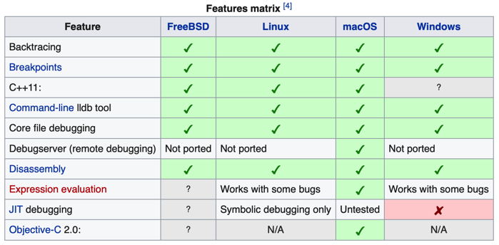
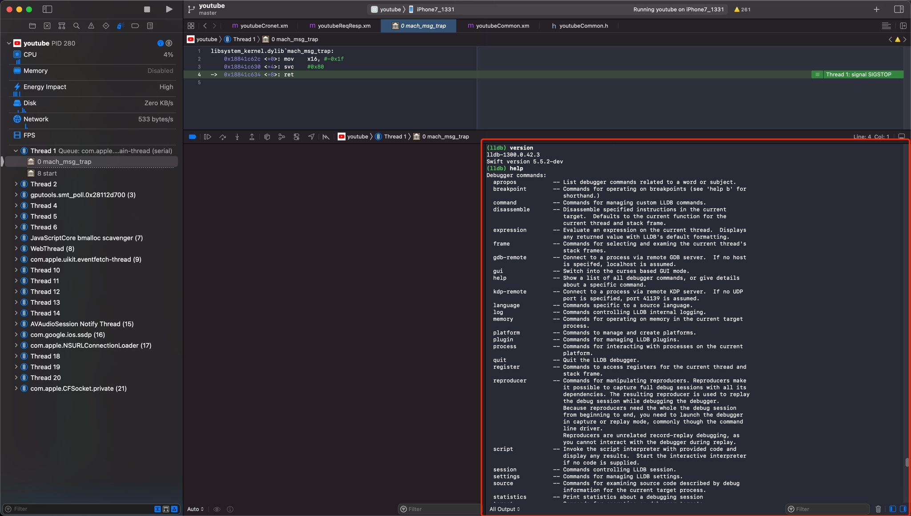

# LLDB概览

TODO：

* 【已解决】XCode和lldb调试常见用法和调试心得

---

## 背景

* 主流常见`调试器`=`debugger`
  * GNU 的 [GDB](https://www.gnu.org/software/gdb/)
  * (开源项目`LLVM`中的) [LLDB](https://lldb.llvm.org/)
* iOS端
  * Apple的`Xcode`的**内置调试器**
    * 之前：`GDB`
    * 现在(`Xcode 5+`)：`LLDB`
* Android端
  * Android内置的调试器
    * 之前：`GDB`
    * 现在：`LLDB`

## LLDB

* `LLDB`
  * 名称：常写成小写的`lldb`
  * 是什么：一个下一代的、高性能的`开源调试器`
  * 说明
    * 和LLVM关系
      * 属于（更大的，开源的）`LLVM`项目的`一部分`=其中`一个模块`
        * 所以LLDB也是开源的
      * 常搭配`LLVM`的其他模块一起使用
        * `expression parser`=`解释器`：`Clang`
        * `disassembler`=`反汇编器`：`LLVM disassembler`
    * 和Xcode关系
      * 是Xcode内置的调试器：之前是GDB，现在是LLDB
  * 特点
    * 支持调试语言
      * Xcode中的LLDB
        * 支持调试`C`、`Objective-C`、`C++`
        * 支持运行平台：桌面端`macOS`、移动端`iOS`（设备和模拟器）
    * 支持众多平台：`macOS`、`iOS`、`Linux`、`FreeBSD`、`NetBSD`、`Windows`
      * 
    * 支持`REPL`、`C++` 和 `Python` 插件
      * 注：`REPL`=`Read-Eval-Print Loop`=`交互式解释器`
* 此处
  * 主要使用场景
    * [iOS逆向](http://book.crifan.org/books/ios_reverse_dev/website)时，用`LLDB`调试`ObjC`的相关内容

## LLDB的位置和版本

### Mac

* Mac中的lldb
  * 二进制
    * Mac自带的： `/usr/bin/lldb`
    * Xcode中的：`/Applications/Xcode.app/Contents/Developer/usr/bin/lldb`
  * 集成进XCode
    * 位置：内嵌在Xcode中的（一般是右下角的）调试区域的控制台
      * 

#### Mac自带的lldb

```bash
crifan@licrifandeMacBook-Pro  ~  which lldb
/usr/bin/lldb
 crifan@licrifandeMacBook-Pro  ~  ll /usr/bin/lldb
-rwxr-xr-x  1 root  wheel   134K  1  1  2020 /usr/bin/lldb

crifan@licrifandeMacBook-Pro  ~  /usr/bin/lldb --version
lldb-1300.0.42.3
Swift version 5.5.2-dev
```

#### Xcode中的lldb

```bash
 crifan@licrifandeMacBook-Pro  ~  ll /Applications/Xcode.app/Contents/Developer/usr/bin/lldb
-rwxr-xr-x  1 crifan  staff   828K 12 15  2021 /Applications/Xcode.app/Contents/Developer/usr/bin/lldb

 crifan@licrifandeMacBook-Pro  ~  /Applications/Xcode.app/Contents/Developer/usr/bin/lldb --version
lldb-1300.0.42.3
Swift version 5.5.2-dev
```
