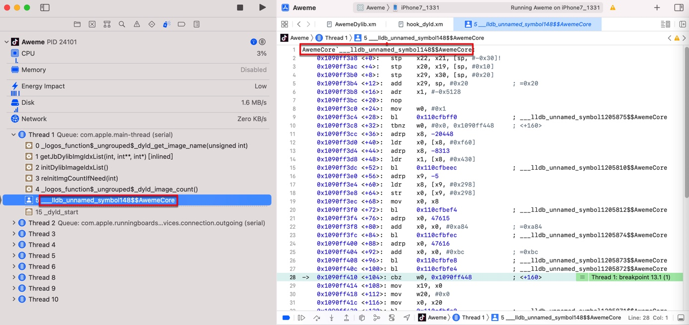

# iOS逆向

TODO：

* 整理常用的命令和举例
  * image
  * po
  * bt
  * reg
  * 等
* iOS逆向时用LLDB调试iOS中ObjC的对象和相关内容
* 【记录】iOS逆向Xcode调试心得：bl后cmn再b.eq很像是switch case或if else的代码逻辑跳转
* 【未解决】Xcode的lldb调试iOS的ObjC或Swift时如何打印出objc_msgSend第一个参数是什么类的实例
* 【已解决】Xcode的lldb中如何访问类的实例的内部属性值
* 【未解决】Xcode的lldb的po中如何判断对象是否是某个类的实例
* 【已解决】XCode的lldb中如何调试运行iOS的ObjC代码

---

## 无名函数

iOS逆向期间，往往可以看到这种函数名：

```c
AwemeCore`___lldb_unnamed_symbol148$$AwemeCore
```



其实就是个：`无名函数`

完整的解释是：

* `AwemeCore`___lldb_unnamed_symbol148$$AwemeCore`
  * `AwemeCore`：函数所属于的（哪个）二进制
    * 注：理论上，同一个函数，可能会出现在多个二进制中
  * `___lldb_unnamed_symbol148$$AwemeCore`
    * 无名函数
      * `___lldb_unnamed_symbol148`：函数名的部分
      * `AwemeCore`：二进制的名字

-》由此可以总结出：

* lldb中的无名函数的命名规则
  * ___lldb_unnamed_symbol**NNN**$$**BinaryName**
    * `___lldb_unnamed_symbol148$$AwemeCore`
      * `NNN`=`148`
        * 从1开始编号
      * `BinaryName`=`AwemeCore`
        * 对应着当前lldb正在调试的二进制是`AwemeCore`

-》

* 知道这个能干什么？
  * 后续去给某个无名函数去加断点时，要注意把函数名写完整了，不要漏写成：
    * `___lldb_unnamed_symbol148`
      * 否则是无法触发断点的
  * 要写成完整的函数名：
    * `___lldb_unnamed_symbol148$$AwemeCore`
      * 才能正常触发断点
