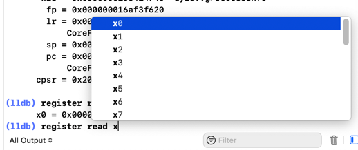
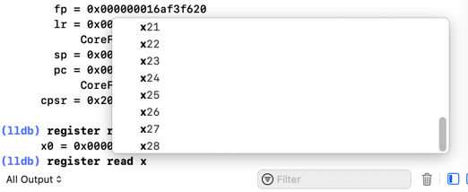
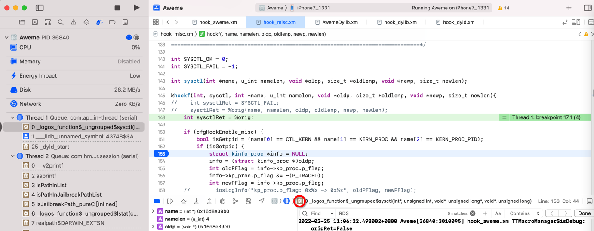
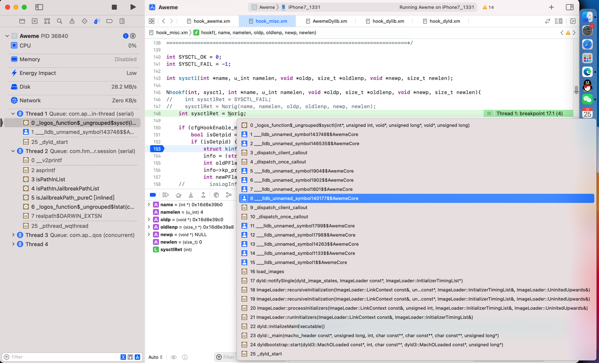
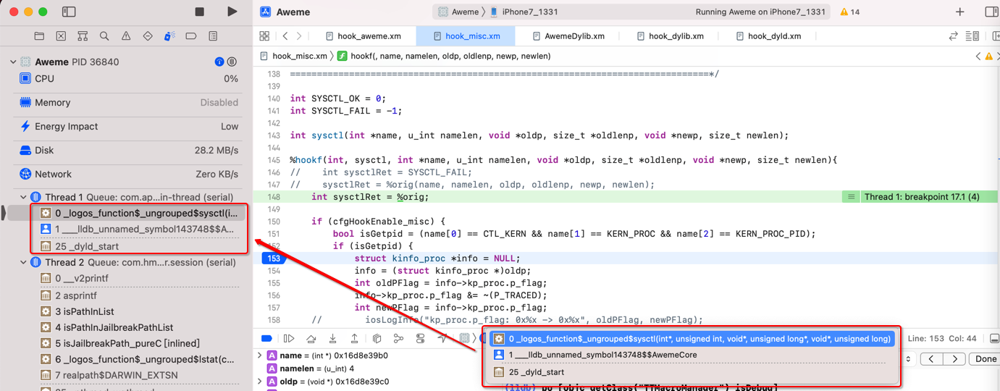
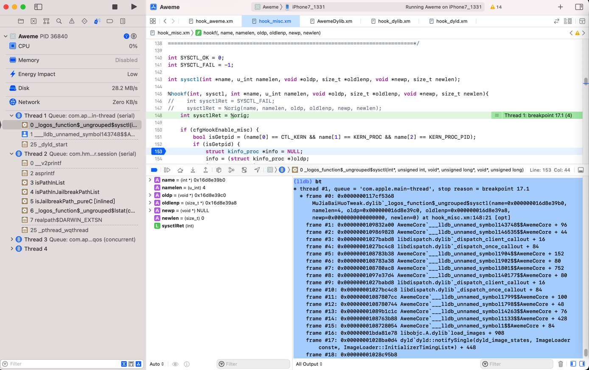

# Xcode中lldb

TODO：

* 【整理】Xcode的lldb调试心得：F7单步进入无名的汇编代码
* 【未解决】XCode和lldb如何根据函数地址加断点
* 【已解决】XCode和lldb调试常见用法和调试心得
* 【已解决】XCode的lldb中如何调试找到当前函数_dyld_get_image_name的返回值
* 【已解决】Xcode调试：lldb中临时变量

---

此处整理`Xcode`中的`lldb`的一些心得：

## 支持自动补全

`Xcode`中`lldb`中支持自动补全：





## 查看函数调用堆栈

`lldb`和`XCode`中查看`函数调用堆栈`=`backtrace`：

XCode调试期间，想要查看：函数调用堆栈

至少有2种方法：

### XCode的UI界面中

`XCode`中，`Command`+`鼠标单击`：



即可看到全部的函数调用堆栈：



注：

直接`鼠标点击`（不加`Command`键），则只显示缩略后的信息：

且和`Debug Navigator`中的线程下面的 函数调用堆栈 简略信息 是一致的：



### lldb命令bt

* `bt` = `thread backtrace`
  * =`th b`
  * =`th ba`

举例：

```c
(lldb) bt
* thread #1, queue = 'com.apple.main-thread', stop reason = breakpoint 17.1
  * frame #0: 0x0000000117cf5368 XxxTweak.dylib`_logos_function$_ungrouped$sysctl(name=0x000000016d8e39b0, namelen=4, oldp=0x000000016d8e39c0, oldlenp=0x000000016d8e39a8, newp=0x0000000000000000, newlen=0) at hook_misc.xm:148:21 [opt]
    frame #1: 0x0000000109832a00 AwemeCore`___lldb_unnamed_symbol143748$$AwemeCore + 96
    frame #2: 0x0000000109869828 AwemeCore`___lldb_unnamed_symbol146535$$AwemeCore + 44
    frame #3: 0x00000001027babd8 libdispatch.dylib`_dispatch_client_callout + 16
    frame #4: 0x00000001027bc4c8 libdispatch.dylib`_dispatch_once_callout + 84
    frame #5: 0x0000000108783b38 AwemeCore`___lldb_unnamed_symbol1904$$AwemeCore + 152
    frame #6: 0x0000000108783a38 AwemeCore`___lldb_unnamed_symbol1902$$AwemeCore + 80
    frame #7: 0x0000000108780ac8 AwemeCore`___lldb_unnamed_symbol1801$$AwemeCore + 752
    frame #8: 0x00000001097e37d4 AwemeCore`___lldb_unnamed_symbol140177$$AwemeCore + 80
    frame #9: 0x00000001027babd8 libdispatch.dylib`_dispatch_client_callout + 16
    frame #10: 0x00000001027bc4c8 libdispatch.dylib`_dispatch_once_callout + 84
    frame #11: 0x00000001087807cc AwemeCore`___lldb_unnamed_symbol1799$$AwemeCore + 100
    frame #12: 0x0000000108780744 AwemeCore`___lldb_unnamed_symbol1798$$AwemeCore + 48
    frame #13: 0x00000001089b1c1c AwemeCore`___lldb_unnamed_symbol14263$$AwemeCore + 76
    frame #14: 0x0000000108763b88 AwemeCore`___lldb_unnamed_symbol1133$$AwemeCore + 428
    frame #15: 0x0000000108728054 AwemeCore`___lldb_unnamed_symbol1$$AwemeCore + 84
    frame #16: 0x00000001bda81e78 libobjc.A.dylib`load_images + 908
    frame #17: 0x00000001028ba0d4 dyld`dyld::notifySingle(dyld_image_states, ImageLoader const*, ImageLoader::InitializerTimingList*) + 448
    frame #18: 0x00000001028c95b8 dyld`ImageLoader::recursiveInitialization(ImageLoader::LinkContext const&, unsigned int, char const*, ImageLoader::InitializerTimingList&, ImageLoader::UninitedUpwards&) + 524
    frame #19: 0x00000001028c953c dyld`ImageLoader::recursiveInitialization(ImageLoader::LinkContext const&, unsigned int, char const*, ImageLoader::InitializerTimingList&, ImageLoader::UninitedUpwards&) + 400
    frame #20: 0x00000001028c8334 dyld`ImageLoader::processInitializers(ImageLoader::LinkContext const&, unsigned int, ImageLoader::InitializerTimingList&, ImageLoader::UninitedUpwards&) + 184
    frame #21: 0x00000001028c83fc dyld`ImageLoader::runInitializers(ImageLoader::LinkContext const&, ImageLoader::InitializerTimingList&) + 92
    frame #22: 0x00000001028ba420 dyld`dyld::initializeMainExecutable() + 216
    frame #23: 0x00000001028bedb4 dyld`dyld::_main(macho_header const*, unsigned long, int, char const**, char const**, char const**, unsigned long*) + 4616
    frame #24: 0x00000001028b9208 dyld`dyldbootstrap::start(dyld3::MachOLoaded const*, int, char const**, dyld3::MachOLoaded const*, unsigned long*) + 396
    frame #25: 0x00000001028b9038 dyld`_dyld_start + 56
```



